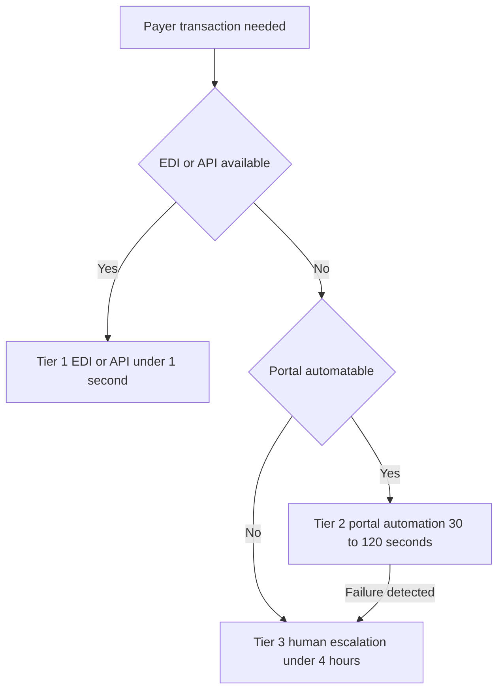

The previous two lessons assumed a clean front door: an EDI transaction or a FHIR API you can call programmatically. Reality is messier. Not every payer offers an API. For the long tail of smaller regional payers, many Medicare Advantage plans, and Medicaid Managed Care Organizations, the only way in is still a human-facing web portal — a login, a form, a submit button designed for a person, not a program. Browser automation is the engineering answer to that tail. Done right — with proper HIPAA controls and audit trails — driving these portals with software is legal, effective, and can reach **60–80% automation rates on portal-only payers**. This lesson is about building that fallback layer correctly, because done wrong it is one of the fastest ways to create a compliance incident.

## The tooling: Playwright, Selenium, Puppeteer

Three mature frameworks can drive a browser the way a person would:

- **Playwright** (Microsoft) — modern, fast, and cross-browser, supporting Chrome, Firefox, and Safari. For new builds this is the recommended default: its speed, reliability, and multi-browser support fit the demands of payer portals well.
- **Selenium** — older and very widely used, with a vast ecosystem; a reasonable choice where an organization already standardizes on it.
- **Puppeteer** — Chrome-focused and capable, but narrower than Playwright.

All three can automate the repetitive navigation that portal work demands. **Recommendation:** default to Playwright for new agents unless an existing Selenium investment dictates otherwise — Playwright's cross-browser reach and modern API reduce the long-term maintenance cost that makes or breaks portal automation.

## HIPAA compliance is not optional here

The moment your automation touches PHI in a payer portal, it is inside HIPAA's scope, and the controls are non-negotiable:

- **Use facility credentials, never personal ones.** The session must run under the practice's account, not an individual's, so access is attributable to the organization and survives staff turnover.
- **Log every PHI entry with an audit trail.** Every value the agent types or reads that constitutes PHI must be recorded so there is a complete record of what the agent did with protected information.
- **Encrypt session cookies at rest.** The artifacts that maintain a logged-in session are themselves sensitive and must be stored encrypted.
- **Never cache PHI in plaintext.** No protected information should sit in logs, temp files, or caches in readable form.

These are architectural requirements, not afterthoughts. A portal automation layer that skips them is a breach waiting to happen.

## Getting past the gate: CAPTCHA and bot detection

Payer portals increasingly deploy **CAPTCHA and bot detection** specifically to stop the kind of automation you are building. There are three practical responses, and the right design usually combines them:

- **CAPTCHA-solving services** such as 2captcha or Anti-Captcha, at roughly **$0.001 per CAPTCHA** — cheap, but a dependency to monitor.
- **Rotated residential IPs** to avoid the rate-based blocking that flags datacenter traffic.
- **Human-in-the-loop for the initial login**, then **automated session reuse** — a person clears the login challenge once, and the agent rides the established session for the rest of the work.

The third option is often the most robust and the most defensible: it keeps a human at the trust boundary while still automating the high-volume work behind it.

## The fragility problem: portals change without notice

The hard truth of portal automation is that **payer portals update their UIs without warning**, and every update can break a brittle agent. A selector that worked yesterday points at nothing today, and the agent silently fails. Designing for this fragility is the difference between an automation that runs for months and one that needs constant babysitting.

Three practices make portal agents resilient:

- **Detect failures and escalate.** When the agent cannot complete a step, it must recognize that, hand off to a human backup, and not pretend it succeeded.
- **Capture screenshots for debugging.** Every failure should produce a visual artifact so a human can see exactly what the portal looked like when the agent broke.
- **Prefer semantic over brittle selectors.** **CSS-selector-based automation is fragile**; use semantic selectors and visual AI where possible so the agent identifies fields by what they mean rather than by an exact DOM path that a redesign will shatter.

This is also where modern LLMs add leverage. **Claude or GPT-4o can parse clinical documentation and extract the specific fields a portal form requires**, which reduces the manual field-mapping you would otherwise maintain per payer and absorbs the variation in how different payers ask for the same information. Instead of writing bespoke mapping code for every portal, you let the model bridge the gap between your structured data and the portal's idiosyncratic form.

## The hybrid architecture and its SLAs

Portal automation is not a standalone strategy — it is one tier in a three-tier fallback chain, and the whole point of the chain is to use the fastest reliable path available for each payer:

1. **EDI / API first** — sub-second transactions where a programmatic interface exists.
2. **Portal automation fallback** — for payers with no API, completing in **30–120 seconds**.
3. **Human-in-the-loop escalation** — for everything the first two tiers cannot handle, with a target resolution of **under 4 hours**.

Those SLA targets — **EDI under 1 second, portal automation 30–120 seconds, human escalation under 4 hours** — are how you reason about the system's behavior and where the cost lives. Most volume should clear at tier one, the portal tier absorbs the tail, and humans handle only the genuine exceptions. The architecture degrades gracefully: no payer is unreachable, but cheaper paths are always preferred.

## Putting it into practice

Build a portal-automation fallback that is compliant, resilient, and correctly positioned in the fallback chain.

1. Choose **Playwright** and write the navigation for a mock payer portal: login with facility credentials, navigate to an eligibility or PA form, fill it, and submit.
2. Implement the **HIPAA controls**: facility-credential session, an audit-trail log of every PHI field touched, encrypted cookie storage, and no plaintext PHI anywhere.
3. Add a **CAPTCHA strategy** — pick human-in-the-loop initial login with automated session reuse, and document when you would fall back to a solving service.
4. Build **resilience**: failure detection that escalates to a human backup, automatic screenshot capture on error, and semantic selectors instead of brittle CSS paths.
5. Wire the tier into the **hybrid chain** — EDI/API first, portal second, human third — and assign each tier its SLA target.

## Key takeaways

- Browser automation is the fallback for payers with no API — the tail of regional payers, Medicare Advantage plans, and Medicaid MCOs — and can reach 60–80% automation on portal-only payers when done right.
- Playwright is the recommended framework for new builds (modern, fast, cross-browser); Selenium and Puppeteer are alternatives, with Selenium fitting existing investments.
- HIPAA controls are architectural and non-negotiable: facility credentials, audit-trailed PHI entry, encrypted session cookies, and zero plaintext PHI caching.
- Handle bot defenses with CAPTCHA-solving services (~$0.001 each), rotated residential IPs, and — most defensibly — human-in-the-loop initial login plus automated session reuse.
- Portals change without notice, so design for fragility: detect-and-escalate on failure, screenshot capture for debugging, and semantic selectors over brittle CSS; LLMs like Claude or GPT-4o can map clinical documentation to portal fields.
- Position portal automation as the middle tier of a hybrid chain — EDI/API (<1s) → portal automation (30–120s) → human escalation (<4h) — so the system always prefers the cheapest reliable path and degrades gracefully.
