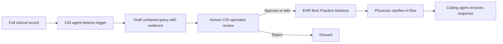

Coding can only be as good as the documentation it reads. When a chart is vague, conflicting, or simply missing the detail needed to assign the right code, the answer is not to guess — it is to ask the physician. That practice is **Clinical Documentation Improvement (CDI)**: querying clinicians to clarify documentation so it accurately reflects the care delivered. Traditionally, CDI specialists review records by hand and compose queries one at a time. An AI agent can do the first pass — surfacing query opportunities directly from the documentation and routing them in real time, while the patient is still in the hospital and the physician still remembers the case. This lesson is about building that agent without crossing the compliance lines that make CDI legally sensitive.

## What actually triggers a query

A CDI agent earns its keep by recognizing the patterns that warrant clarification. There are three classic triggers, and your agent should detect all of them.

The first is **conflicting documentation**: the body of a note describes "sepsis" while the diagnosis list says only "infection." The chart contradicts itself, and a coder cannot resolve it without asking.

The second is **clinical indicators without a diagnosis**: the labs and orders point at a condition the physician never named. A high white-blood-cell count, antibiotics on board, and a documented fever strongly suggest sepsis — but if no one wrote "sepsis," it cannot be coded. The evidence is present; the diagnosis is absent.

The third is **vague diagnoses**: "respiratory failure" when the chart could support "acute hypoxic respiratory failure." The more specific term changes the code, the severity, and often the DRG. Each of these is a place where the documentation is improvable, and each is something an LLM reading the full record can flag.

## Generating the query the model is allowed to send

Here is where CDI differs sharply from ordinary text generation: *how* you ask is regulated. Under the **AHIMA/ACDIS query practice guidelines**, a compliant query must be **unbiased** — it presents options without leading the physician toward a particular answer. It must be grounded in **clinical documentation, not assumption**. And it asks the physician to *clarify*, never to add new information the record does not support. A query that says "the patient clearly has sepsis, please document it" is non-compliant and creates audit risk. A query that says "the record shows WBC of X, temperature of Y, and antibiotic therapy; please clarify whether these findings represent sepsis, a localized infection, or another condition" is compliant.

So the agent's job is twofold: read the complete record, identify the clinical indicators — lab values, vitals, medications, imaging — that suggest an undocumented or under-specified diagnosis, and then generate query text that lays out that evidence and invites clarification without steering. The compliance rules are not an afterthought to bolt on; they are the specification the generator must satisfy.

## Putting the query where the work happens

A query nobody sees changes nothing. The integration point that makes real-time CDI work is the physician's own workflow. When the attending opens the patient's chart to write a new progress note, the agent's query surfaces in the EHR — typically as a Best Practice Advisory. The physician responds inside the EHR, in the same flow they are already in, and the coding agent receives that response immediately. The loop closes before discharge, while the clinical picture is fresh, instead of weeks later when a retrospective query lands in an inbox and gets ignored.

Real-time placement is what separates a CDI agent that lifts documentation quality from one that generates noise nobody acts on.

## Measure the loop, then improve it

CDI is one of the easier RCM functions to instrument, and you should instrument it heavily. Track three things. **Query response rate** — what fraction of queries the physician answers at all; aim above 85%. **Query agree rate** — how often the physician agrees with the suggested documentation, which tells you whether your triggers are sound or trigger-happy. And **revenue impact per query** — the DRG improvement each answered query produces. Those three metrics together tell you whether the agent is accurate, whether clinicians trust it, and whether it is paying for itself. They also become the training signal: low agree rates point at triggers to tune, and the agree/disagree labels feed the model-improvement loop directly.

## Keep a human between the agent and the physician

The most important architectural constraint in this lesson is also the most easily forgotten in the excitement of automation: in most health systems today, an AI-generated query must be **reviewed by a human CDI specialist** — or coded by a human — before it is sent to a physician. Full end-to-end automation of CDI queries is a *future state*, pending more validation data and regulatory comfort. The reasons are not bureaucratic. A leading or non-compliant query sent at scale is a compliance exposure across every chart it touched, and physician trust in the entire program collapses the first time the agent sends something biased or clinically wrong.

So design for human review from day one. The agent drafts; the specialist approves, edits, or rejects; only then does the query reach the physician. As your agree-rate data accumulates and your guardrails prove out, you can argue for narrowing that review to high-confidence cases — but you build the gate first and relax it later, never the reverse.

## Putting it into practice

Build a CDI query agent that drafts compliant, reviewable queries.

1. Feed the agent a simulated record containing a clinical-indicator-without-diagnosis pattern — for example, elevated WBC, fever, and antibiotic orders with no sepsis diagnosis. Use no real PHI.
2. Have the model identify the supporting indicators and assemble them as evidence.
3. Generate query text that presents the evidence neutrally and asks the physician to clarify — explicitly check it against the unbiased / non-leading rule before output.
4. Route the draft to a human-review step (a queue, not the physician) and log a stub for response rate, agree rate, and revenue impact so the measurement loop exists from the start.

## Key takeaways

- CDI exists to fix documentation before it is coded; the agent's three core triggers are conflicting documentation, clinical indicators without a diagnosis, and vague diagnoses.
- Compliance is the spec: AHIMA/ACDIS guidelines require queries to be unbiased, grounded in documentation, and clarifying — never leading or adding unsupported information.
- Real-time integration is what makes CDI work — surface the query as an EHR Best Practice Advisory when the physician opens the chart, and capture the response in-flow.
- Instrument the loop: response rate (>85% target), agree rate, and revenue impact per query both prove value and feed model improvement.
- Keep a human CDI specialist between the agent and the physician; full automation is a future state, so build the review gate first and relax it only as validation data accrues.
