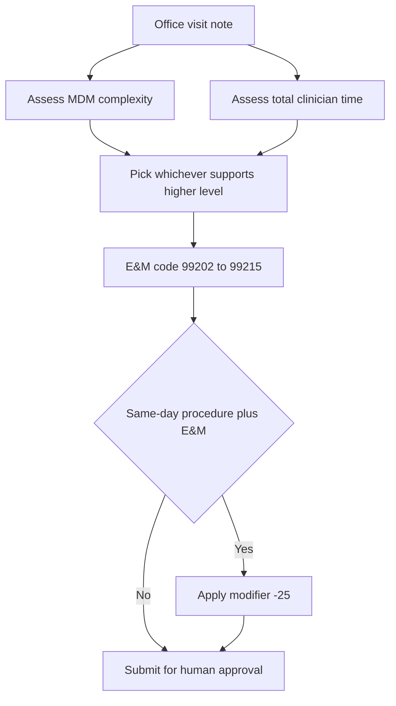

Inpatient coding is about diagnoses and DRGs. Outpatient and physician-practice coding is a different world, and it is dominated by **E&M** — Evaluation and Management codes. Every office visit gets one, which makes E&M the highest-volume coding decision in ambulatory medicine and a place where small, systematic errors compound into large revenue and compliance problems. The good news is that since the AMA simplified E&M coding in 2021, an AI agent can now determine the correct level from the note with high accuracy — catching the undercoding that leaves earned revenue on the table and the overcoding that creates audit risk.

## Why 2021 changed everything for automation

The **2021 AMA E&M revision** rebuilt how office and outpatient visits (codes 99202–99215) are leveled. The old system was a tripod of history, exam, and medical decision making, with counting rules so fiddly that two coders could read the same note and disagree. The revision threw out history and exam as scoring elements and based the level on just two things: **medical decision making (MDM) complexity** *or* **total clinician time** on the day of the encounter. Pick whichever supports the higher level; document accordingly.

That simplification is exactly what makes the problem tractable for an LLM. MDM and total time are both extractable from a well-written note, and the decision tree is far cleaner than the old element-counting. An AI agent handles this with high accuracy precisely because the AMA removed the ambiguity that used to trip up humans and machines alike.

## Reading MDM the way the rules do

To level a visit by MDM, the agent has to assess complexity the way the guidelines define it, across the spectrum from **straightforward** to **high**. Straightforward is one self-limited problem with minimal data and minimal risk. Low complexity is something like two self-limited problems or one stable chronic condition with limited data. Moderate complexity is the workhorse: one or more chronic conditions with exacerbation, a moderate amount of data, and prescription drug management. High complexity sits above that.

Your agent's job is to read the note, identify the problems addressed, the data reviewed, and the risk involved — including whether prescription drug management is in play — and map those to the MDM level. Because the categories are defined rather than vibes-based, this is a classification task an LLM does well when prompted with the actual definitions rather than left to improvise.

## The money is in correcting reflexive coding

Here is the pattern that pays for the whole agent: physicians default to **99213** for nearly every established-patient visit, regardless of how complex the encounter actually was. It is the safe, habitual middle. But an MDM analysis frequently shows the documentation supports **99214 or 99215**. That is real, earned revenue being left behind out of habit. An agent that reviews the MDM elements and flags the under-leveled visits is a direct revenue-recovery engine — and, in the other direction, it flags the over-leveled visits that create compliance exposure. The same analysis protects against both failure modes.

## Procedures, modifiers, and the -25 problem

For surgical and procedural specialties, the agent also reads the operative note, extracts the procedures performed, and suggests the appropriate **CPT** codes plus modifiers — laterality (**-LT/-RT**), distinct procedural service (**-59**), multiple procedures (**-51**), increased complexity (**-22**). Modifiers are where revenue and compliance both quietly live.

One modifier deserves special attention because it is so often missed: **-25**. When a physician performs a procedure *and* a significant, separately identifiable E&M service on the same day, modifier -25 must be appended to the E&M to signal it was a distinct service — otherwise the payer bundles the E&M into the procedure and it goes unpaid. This is a pure pattern-detection task: the agent sees a same-day procedure-plus-E&M and auto-applies -25. Automating that one rule recovers revenue on every qualifying encounter that a busy clinician would have let slide.

## Wiring it into charge capture

A coding suggestion that arrives three days late has already cost you. The integration that makes this real is **charge capture**: for every completed encounter, the agent reviews the documentation, suggests the codes and modifiers, a human coder reviews and approves, and charges are submitted — same day. The payoff is collapsing charge lag from the typical 3–5 days down to same-day submission, which accelerates the entire cash cycle. Note the human coder is still in the loop here, just as in inpatient coding: the agent proposes, the human approves, the charge goes out.

## Choosing your approach

You have two viable patterns for the E&M leveler.

**Option A — a prompted frontier model with the MDM and time rules in the system prompt.** Fast to stand up, transparent, easy to update when guidelines shift. It handles the simplified 2021 logic well and is the natural fit for E&M because the rules are now clean enough to express in a prompt.

**Option B — a fine-tuned classifier trained on your own coded encounters.** Tighter accuracy on your specialty mix and cheaper at high volume, at the cost of a training pipeline and labeled data.

**Recommendation:** start with Option A inside a HIPAA-compliant agentic platform. E&M's post-2021 rules are simple enough that a well-prompted frontier model captures most of the value immediately, and you can layer fine-tuning on later for high-volume specialties once you have approved-charge data to train on. Build the leveler and the -25 detector first — they deliver revenue on day one.

## Putting it into practice

Build an E&M leveling agent with modifier detection.

1. Feed the agent a simulated established-patient office note that documents a chronic condition with exacerbation and prescription drug management. Use no real PHI.
2. Prompt it to determine the MDM level using the actual category definitions and to recommend the E&M code (expect 99214 territory, not a reflexive 99213).
3. Add a check that detects a same-day procedure-plus-E&M pattern and auto-applies modifier -25 to the E&M.
4. Output the suggested codes and modifiers in a charge-capture-ready record for a human coder to approve, and log the would-be charge-lag reduction.

## Key takeaways

- The 2021 AMA revision rebuilt office/outpatient E&M (99202–99215) around MDM complexity *or* total time, dropping history and exam as scoring elements — which is exactly what makes the task automatable.
- Level visits by mapping the note to defined MDM categories (straightforward → low → moderate → high), where moderate hinges on chronic exacerbation plus prescription drug management.
- The revenue case is correcting reflexive 99213 coding: MDM analysis often supports 99214/99215, recovering earned revenue while also flagging compliance-risky overcoding.
- Automate modifiers, especially -25: when a procedure and a significant separate E&M occur the same day, the agent detects the pattern and applies -25 so the E&M is not bundled and lost.
- Wire the agent into charge capture with a human approval step to cut charge lag from 3–5 days to same-day; start with a prompted frontier model and add fine-tuning later for high-volume specialties.
