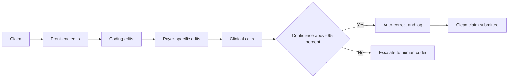

A "clean claim" is one that passes every payer edit and adjudicates on its first submission — paid, no rework, no phone calls. It is the single most leveraged outcome in the revenue cycle, because the cheapest denial to manage is the one that never happens. The average US hospital runs an **85–90% clean claim rate**; best-in-class systems reach **98%+**. That spread looks small until you multiply it across thousands of claims a month, where each point of improvement is worth millions annually. This lesson is about building the agent that closes the gap: a pre-submission scrubber that catches the errors clearinghouses miss and fixes them before a payer ever sees them.

## The four layers of a scrub

Claim scrubbing is not one check — it is four, applied in sequence, and your agent should mirror that structure because each layer fails for a different reason and needs a different fix.

- **Front-end edits** validate registration data completeness: is the subscriber ID present and well-formed, is the date of service inside the coverage window, are demographics consistent. These are the cheapest errors to catch and the most common.
- **Coding edits** check ICD-10 and CPT validity and modifier appropriateness — is the code current, does the modifier belong on this procedure, is the diagnosis sequence right.
- **Payer-specific edits** apply each payer's proprietary contract rules: covered services, network restrictions, whether prior authorization was required for this service.
- **Clinical edits** confirm the diagnosis actually supports the procedure billed — the medical-necessity question a payer will otherwise ask after the fact.

Build the agent to run these as discrete stages so that when a claim fails, you know *which layer* rejected it. That routing information is what lets you auto-fix some failures and escalate others.

## CCI and the rules everyone shares

The **Correct Coding Initiative (CCI)** is the floor. These are CMS edits that prevent billing certain code combinations together — pairs that are mutually exclusive or where one code is already bundled into another. Every clearinghouse automates CCI, which means by the time a claim reaches the payer these edits are mostly resolved. The opportunity for your agent is to run them *earlier*: an LLM can pre-check CCI edits at the point of charge entry, before the claim is even assembled, so the coder fixes the combination while the encounter is fresh rather than after a rejection comes back days later.

Treat CCI as table stakes. It is well-documented, deterministic, and shared across all payers, which makes it the easiest layer to encode and the wrong place to expect competitive advantage. The advantage lives one layer up.

## Payer-specific edits: where the money hides

Each payer maintains proprietary edits beyond CCI, and these are messy, undocumented, and constantly shifting. The lesson names the texture of it: UnitedHealth LocalPlus network restrictions, Aetna secondary-diagnosis requirements, Medicare Advance Beneficiary Notices (ABN). No public rulebook fully captures these, so you cannot hard-code your way to coverage. Instead, you train on your own history.

This is the case for a **denial prediction model**. Take your historical claim data — features like payer, CPT, ICD-10, rendering provider, patient demographics, and service date — labelled with the actual outcome (paid, denied, or adjusted). An **XGBoost** or **LSTM** model learns the payer-specific patterns that no static ruleset encodes: that a particular payer denies a given code-plus-diagnosis pair, or pends high-dollar claims from certain providers. The model outputs a denial probability for every claim *before* submission, and you route the high-risk ones for human review while letting the clean ones flow.

A useful way to think about the division of labor: rules handle what is written down (CCI, format validity), and the learned model handles what is only visible in your own denial history. The two are complementary, not competing.

## Wiring into the clearinghouse and choosing how to fix

Claims do not go straight to payers; they pass through a clearinghouse — **Waystar, Availity, or Change Healthcare (now Optum)** — in **EDI 837P/I** format. Your agent integrates with the clearinghouse API to pre-validate claims and to receive the clearinghouse acknowledgment, giving you a second confirmation that the claim is structurally sound before it reaches adjudication.

The decisive design choice is what the agent does when it finds a problem. The recommended pattern is a **confidence-gated proactive fix**: when the scrub identifies an issue and the agent's confidence in the correction exceeds **95%** — adding a clearly-indicated modifier, correcting an obvious diagnosis sequence — it auto-corrects and records the change. Below 95% confidence, it escalates to a human coder rather than guessing. Set the bar high deliberately: a wrong auto-fix on a claim is worse than a flagged one, because it can create a compliance problem instead of a billing one. Track the **fix-to-clean conversion rate** as your headline metric — what fraction of caught issues were resolved into clean claims — so you can tune the threshold over time.

## Putting it into practice

Stand up a minimal pre-submission scrubbing agent against a sample of your historical claims.

1. Pull a labelled claim dataset (payer, CPT, ICD-10, provider, demographics, service date → paid/denied/adjusted) and split it into train and test sets.
2. Implement the four scrub layers as ordered stages, starting with deterministic CCI and format checks so every failure reports which layer caught it.
3. Train an XGBoost denial-prediction model on the labelled data and have it emit a denial probability per claim.
4. Add the confidence gate: auto-correct above 95% confidence, escalate below it, and log every decision.
5. Measure clean claim rate and fix-to-clean conversion on the held-out set, then compare against the 85–90% baseline to size the gain.

## Key takeaways

- A clean claim adjudicates on first submission; closing the gap from a typical 85–90% rate toward best-in-class 98%+ is worth millions annually.
- Scrub in four layers — front-end, coding, payer-specific, and clinical edits — so each failure routes to the right fix.
- CCI edits are the shared, deterministic floor; encode them but expect no advantage there.
- Payer-specific edits are undocumented and shifting, so learn them from your own denial history with an XGBoost or LSTM denial-prediction model.
- Integrate with the clearinghouse (Waystar, Availity, Optum) via EDI 837P/I to pre-validate before payer submission.
- Gate fixes on confidence: auto-correct above 95%, escalate below, and track fix-to-clean conversion as the core metric.
