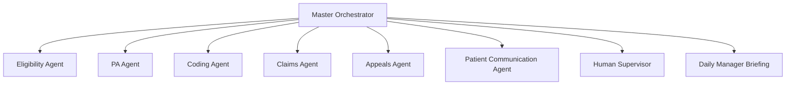

By module 5 you have built individual agents — eligibility, prior authorization, coding, claims, denials. The Personal Medical Biller is what happens when you stop thinking in single agents and start thinking in *systems*. It is not one model with a long prompt. It is a role — a Digital FTE, a full-stack revenue cycle employee — assembled from a master orchestrator and a team of specialized sub-agents, each expert in one domain, each accountable for one slice of the patient's billing lifecycle. The architecture you choose here determines whether you can scale to one patient account or ten thousand.

## The orchestrator owns the lifecycle

The hardest problem in multi-agent systems is not the agents — it is coordination. The master orchestrator solves this by being the one component that holds the *whole picture* for a patient: the complete billing history, every active claim, every open issue, and the next action due on each. It does not do the specialized work itself. Its job is to route — to decide that a coverage question goes to the Eligibility Agent, an unresolved denial goes to the Appeals Agent, an inbound patient question goes to the Patient Communication Agent — and then to reconcile what comes back into a single coherent state.

The orchestrator also has two outward-facing duties that make it a genuine *employee* rather than a script. First, it surfaces issues that require human attention, rather than silently failing or guessing. Second, it generates a daily briefing for the billing manager — the standing report a human supervisor would expect from any direct report: what was processed, what is stuck, what needs a decision. Build the orchestrator as the spine of the system, and the sub-agents become interchangeable specialists hanging off it.

## Six specialists, one team

The sub-agents map directly to the RCM workflows you have already studied, each scoped narrowly enough to be reliable:

- **Eligibility Agent** runs coverage checks.
- **PA Agent** tracks authorization status.
- **Coding Agent** reviews encounter documentation.
- **Claims Agent** tracks the claim lifecycle.
- **Appeals Agent** manages denial resolution.
- **Patient Communication Agent** handles patient billing questions.

The discipline here is *narrow scope*. A coding agent that only reviews documentation is far easier to test, prompt, and trust than a single agent asked to do everything from eligibility to appeals. Narrow agents have small, auditable tool sets and predictable failure modes. When something goes wrong, you know exactly which specialist to inspect. This is the same logic that makes human RCM teams specialize — and it is even more important for agents, where a sprawling responsibility set is where hallucination and error creep in.

## Memory: the difference between an agent and a chatbot

A chatbot forgets. A Digital FTE remembers — and billing is fundamentally a memory problem, because a claim filed today is denied next week and appealed the week after. The Personal Medical Biller needs three distinct kinds of memory, and conflating them is a classic architecture mistake.

**Structured per-patient state** lives in a database and holds the facts that must be exact: claim ID mapped to status, PA number mapped to expiry date, denial mapped to appeal deadline. These are not things you want an LLM to "remember" approximately — a missed appeal deadline is lost revenue. Keep them in structured storage the orchestrator queries deterministically.

**A vector store** handles clinical documentation retrieval — the unstructured encounter notes the Coding Agent needs to pull relevant context from. This is where semantic search belongs, not where deadlines belong.

**Conversation memory** holds the running thread of an ongoing patient interaction, so the Patient Communication Agent does not ask a patient to re-explain their question. Separating these three keeps each cheap, fast, and correct for its purpose.

## Tools and the escalation contract

Agents act on the world only through tools, and the Personal Medical Biller's tool inventory is the list of systems a human biller touches: an EHR read API, payer EDI integration, a clearinghouse API, phone and fax automation (Twilio plus a fax API, because much of payer communication is still by fax), email automation, document generation for PDF statements and appeal letters, and CRM write access to update patient account notes. Every tool is a controlled surface — the agent can do exactly what the tool exposes and nothing more.

The other half of trustworthy autonomy is knowing when *not* to act. The escalation protocol is a hard contract: any action with a dollar value over $500, any patient complaint, any potential HIPAA violation, and any regulatory ambiguity escalate to a human supervisor — with a full context briefing, not a bare alert. The target escalation rate is under 10% of total actions. Above that and the system is not autonomous enough to pay for itself; with no escalation at all, it is unsafe. That band is the design target.

Underneath all of this sits a HIPAA-compliant agentic platform that provides the orchestration layer, compliant data handling, the audit trail, and multi-tenant deployment infrastructure. Each sub-agent deploys as a skill on that platform, so you inherit compliance and observability rather than rebuilding them per agent. xEHR.io and the RCM Employee product are concrete examples of this pattern in production.

## Putting it into practice

Design the agent topology before you write a line of prompt — the structure is the product.

1. Draw the orchestrator at the center and the six sub-agents around it. For each sub-agent, write its single responsibility in one sentence.
2. For each sub-agent, list only the tools it needs from the inventory (EHR read, payer EDI, clearinghouse, phone/fax, email, document generation, CRM write). If a sub-agent needs more than three, it is probably too broad — split it.
3. Define your three memory stores explicitly: what goes in structured per-patient state, what goes in the vector store, and what goes in conversation memory. Put every deadline and ID in structured state.
4. Write your escalation rules as four concrete triggers (>$500, complaint, possible HIPAA issue, regulatory ambiguity) and set a measurable target: escalation rate under 10%.

## Key takeaways

- The Personal Medical Biller is a Digital FTE — an orchestrated system of specialized sub-agents, not a single large-prompt agent.
- The master orchestrator owns the complete per-patient lifecycle, routes work to specialists, surfaces human issues, and produces a daily manager briefing.
- Six narrow sub-agents (Eligibility, PA, Coding, Claims, Appeals, Patient Communication) are easier to test and trust than one broad agent.
- Use three separate memory types: structured per-patient state for IDs and deadlines, a vector store for clinical docs, and conversation memory for patient threads.
- Tools are the only way agents act; pair them with a hard escalation contract (>$500, complaints, HIPAA risk, regulatory ambiguity) targeting under 10% escalation.
- A HIPAA-compliant agentic platform supplies orchestration, compliant data handling, audit trails, and multi-tenant deployment; sub-agents ship as platform skills.
