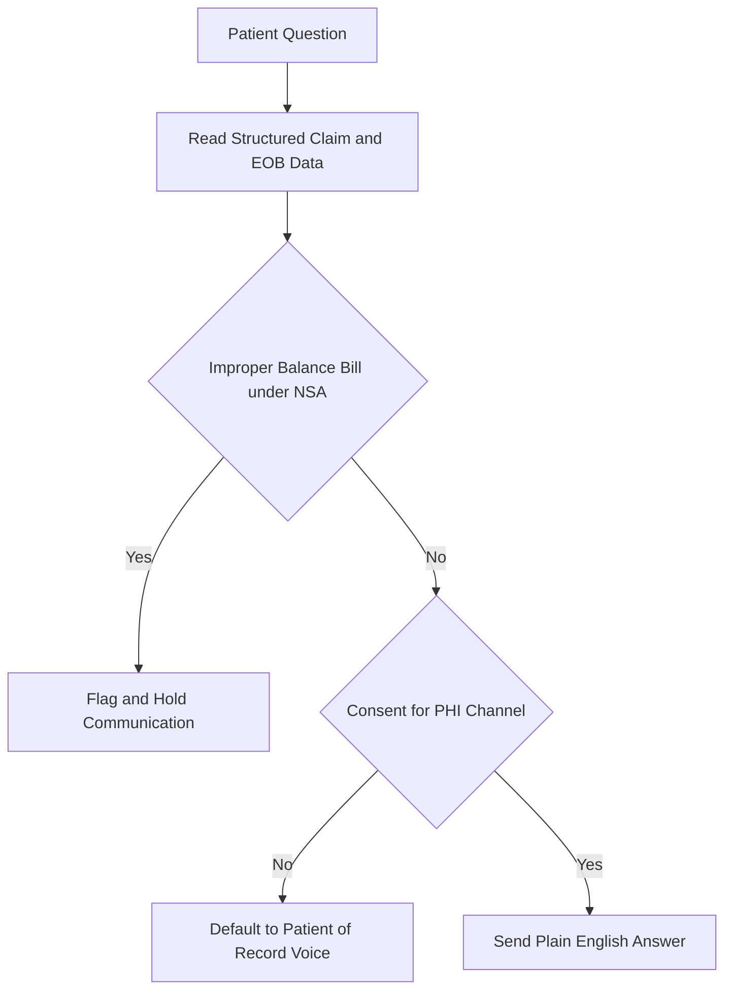

Everything you have built so far runs in the background — orchestrators, claims tracking, appeals. This lesson is about the one part of the Personal Medical Biller a patient actually meets. The patient-facing agent is the billing advocate: it answers questions about bills, explains the Explanation of Benefits, processes payments, sets up payment plans, and surfaces financial assistance the patient never knew existed. Done right, it eliminates the most dreaded interaction in healthcare administration — the billing department phone call — and produces the single largest patient-satisfaction improvement available anywhere in the administrative stack.

## Most of the work is answering five questions

The volume here is surprisingly concentrated. Roughly 80% of patient billing questions are the same handful: "Why is my bill so high?", "What does my insurance cover?", "Can I set up a payment plan?", "Why did my insurance deny this?", and "Is this bill correct?" Every one of these is answerable from data you already have — structured claim data plus EOB data. The patient experiences a frustrating mystery; the agent sees a fully determined record.

That asymmetry is the entire opportunity. Because the questions are predictable and the answers are grounded in structured data, the patient-facing agent can resolve the large majority of inquiries without a human and without guessing. The design goal is not a clever conversationalist — it is a reliable translator between the patient's plain-language question and the structured record that already contains the answer.

## Translate the EOB into plain English

The Explanation of Benefits is written in insurance-industry jargon that ordinary patients cannot parse — deductibles, allowed amounts, coinsurance, adjustments. The agent's core job is translation: turning that document into a sentence a person understands. Instead of a grid of codes, the patient hears, "Your insurance paid $X, you owe $Y because you have a $Z deductible that wasn't met yet."

This is where grounding in structured data pays off directly. The agent is not inventing an explanation; it is reading the EOB fields and rendering them in human language. The same applies to "Why did my insurance deny this?" — the denial reason is in the claim data, and the agent's value is restating it clearly, not generating a plausible-sounding story. Keep the agent tethered to the record, and the plain-English layer becomes trustworthy rather than a liability.

## Be proactive about money the patient is owed

A passive billing system waits to be asked. A good advocate goes looking for relief on the patient's behalf, and two patterns make that real.

**Financial assistance screening.** The agent calculates the patient's estimated bill-to-income ratio, identifies their federal poverty level bracket, and auto-screens for the facility's charity care programs — then presents those options proactively, rather than waiting for the patient to somehow know to ask. Most patients eligible for charity care never apply simply because no one told them it existed; an agent that screens by default closes that gap.

**Payment plan automation.** For balances over $200, the agent offers three payment plan options — 3, 6, or 12 months — collects the payment method, sets up automatic payments, and sends a confirmation, with no human in the loop. This is the kind of bounded, rule-defined transaction agents handle cleanly: the thresholds and options are fixed, the action is reversible and logged, and the patient gets resolution in one conversation instead of a transfer to a billing specialist.

## Protect the patient — and verify consent before you speak

Advocacy includes catching bills that should never have been sent. The No Surprises Act of 2022 prohibits balance billing for out-of-network emergency services and certain facility services. The agent cross-references the charges against NSA protections and flags improper balance bills *before* any patient communication goes out — so the system never asks a patient to pay something the law says they do not owe. Catching this upstream is both a compliance safeguard and the clearest possible demonstration that the agent is on the patient's side.

Finally, the channel itself is a compliance surface. Patient financial communications by text or email require explicit patient consent before any PHI is sent, so the agent must verify consent before transmitting PHI through any digital channel. Voice calls default to the patient-of-record contact information only. These are not optional courtesies — they are the conditions under which the agent is allowed to communicate at all, and they belong in the agent's logic, checked on every outbound message, not assumed.

## Putting it into practice

Build the patient-facing billing advocate as a tightly scoped, consent-aware agent.

1. Enumerate the five high-volume questions and, for each, map exactly which structured fields (claim data, EOB data) supply the answer. This is your coverage for ~80% of inquiries.
2. Write an EOB-to-plain-English template that fills from EOB fields — e.g., "Your insurance paid $X, you owe $Y because of a $Z deductible that wasn't met." Ground every explanation in the record; never generate one.
3. Implement two proactive flows: financial assistance screening (bill-to-income ratio, federal poverty level bracket, charity care match) and payment plan automation for balances over $200 (3/6/12-month options, payment method capture, autopay, confirmation).
4. Add two guardrails before any message goes out: cross-reference charges against No Surprises Act protections to flag improper balance bills, and verify explicit consent before sending PHI via text or email (voice defaults to patient-of-record contact).

## Key takeaways

- The patient-facing agent is the billing advocate — it answers bill questions, explains EOBs, processes payments, sets up plans, and finds financial assistance, replacing the dreaded billing phone call.
- About 80% of patient questions are five recurring ones, all answerable from structured claim and EOB data — so ground answers in the record, never invent them.
- EOB translation into plain English ("insurance paid $X, you owe $Y because of an unmet $Z deductible") is the agent's core, high-value function.
- Be proactive: screen for charity care via bill-to-income ratio and federal poverty level, and automate payment plans for balances over $200 (3/6/12 months) with no human involvement.
- Protect patients by cross-referencing charges against the No Surprises Act (2022) and flagging improper balance bills before any communication.
- Channel compliance is mandatory: verify explicit patient consent before sending PHI by text or email, and default voice contact to patient-of-record information only.
