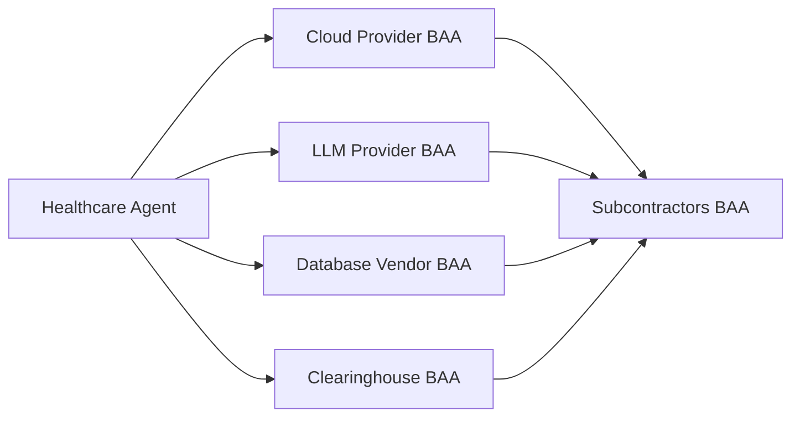

HIPAA's Security Rule was written in 2003 — before large language models, cloud computing, and the kind of autonomous agents this book teaches you to build. None of those technologies existed when the rule was drafted, yet the rule still governs them. That is the first thing to internalize: you do not get a new, AI-specific regulation. You get a twenty-year-old framework whose principles you must *interpret* onto modern architecture. The core requirement has not changed — protect electronic protected health information (ePHI) with administrative, physical, and technical safeguards appropriate to the risk. What changes is where the risk now lives: in API calls to model providers, in agent logs, in service-account credentials. Compliance for an AI agent is not a policy document you write at the end. It is architecture you design at the start.

## The BAA chain is the foundation

Before any agent processes a single patient record, draw the data-flow diagram and follow the PHI. Every vendor that touches ePHI in that flow must have a signed Business Associate Agreement (BAA). This is not a single contract — it is a *chain*. The cloud infrastructure provider needs a BAA (AWS, Azure, and Google Cloud all offer one). The LLM provider needs a BAA — Anthropic, for example, offers a BAA for Claude on its enterprise tier. The database vendor needs one. The clearinghouse you submit claims through needs one. And critically, so does every subcontractor those vendors rely on, because PHI does not stop being PHI when it flows downstream.

The discipline here is mechanical but unforgiving: if a vendor sees PHI and has not signed a BAA, you have a compliance gap, full stop. The most common failure is the "convenience" tool slipped in mid-project — a logging service, an analytics dashboard, a developer's favorite LLM API used for a quick experiment — that quietly receives PHI without a BAA behind it. Build the diagram first, gate every new dependency against it, and treat "does this vendor have a BAA?" as a blocking question in code review.

## Minimize the PHI that ever reaches the model

The cheapest PHI to protect is the PHI you never send. HIPAA's minimum-necessary principle maps directly onto AI architecture: the less PHI in your model inputs, the lower your risk surface. Design agents to operate on patient *identifiers* — a patient ID, a claim ID — and to retrieve the specific PHI only at the moment a task genuinely requires it. Do not batch-send full patient records to an LLM for generic "processing." A prompt that contains an entire chart when the task only needs a date of birth is a self-inflicted exposure.

This reframes prompt engineering as a privacy decision. Each field you include in a model input is a field that now lives in that provider's request path, possibly in their logs, and certainly in your own. The agent that fetches *exactly* what it needs, when it needs it, is both more compliant and — usefully — cheaper and faster, because the prompts are smaller. Minimization is one of the rare cases where the secure design and the efficient design are the same design.

## Audit trails, encryption, and agent identity

Three technical safeguards turn principle into running code.

**Audit trails.** Every access, creation, modification, and disclosure of PHI must be logged with the actor's identity — and for an agent, that means the *agent's* identity, not a borrowed human one — plus a timestamp, the action taken, and the specific PHI involved. Those logs must be retained per your retention policy and protected from modification, because an audit trail that can be edited is not an audit trail. Treat the log as tamper-evident infrastructure, not as debug output.

**Encryption.** All ePHI must be encrypted at rest (AES-256) and in transit (TLS 1.3). For agents this has sharp edges: every LLM API call carrying PHI must run over TLS, and any log file that captures PHI must itself be encrypted. The model API is just another network hop, and it must be protected like one.

**Agent identity.** Each agent gets a distinct identity — a service account — never a human's credentials. Apply least privilege so an agent can reach only the APIs its role demands: a claim-submission agent has no business holding eligibility-write permissions it never uses. Rotate those credentials regularly. Distinct, scoped, rotated identities are what make your audit trail meaningful in the first place, because they let the log say precisely *which* agent did *what*.

## Risk analysis must cover the AI-specific threats

HIPAA requires a documented risk analysis, and for AI systems the generic template is not enough — you have to name the failure modes the technology actually introduces. At minimum, document the risk of model hallucination leading to PHI disclosure, the risk of prompt-injection attacks that coerce the agent into leaking or misusing data, the risk of training-data memorization surfacing PHI it should not, and the risk of a breach at the model API itself. Writing these down is not bureaucracy; it is the step that forces you to design mitigations — input validation, output filtering, BAA coverage — for threats that a 2003-era checklist never imagined.

## Putting it into practice

Turn the abstract requirement into a concrete compliance map for one agent you intend to build.

1. Draw the end-to-end data-flow diagram for the agent and mark every point where PHI crosses a vendor boundary (cloud, LLM provider, database, clearinghouse, subcontractors).
2. For each boundary, record whether a BAA is in place. Any boundary without one is a blocking gap — list it as a remediation item.
3. Specify the agent's service-account identity and the minimum set of API permissions its role actually needs; write down what it must *not* be able to do.
4. Define the audit-log schema: agent ID, timestamp, action, and the specific PHI touched — and confirm the log store is encrypted and write-protected.
5. Write a short AI risk-analysis section naming hallucination, prompt injection, memorization, and API breach, with one mitigation each.

## Key takeaways

- HIPAA's 2003 Security Rule still governs AI agents; you interpret its administrative, physical, and technical safeguards onto modern architecture rather than receiving new AI-specific rules.
- The BAA chain is foundational: every vendor that touches PHI — cloud, LLM provider, database, clearinghouse, and their subcontractors — must have a signed BAA, with no convenience exceptions.
- Minimize PHI in model inputs: operate on identifiers and retrieve specific PHI only when a task requires it; never batch-send full records to an LLM.
- Encrypt ePHI at rest (AES-256) and in transit (TLS 1.3), including every PHI-bearing LLM call and log file, and keep audit logs tamper-protected.
- Give each agent a distinct, least-privilege, regularly rotated service account — never human credentials — so the audit trail is precise and meaningful.
- Document an AI-specific risk analysis covering hallucination, prompt injection, training-data memorization, and model-API breach, each paired with a mitigation.
