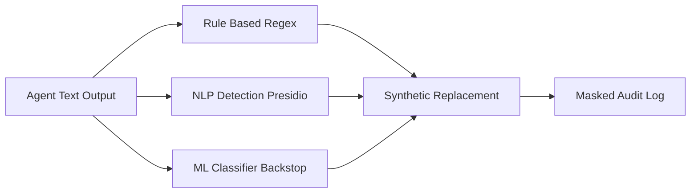

One of the most dangerous failure modes in healthcare AI is not the dramatic one. It is not the agent that goes rogue or the attacker who breaks the encryption. It is the quiet one: protected health information leaking into a log file, an error message, or a training dataset where it was never supposed to be. A stack trace that prints the patient record. A debug line that captures the full prompt. A monitoring dashboard that ingests raw model inputs. Each of these is a PHI disclosure, and each happens by accident, in code nobody thought of as handling PHI. The defense is architectural: automated PHI detection and masking at the system boundary, applied *before* any PHI can enter a system that is not HIPAA-compliant. You do not ask developers to remember to scrub PHI. You build a wall that scrubs it for them.

## Three detection approaches, used together

There is no single technique that catches all PHI, so production healthcare systems combine three.

**Rule-based detection** uses regular expressions to catch structured identifiers: Social Security numbers, medical record numbers (MRNs), phone numbers, dates. It is fast, deterministic, and excellent for patterns with rigid shapes — and useless for anything unstructured, like a name buried in a free-text note.

**NLP-based detection** uses libraries and managed services that understand language. Microsoft's Presidio is the open-source workhorse here: a data-protection and de-identification SDK that detects and anonymizes sensitive entities across text, and supports healthcare-specific types such as NPI, MRN, and DEA numbers alongside dozens of general PII entities. It is a Python library, production-ready, and actively maintained. AWS Comprehend Medical is the managed counterpart — a HIPAA-eligible service that extracts medical entities (conditions, medications, anatomy, and PHI) from clinical text, which makes it useful precisely where regex fails: parsing unstructured clinical notes.

**ML classifiers** — for example a BERT model fine-tuned on a PHI dataset — catch contextual cases the first two miss, where whether a token is PHI depends on the surrounding sentence.

The recommendation for healthcare agent logs is not to pick one. It is to run an *ensemble*: regex for the structured slam-dunks, NLP for the linguistic cases, and an ML classifier as the contextual backstop. Each layer covers the others' blind spots, and the cost of a false negative — real PHI in a log — is high enough to justify the redundancy.

## Mask without destroying debuggability

Detection is only half the job; what you do with the detected PHI matters. The naïve approach replaces everything with `[REDACTED]`, which is safe but destroys your ability to debug — every log line becomes a row of black boxes, and you can no longer tell whether two events involved the same patient.

The better approach is **synthetic replacement**: swap each piece of real PHI for a realistic, consistent fake. A real name becomes a stable fake name (the same patient maps to the same pseudonym every time). A real date of birth becomes a shifted DOB, moved by one to five years. This preserves the *structure* and *relationships* in your data — you can still follow a patient through a workflow, still spot that an error recurs for one individual — without a single real identifier in the log. This is exactly the SURROGATE strategy that mature de-identification services use: replace identifiers with plausible pseudonyms and randomize number-based fields, keeping the data usable while making it non-identifying.

## Audit-trail-first: log the intent before the action

A particularly robust architecture inverts the usual order of operations. Instead of executing an agent action and then logging what happened, you log a PHI-masked summary of the intended action *first*, and only then execute. Call it an audit-trail-first pattern.

The payoff shows up exactly when things go wrong. If the action fails — the API times out, the claim is rejected, the agent crashes mid-step — the audit record already exists, and it shows precisely what was attempted, with the PHI masked, rather than leaving you to reconstruct a failed action from raw error output that may itself contain unmasked PHI. You get a complete, debuggable trail of intent that never depended on the action succeeding, and never wrote real PHI into the log. This style aligns naturally with formal AI-management frameworks such as ISO 42001, because it produces continuous, reviewable evidence of what every agent set out to do. HIPAA-compliant agentic platforms built around this idea treat the masked audit summary as the *first* artifact of every action, not an afterthought.

## Training data is PHI too

The masking discipline does not stop at logs. Production PHI must never be used to fine-tune a model without IRB approval and a data use agreement — full stop. The risk is memorization: a model trained on real records can later regurgitate them, turning your training pipeline into a slow PHI leak. The compliant path is to fine-tune on de-identified data, or on synthetic data generated to match the *distributions* of de-identified data rather than copying any real record. Treat your training corpus with the same suspicion as your logs: if real PHI can get in, assume it can get out.

## Putting it into practice

Build a PHI-masking boundary for one agent's logging path and prove it works.

1. Inventory every place your agent emits text that could contain PHI: structured logs, error/exception output, monitoring payloads, and any model-training data path.
2. Stand up a detection ensemble — regex for SSN/MRN/phone patterns, Presidio (or AWS Comprehend Medical for clinical notes) for NLP entities, and reserve a slot for an ML classifier as a contextual backstop.
3. Implement synthetic replacement, not blanket redaction: map each real identifier to a consistent fake (stable pseudonym names, DOB shifted ±1–5 years) so logs stay debuggable.
4. Adopt the audit-trail-first ordering: write the PHI-masked summary of an intended action before executing it, and confirm the record survives a forced failure.
5. Write a one-line policy banning production PHI in fine-tuning without IRB approval and a data use agreement, defaulting to de-identified or synthetic training data.

## Key takeaways

- Accidental PHI leakage into logs, errors, and training data is a top failure mode; the fix is automated detection and masking at the system boundary, before PHI reaches any non-compliant system.
- No single detector suffices — combine rule-based regex, NLP (Presidio, AWS Comprehend Medical), and ML classifiers as an ensemble so each covers the others' blind spots.
- Prefer synthetic replacement over blanket redaction: consistent fake names and shifted dates keep logs debuggable while removing all real identifiers.
- Presidio is an open-source, production-ready de-identification SDK supporting healthcare entities (NPI, MRN, DEA); AWS Comprehend Medical is the HIPAA-eligible managed option for clinical text.
- An audit-trail-first pattern logs the PHI-masked intent before executing, so failed actions still leave a clean, debuggable record and never write real PHI — and it aligns with ISO 42001.
- Never fine-tune on production PHI without IRB approval and a data use agreement; default to de-identified or distribution-matched synthetic data to avoid memorization leaks.
