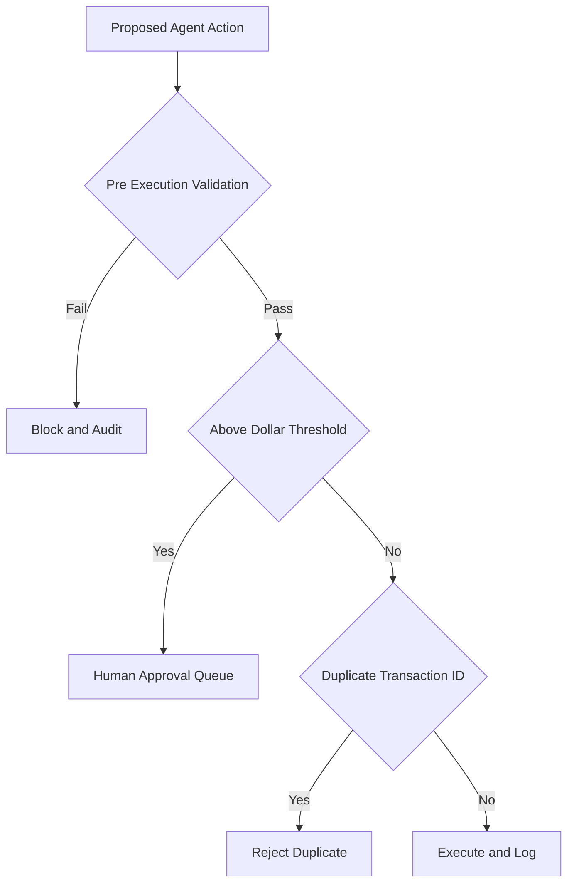

Healthcare AI agents are not toys, and their failures are not cosmetic. An agent that submits a claim to the wrong patient's insurance, generates a billing amount in error, or sends a message containing PHI to the wrong recipient has not produced a bug report — it has produced a potential HIPAA breach, a billing-fraud event, or both. The financial and patient harm is real, and it lands fast. So production safety for these agents is not about catching errors after they happen and apologizing. It is about architecture that prevents the harmful action from executing in the first place, and that contains the damage cleanly when prevention fails. Everything in this lesson is built on a single inversion: assume the agent will eventually try to do something wrong, and design the system so that trying is not the same as succeeding.

## Validate before you execute

Every agent action with an external consequence — submitting a claim, sending a patient message, making a payment, filing an appeal — must pass validation against a rule set *before* it executes. Not after. Pre-execution validation is the difference between an error you caught and an error you mailed to a patient.

Crucially, the validation step itself is logged as a separate audit event. This gives you a record not just of what the agent did, but of what it *checked* before doing it — which is exactly the evidence you need when a regulator or a patient asks how the system decided to act. Treat validation as a first-class, audited gate on the path to every irreversible action, not as an `if` statement buried inside the action handler.

## Circuit breakers and idempotency

Two patterns borrowed from financial and distributed systems engineering do most of the heavy lifting.

**Dollar-value circuit breakers** cap the financial blast radius of a runaway agent. An agent cannot submit a claim or a payment adjustment above a defined threshold — somewhere in the range of $500 to $5,000 depending on the agent's role — without human approval. The number is a judgment call, but the principle is not: automation errors scale, and a single buggy loop should never be able to create a large financial exposure unattended. The circuit breaker turns a potential catastrophe into a routine approval queue.

**Idempotency** defends against the quieter danger of duplication. Every claim submission, prior-authorization request, and communication must be idempotent: submitting it twice must produce the same result as submitting it once. Retry logic — network blips, timeouts, an over-eager error handler — is exactly the kind of thing that fires the same action multiple times, and a duplicate claim is its own compliance and billing problem. Implement this with transaction IDs and deduplication checks so the system recognizes a repeat and refuses to act on it twice.

## Plan the rollback before you need it

For every irreversible agent action, define the rollback path *in advance* — because the moment you need it is the worst moment to be inventing it. The rollback that exists varies by action. A claim submission can typically be voided within 24 hours at most clearinghouses, which gives you a real, if narrow, window to reverse a mistake. A patient communication, by contrast, cannot be recalled once sent — there is no undo on an email or a text that has left the building.

That asymmetry is itself a design instruction: the actions you cannot roll back demand the most validation *before* they fire, because for them, prevention is the only safety mechanism you have. Spend your validation budget where rollback is impossible.

## Incident response and change management

When prevention fails anyway, structured response contains the damage.

For a detected PHI breach inside the agent system, the sequence is: **immediate containment** — revoke the agent's credentials and stop processing, so the leak cannot widen while you investigate — followed by a **risk assessment** using HIPAA's four-factor breach analysis (the nature and extent of the PHI involved, who used or received it, whether it was actually acquired or viewed, and the extent to which the risk has been mitigated). That assessment drives a **notification decision**, escalated to your Privacy Officer within 24 hours as an internal containment deadline. From there, external notifications follow the regulatory breach-notification timeline — under the HIPAA Breach Notification Rule, individual and Secretary notifications must be made without unreasonable delay and no later than 60 days from discovery. Knowing that clock starts at *discovery* is exactly why fast internal escalation matters.

**Change management** closes the loop on the most common source of new failures: changes. Agent system-prompt edits, tool-permission changes, and model upgrades must be tested in staging against historical claim data before they reach production — a prompt tweak that looks harmless can silently change behavior across thousands of cases. Use A/B testing and have a human audit the divergent outputs, the cases where the new version disagrees with the old, before any full rollout. The divergences are where the regressions hide. Mature HIPAA-compliant agentic platforms gate every prompt, permission, and model change behind exactly this staging-and-audit process, because in healthcare a silent behavior change is a silent risk.

## Putting it into practice

Design the safety envelope for one production agent action before you ship it.

1. Pick one external-consequence action your agent performs (submit claim, send message, make payment, file appeal) and write the pre-execution validation rule set, logging the check as its own audit event.
2. Set a dollar-value circuit-breaker threshold appropriate to the agent's role and route anything above it to human approval.
3. Make the action idempotent: assign a transaction ID and add a deduplication check so a retry cannot double-submit.
4. Document the rollback path — void window for claims, or "no recall possible, validate harder" for communications — and match validation strength to how reversible the action is.
5. Write the incident-response runbook: containment (revoke credentials, stop processing) → four-factor risk assessment → Privacy Officer within 24 hours → external notification within the 60-day rule.
6. Define the change-management gate: staging tests against historical claim data plus human audit of divergent A/B outputs before any prompt, permission, or model change goes live.

## Key takeaways

- Healthcare agent failures cause real harm — wrong-patient claims, billing errors, misdirected PHI are potential HIPAA breaches and fraud events — so safety architecture must prevent harmful actions, not just report them.
- Every external-consequence action requires pre-execution validation against a rule set, logged as a separate audit event.
- Dollar-value circuit breakers ($500–$5,000 by role) cap financial blast radius by routing large actions to human approval; idempotency with transaction IDs and deduplication prevents duplicate claims from retries.
- Define rollback paths in advance — claims can often be voided within 24 hours, but sent communications cannot be recalled — and concentrate validation on the irreversible actions.
- Incident response runs containment → four-factor risk assessment → Privacy Officer within 24 hours internally → external notification within the HIPAA 60-day rule from discovery.
- Change management gates prompt, permission, and model changes behind staging tests on historical data and human audit of divergent A/B outputs before rollout.
