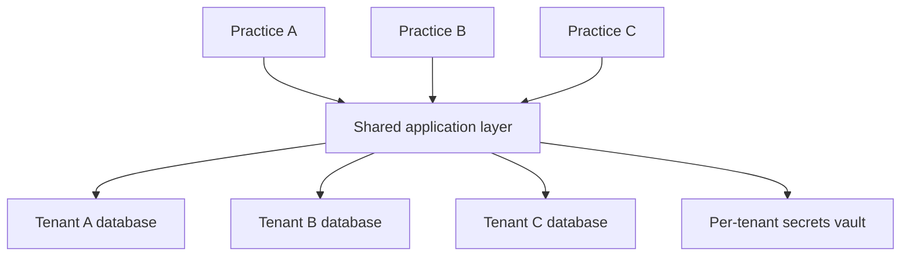

Building a Personal Medical Biller for one practice is an engineering exercise. Building it for ten thousand practices is an architecture problem — and the constraint that dominates that architecture is not performance or cost, it is isolation. Under HIPAA, the patient data belonging to Practice A can *never* be reachable by Practice B. That single invariant decides how you lay out databases, where you store credentials, and how you prove compliance to an auditor. A multi-tenant SaaS for healthcare AI agents has to share infrastructure efficiently across every tenant while keeping their data in completely separate compartments. The pattern that delivers both is a shared application layer sitting on top of per-tenant data stores — schema-per-tenant or, better, database-per-tenant.

## Choosing an isolation model

There are three places on the isolation spectrum, and the choice is a direct trade between cost and breach risk.

- **Shared database** — every tenant's rows live in the same tables, separated only by a `tenant_id` column. It is the cheapest model and the densest use of infrastructure, but it is also the highest-risk: a single missing `WHERE tenant_id = ?` clause in application code exposes one practice's PHI to another. For HIPAA-regulated data, that blast radius is unacceptable.
- **Schema-per-tenant** — tenants share a database instance but each gets its own schema. Isolation is enforced at the database permission layer, not in application logic, so a query authenticated as Tenant A's user literally cannot read Tenant B's schema. Moderate cost, moderate isolation. This is the practical floor for healthcare.
- **Database-per-tenant** — each practice gets its own database. Highest isolation, easiest to audit, and the cleanest compliance story, at the cost of more provisioning and operational overhead per tenant.

The recommendation for HIPAA-sensitive healthcare data is **database-per-tenant**, or **schema-per-tenant at the absolute minimum**. The deciding factor is auditability: when a database user for Practice A's data has no permission that could possibly touch Practice B's data, you are not asserting isolation in a code review, you are demonstrating it in the access-control configuration. That is the difference between telling an auditor your code is careful and showing them that cross-tenant access is impossible by construction.

## What lives inside a tenant

A "tenant" is a practice, and each tenant carries a well-defined data model that the architecture must hold separately:

- **Practice profile** — NPI, Tax ID, and the set of payer contracts the practice operates under.
- **Patient roster** — the MRN mapping that ties the practice's patients to claim state.
- **EHR integration credentials** — how the agent reads clinical data for that practice.
- **Payer portal credentials** — the logins the agent uses against each payer.
- **Agent configuration** — the per-tenant behavior of the Personal Medical Biller.
- **Billing and subscription data** — what the practice pays and for what.

Notice that some of this is data (rosters, profiles) and some of it is *secrets* (EHR and payer credentials). Those two categories want different homes, which is the subject of the next two sections.

## Connecting to many EHRs and many payers

No two tenants are the same on the integration surface. One practice runs Epic, the next Cerner, the next Athena or eClinicalWorks. The integration layer therefore cannot assume a single EHR — it must be a registry of connectors. The good news is that FHIR R4 gives you a standardized path: certified EHRs expose Patient, Encounter, Condition, and related resources through standard FHIR endpoints, so a single FHIR connector covers a large share of the certified market. The bad news is that legacy systems will still need bespoke connectors. Design the integration layer so adding a new EHR is adding a connector, not rewriting the agent.

Payer credentials are the more sensitive half. Each practice has different payer contracts and different portal logins, and those credentials must **never** sit in the shared application database. Store them encrypted in a per-tenant vault — HashiCorp Vault or AWS Secrets Manager scoped per tenant — so that the agent fetches a credential at the moment it acts and the secret is never co-located with another tenant's secret. This keeps the highest-value attack target out of the data plane entirely.

## Customization and the BAA chain

Two tenants running the same Personal Medical Biller should still behave differently, because their billing reality differs. A cardiology practice needs different specialty coding rules than primary care or orthopedics; a Medicare-heavy payer mix demands different handling than a commercial-heavy one; claim dollar thresholds and communication preferences vary by practice. All of this lives as **per-tenant agent configuration** — the shared agent code reads a tenant's config to decide how to behave, rather than forking the agent per customer.

Finally, compliance is layered, and the architecture has to make that layering explicit. Each tenant signs a **BAA with Autosapien** covering their patient data; Autosapien in turn holds **BAAs with its infrastructure providers** — AWS and Anthropic — covering the platform the data runs on. This is a chain: tenant → SaaS → infrastructure. Every link must be documented and kept current, because an auditor following PHI from a practice down to the model and the cloud must find an unbroken series of agreements. The multi-tenant architecture is not just a data-isolation design; it is the physical embodiment of that BAA chain.

## Putting it into practice

Sketch the tenant architecture for a 100-practice deployment of a HIPAA-compliant agentic platform.

1. Choose an isolation model and justify it: write one sentence defending **database-per-tenant** (or schema-per-tenant) over a shared database, citing auditability as the deciding factor.
2. List the six per-tenant data objects (practice profile, patient roster, EHR credentials, payer credentials, agent configuration, billing) and mark which two are *secrets* that belong in a per-tenant vault rather than the database.
3. Design the EHR integration layer as a connector registry: name at least three EHRs (Epic, Cerner, Athena) and note which can be reached via a single FHIR R4 connector versus a custom one.
4. Draw the BAA chain — tenant → Autosapien → AWS/Anthropic — and confirm each link is documented.

## Key takeaways

- HIPAA's hard invariant for multi-tenant SaaS is total isolation: Practice A's data must be unreachable by Practice B, and that constraint drives the whole architecture.
- The three isolation models trade cost against breach risk — shared database (cheap, risky), schema-per-tenant (moderate), database-per-tenant (strongest, most auditable); healthcare needs database-per-tenant, or schema-per-tenant at minimum.
- Each tenant holds a defined data model — practice profile, patient roster, EHR credentials, payer credentials, agent configuration, billing — and the credentials belong in a per-tenant vault, never the shared database.
- EHR integration is a connector registry: FHIR R4 standardizes access to certified EHRs (Epic, Cerner, Athena, eCW), while legacy systems still need custom connectors.
- Per-tenant agent configuration delivers specialty, payer-mix, and threshold customization on shared agent code rather than forking per customer.
- Compliance is a documented BAA chain — tenant → Autosapien → AWS/Anthropic — and the architecture must make every link explicit and maintained.
