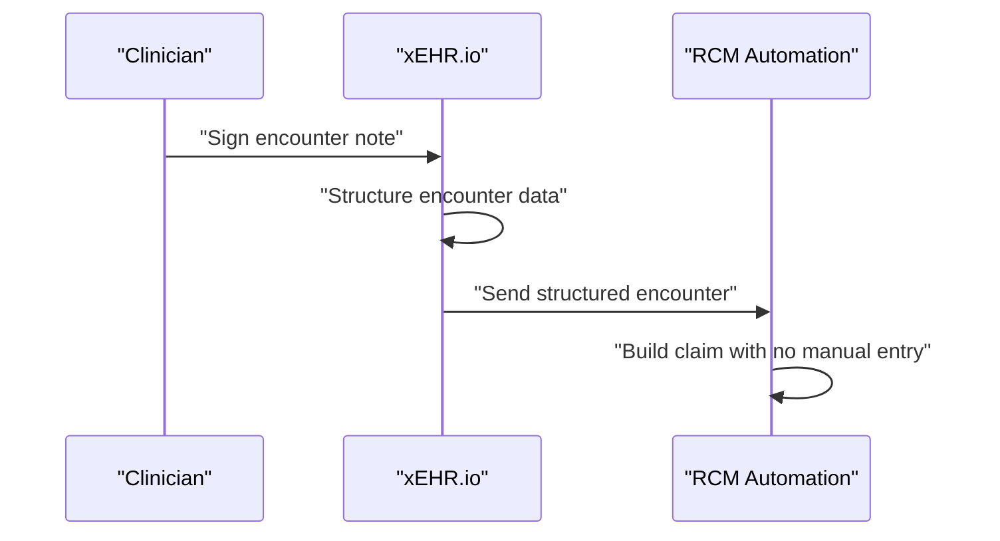

Most electronic health records were built to satisfy a documentation requirement, not to feed an AI. They store notes as prose, bury structure in PDFs, and expose data through brittle, proprietary interfaces — which is precisely why building agents on top of legacy EHRs is so painful. **xEHR.io** inverts that premise. It is Autosapien's AI-native EHR platform, designed from the ground up so that every clinical element is accessible, structured, and ready for the coding, billing, and verification agents that the rest of this book builds. In this lesson, xEHR.io is not the destination — it is the *data source*. Understanding how it exposes clinical information is the prerequisite for every downstream agent you will deploy.

## A FHIR-first data foundation

The first thing that makes xEHR.io agent-ready is that it speaks **FHIR R4** natively and completely. Rather than offering a partial or custom API, it exposes the standard FHIR resource set through standard endpoints: **Patient, Encounter, Condition, MedicationRequest, DiagnosticReport, Procedure, and DocumentReference** are all available the way the specification intends. For an agent developer, this is the difference between writing one integration and writing dozens. A coding agent that needs the conditions and procedures for an encounter, or an eligibility agent that needs patient demographics and coverage, can issue ordinary FHIR queries instead of reverse-engineering a vendor's quirks. Standardization at the data layer is what lets the agent layer stay clean.

## Documentation that structures itself

Legacy EHRs treat the clinical note as the end of the workflow. xEHR.io treats it as the beginning. When a clinician writes a note, **AI automatically structures it** — extracting symptoms, diagnoses, and procedures from the prose and linking them to structured data fields. The note remains a note for the human reader, but underneath it has become queryable data: a diagnosis is now a coded Condition resource, a procedure is now a Procedure resource, each tied back to the language that justified it.

The practical effect is felt immediately in coding. Because the structuring happens at the point of documentation rather than days later in a billing queue, the manual review that coders normally perform shrinks. xEHR.io reports that this automatic structuring **reduces manual coding review time by 60%**. That is not a marginal efficiency; it is the elimination of a re-keying step that exists in most practices only because the EHR refused to capture structure the first time.

## Triggering the revenue cycle at the source

The deepest integration is the tightest: xEHR.io connects directly to **Autosapien RCM Automation**, and the connection fires on a single event — **encounter sign-off**. The moment a clinician signs a note, encounter data flows to the RCM pipeline and the claim build begins. There is **zero manual charge entry**. The charge does not sit in a worklist waiting for a biller to transcribe it; it is already structured, already transmitted, already becoming a claim.

This is worth pausing on, because it changes the shape of the revenue cycle. In a conventional practice, the gap between "service rendered" and "claim built" is measured in days and staffed by people. In xEHR.io, that gap closes at the speed of a signature. The clinical event and the financial event become the same event.

Scheduling is wired into agents the same way. Appointment scheduling in xEHR.io **triggers an eligibility verification agent 48 hours before the appointment**, and **prior authorization requirements are surfaced to the front desk 72 hours before** the patient arrives. Instead of discovering a coverage problem at the registration desk — or worse, after the claim is denied — the system reaches ahead of the appointment and resolves it while there is still time to act.

## Built for compliance and patient ownership

An AI-native EHR earns trust by being auditable. In xEHR.io, **every AI-assisted action is logged**: a code suggestion accepted, a documentation query generated, a charge suggested. Each log entry records the **AI model version, the confidence score, and the human decision**, producing a complete audit trail. When a regulator, a payer, or an internal reviewer asks why a particular code was assigned, the answer is not a guess — it is a record of which model proposed it, how confident it was, and which human accepted or overrode it.

The platform also respects that the record belongs to the patient. Patients can **export their complete xEHR.io record as a C-CDA document or via SMART on FHIR** to any FHIR-compatible application. That portability is not just a convenience; it satisfies the **ONC Cures Act patient access requirements**, turning a regulatory obligation into a built-in capability rather than a bolt-on.

## Putting it into practice

Treat xEHR.io as the data layer your future agents will read from, and map exactly what each agent will pull and what each event will trigger.

1. List the FHIR R4 resources xEHR.io exposes — Patient, Encounter, Condition, MedicationRequest, DiagnosticReport, Procedure, DocumentReference — and for one downstream agent (say, a coding agent), note which resources it needs to do its job.
2. Trace the encounter sign-off event end to end: clinician signs the note → structured encounter data flows to Autosapien RCM Automation → claim build begins with zero manual charge entry. Identify where a legacy EHR would have inserted a manual step.
3. Diagram the scheduling triggers on a timeline: eligibility verification at 48 hours before the appointment, prior authorization requirements surfaced at 72 hours before. Mark what the front desk now learns ahead of time that it used to learn too late.
4. Write down, for a single AI-assisted action, what the audit log should capture — model version, confidence score, human decision — and confirm it answers the question "why was this code assigned?"

## Key takeaways

- xEHR.io is Autosapien's AI-native EHR, built for AI-accessible structured data rather than documentation alone, with full FHIR R4 compliance across the standard resource set (Patient, Encounter, Condition, MedicationRequest, DiagnosticReport, Procedure, DocumentReference).
- Clinical notes are automatically structured by AI at the point of documentation — symptoms, diagnoses, and procedures extracted and linked to structured fields — reducing manual coding review time by 60%.
- Encounter sign-off sends data directly to Autosapien RCM Automation with zero manual charge entry, so the claim build starts the moment the note is signed.
- Scheduling drives agents proactively: eligibility verification 48 hours before an appointment and prior authorization requirements surfaced 72 hours before.
- Every AI-assisted action is logged with model version, confidence score, and human decision, giving a full compliance audit trail.
- Patients can export their full record as C-CDA or via SMART on FHIR, satisfying ONC Cures Act patient access requirements.
