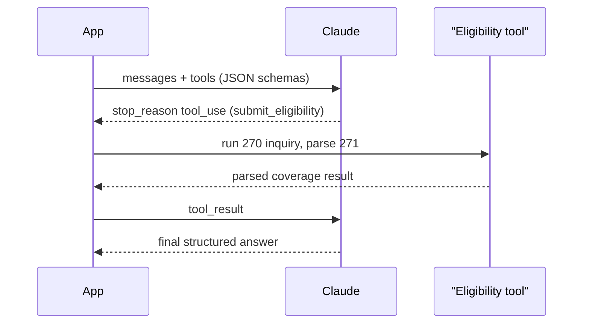

This is the hands-on build: a working eligibility Digital FTE, end to end. You will wire a Claude model to a small set of tools, submit a real HIPAA 270 eligibility request, parse the 271 response that comes back, and return a structured coverage answer with a human-escalation path for the cases the agent should not decide alone. The scope you wrote in the previous lesson becomes the system prompt; this lesson turns that spec into a running loop. Throughout, use synthetic or test data only — never real PHI.

## The architecture: a reasoning core plus deterministic tools

The agent has two halves that should stay strictly separated. The reasoning core is a Claude model: it reads the patient's context, decides what to do, and produces the final structured answer. The tools are small, deterministic functions that *act*: they call an eligibility API, read patient and insurance context, and write an audit log. The model never talks to a payer directly and never invents a coverage fact — it orchestrates, and the tools carry out the work and return real data.

This split is what makes the agent both correct and compliant. Because the model only sees what a tool explicitly returns, it cannot fabricate a deductible or hallucinate an active plan; and because each tool is a narrow, auditable function, you can log and review every action it takes.

## Three small tools, defined as JSON schemas

Keep the tool set minimal and each tool single-purpose. For this agent, three tools are enough:

- **`submit_eligibility`** — takes the patient's member ID, date of birth, payer, provider NPI, and service type codes; submits a 270 to a clearinghouse and returns the *parsed* 271 as structured fields (coverage active/inactive, copay, deductible remaining, plan, prior-authorization-required flag). The payer-specific X12 parsing lives inside this tool, hidden from the model.
- **`get_patient`** — reads patient and insurance context from the EHR given a patient/encounter ID, so the model never needs full PHI in its prompt.
- **`log_result`** — writes an audit record: inputs, outputs, the decision, and a timestamp.

The design principle is that the model decides *when* to call each tool, and the tool encapsulates the messy details — the payer connection, the X12 envelope, the database write. Small and deterministic beats clever and broad.

## The current Anthropic tool-use loop

Build against the current Anthropic tool-use API. You define each tool as a JSON schema in the request's `tools` parameter — a name, a description, and an input schema describing the arguments. The loop then runs like this: you send the conversation to the model; the model responds, and when it wants to act it returns `stop_reason: "tool_use"` along with one or more `tool_use` blocks naming the tool and its arguments. Your code executes that tool, then sends the output back to the model as a `tool_result`. The model may call another tool or, when it has what it needs, return its final answer. You loop — call tool, feed result back — until the model stops requesting tools and emits the structured coverage result.

## The core transaction: 270 out, 271 in

Inside `submit_eligibility`, the real healthcare work happens. The tool submits a HIPAA **270** eligibility request — most easily through a multi-payer network like the **Availity** API rather than hand-rolling X12 — and receives the **271** response. It parses that 271 into a small, clean structure: is coverage **active or inactive**, what is the **copay**, how much **deductible** remains, what **plan**, and is **prior authorization required**. That normalized object is what the tool returns to the model. The model then reports only those facts. This is the grounding guarantee: coverage answers come from the 271, full stop.

## Grounding, guardrails, and audit

Two rules keep the agent trustworthy. First, **never let the model invent coverage facts** — it reports only what the 271 returns, and a low-confidence or unparseable response is not a guess, it is an escalation. Wire an explicit path so that when the tool cannot cleanly parse the payer response, or confidence is below your threshold, the case routes to a human instead of producing an answer. Second, **audit-trail-first**: every tool call and every decision is logged via `log_result` with inputs, outputs, and timestamps, for HIPAA accountability and for the evaluation you will run in shadow mode. The logs are not an afterthought — they are how you later prove the agent works and find the edge cases it missed.

## Putting it into practice

Build the eligibility agent end to end on test data.

1. Define the **three tools as JSON schemas**: `submit_eligibility` (returns a parsed 271), `get_patient`, and `log_result`.
2. Write the **system prompt** from your SKILL.md-style scope: role, the tools it may call, the required structured output, and the escalation rule.
3. Wire the tools to a **Claude model via tool use**: send `tools` in the request, watch for `stop_reason: "tool_use"`, execute the named tool, and feed the result back as a `tool_result`, looping until the model returns its final answer.
4. Run an **end-to-end verification** on a synthetic test patient: the model calls `get_patient`, then `submit_eligibility`, parses the 271, and returns active/inactive coverage with copay and deductible remaining.
5. Add the **escalation path**: low-confidence or unparseable 271 responses route to a human instead of producing a coverage answer.
6. Confirm every step wrote an **audit record** via `log_result`.

You now have a running eligibility Digital FTE — the loop that the production checklist in the next lesson will harden.

## Key takeaways

- Keep two halves separate: a Claude model as the reasoning core that decides *when* to act, and small deterministic tools that *do* the acting and return real data.
- Three tools are enough — `submit_eligibility` (parsed 271), `get_patient`, `log_result` — each single-purpose, with payer-specific X12 details hidden inside the tool.
- The current Anthropic loop: define tools as JSON schemas in `tools`, the model returns `stop_reason: "tool_use"` with `tool_use` blocks, you execute and send back a `tool_result`, looping until the final answer.
- The core transaction is a HIPAA 270 out and a 271 back (easiest through the Availity API), parsed into active/inactive, copay, deductible remaining, plan, and PA-required.
- Ground every answer in the 271 — the model never invents coverage facts, and low-confidence or unparseable responses escalate to a human rather than guess.
- Log every tool call and decision with inputs, outputs, and timestamps; the audit trail is both your HIPAA record and your source of edge cases.
