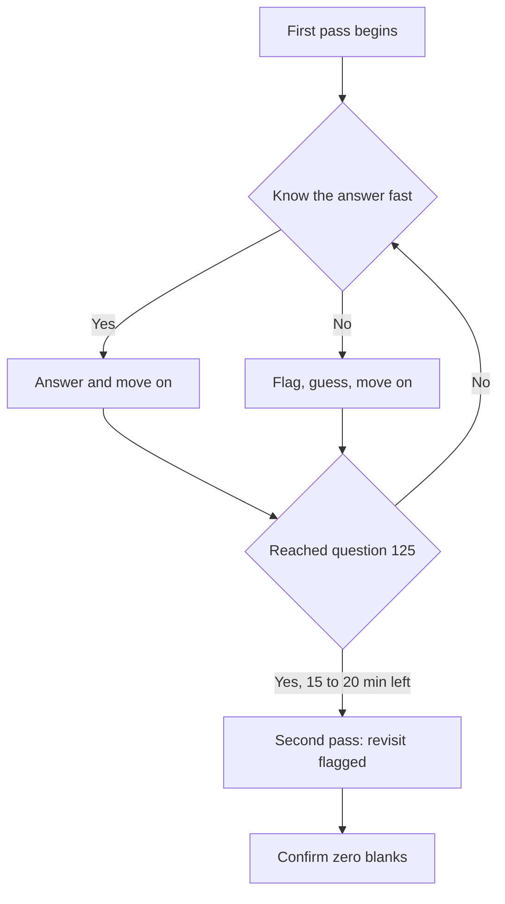

Knowing the material is only half the battle on the CEHRS exam. The other half is knowing how the test itself works — how the National Healthcare Association (NHA) writes its questions, how to budget your time, and what to do when you genuinely do not know the answer. The exam is 125 questions in 2 hours and 40 minutes, which works out to about 77 seconds per question. That sounds tight, but with a deliberate approach it is more than enough time. This lesson turns the format into a strategy you can execute on test day.

## The three question types — and why application dominates

NHA writes questions at three cognitive levels, and recognizing which one you are facing changes how you attack it. **Knowledge** questions ask you to recall a definition or a fact straight from memory. **Application** questions hand you a short scenario and ask you to apply a rule to it. **Analysis** questions go a step further: you evaluate a situation and choose the *best* course of action among several that may all be partly correct.

The single most important thing to internalize is that **most CEHRS questions are application-level.** You will rarely be asked "What does HIPAA stand for?" Instead you will be told what a clerk did and asked whether it was permissible. This means rote memorization alone will not carry you — you have to practice taking a fact and bending it to fit a specific situation. When you study, do not just memorize that the minimum-necessary standard exists; rehearse spotting when a scenario violates it.

## Answer everything — there is no penalty for guessing

This rule is simple and non-negotiable: **the CEHRS exam imposes no penalty for guessing, so you must never leave a question blank.** A blank answer is a guaranteed zero; even a wild guess gives you a chance. If you are uncertain, the move is always to eliminate what you can and commit to the most defensible remaining option.

That defensibility matters. When two answers look plausible, ask which one you could justify to a compliance officer. In healthcare, the safest, most patient-protective, most rule-abiding choice is usually the intended answer.

## Elimination strategies that work across domains

Most CEHRS questions can be narrowed to two choices by deleting the answers that break a known rule. Two domain-specific patterns recur often enough to memorize:

- **HIPAA questions:** eliminate any answer that violates patient rights or that shares more than the minimum necessary information. If an option discloses more than the situation requires, it is almost always wrong.
- **Documentation questions:** eliminate any answer that involves deleting or altering documentation without an addendum. The legal record is never erased or overwritten — corrections are made by adding to it, never by removing.

Internalizing these two filters alone will rescue you on a meaningful slice of the exam, because they instantly disqualify the trap answers NHA likes to plant.

## Read the keywords — they tell you what is being asked

NHA salts its questions with qualifier words that signal the question wants a *priority*, not just any correct action. Watch for **"most appropriate," "first," "best," and "should."** When you see them, the test is acknowledging that several answers may be technically acceptable and asking which one comes first or matters most. Do not stop at the first correct-looking option; find the one that is correct *and* highest-priority.

For scenario questions, use a deliberate reading order: **read the last sentence first** so you know exactly what is being asked, then go back and read the scenario for the relevant facts. This keeps you from absorbing details that do not matter and, just as importantly, stops you from reading in assumptions the question never stated. If a fact is not on the page, it does not exist for the purposes of your answer.

## Pacing: a two-pass approach

The clock is a tool, not a threat, if you manage it. The proven method is a two-pass strategy. On the **first pass**, answer everything you know quickly, and **flag any difficult question and move on** rather than burning two minutes early. On the **second pass**, return to your flagged questions with the time you banked. Aim to have all 125 questions answered with **15 to 20 minutes remaining** so you can review flagged items and confirm nothing was left blank. At roughly 77 seconds per question, finishing early is entirely realistic if you refuse to get stuck.

## Putting it into practice

1. Take a short practice set and label each question knowledge, application, or analysis. Confirm for yourself that application dominates, and notice how that changes your reasoning.
2. Drill the two elimination filters until they are automatic: for HIPAA, "does this share more than minimum necessary or violate a patient right?"; for documentation, "does this delete or alter the record without an addendum?"
3. Practice the last-sentence-first reading order on every scenario question for a full study session until it becomes a habit.
4. Run a timed set and enforce the rule that any question taking longer than about 77 seconds gets flagged and skipped — then clear the flags in a second pass.
5. Finish every practice exam with a deliberate sweep to ensure zero blank answers, because there is no penalty for guessing.

## Key takeaways

- The CEHRS exam is 125 questions in 2 hours 40 minutes — about 77 seconds each — and most questions are application-level, asking you to apply a rule to a scenario rather than recall a bare fact.
- There is no penalty for guessing: never leave a question blank; eliminate what you can and choose the most defensible answer.
- Two elimination filters cover a lot of ground — for HIPAA, cut answers that exceed minimum necessary or violate patient rights; for documentation, cut answers that delete or alter the record without an addendum.
- Keywords like "most appropriate," "first," "best," and "should" signal the question wants the priority action, not just any correct one.
- For scenarios, read the last sentence first, then the facts; never read in assumptions that are not stated.
- Use a two-pass strategy: flag and skip hard questions, finish all 125 with 15 to 20 minutes to spare, and use that time to clear flags and confirm no blanks.
