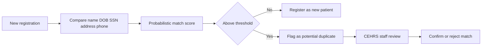

Every patient encounter begins with a question that sounds trivial but is anything but: *who is this person, and have we seen them before?* The database that answers it is the **Master Patient Index (MPI)**, and it is the most critical database in any health system. Get the MPI right and clinical data, billing, and legal records all line up under one identity. Get it wrong and you risk wrong-patient medical errors, billing fraud, and HIPAA violations. As a CEHRS specialist, you are an MPI custodian — and the exam treats this material as core identity-management knowledge.

## What the MPI actually does

The MPI exists to do one thing precisely: assign a unique **Medical Record Number (MRN)** to each patient and link every encounter that patient ever has back to that single identity. A patient who visits the emergency department in March, the cardiology clinic in June, and the lab in September should map to *one* MRN, so that any provider pulling the chart sees the complete, unified picture — every medication, every allergy, every prior result.

When a single hospital becomes a multi-facility health system, the index has to grow with it. That expanded version is the **Enterprise MPI (EMPI)**, which extends identity matching across multiple facilities within the network. The EMPI is what keeps a patient's identity consistent as they move between the system's hospitals, clinics, and ambulatory centers. The memory hook the exam rewards: *MPI = one facility; EMPI = the whole enterprise.*

## The two errors that define MPI work: duplicates and overlays

Almost everything the CEHRS specialist does in MPI maintenance comes down to preventing or fixing two specific error types, and the exam loves to test the difference.

A **duplicate** occurs when the *same patient* is registered as two separate people — two MRNs for one human being. The danger is silent fragmentation: the patient's clinical data splits across two records, so a provider looking at one of them sees an incomplete medication list, missing allergies, and a partial history. Nothing looks obviously broken, which is exactly what makes duplicates dangerous.

An **overlay** is the opposite and far more dangerous: *two different patients'* records are merged incorrectly into one. Now one person's data sits inside another's chart, which can lead directly to the wrong patient receiving the wrong treatment. Because of that potential for harm, an overlay must be reported as a **patient safety event**, not quietly corrected. If you remember nothing else, remember this contrast: *a duplicate splits one patient in two; an overlay fuses two patients into one — and the overlay is the one that can kill someone.*

## How the system catches problems before you do

You are not expected to spot duplicates by reading every chart. Modern registration systems run **duplicate-detection algorithms** that compare identifying fields — name, date of birth, Social Security number, address, and phone — using **probabilistic matching**. Rather than demanding an exact match, probabilistic matching scores how likely two records describe the same person, accounting for typos, nicknames, and transposed digits. The system flags *potential* duplicates above a confidence threshold, and CEHRS staff review those flagged candidates to confirm or reject the match. The human review step matters: an algorithm proposes, but a trained specialist decides.

The detection-and-review flow keeps a human in the loop:

## Keeping the index clean over time

An MPI is never "done." It degrades constantly as new registrations introduce fresh errors, so health systems run ongoing **deduplication** — periodic MPI cleanup projects that find and resolve accumulated duplicates. The scale is real: most large health systems carry a **3–8% duplicate rate**, while the **industry-standard target is below 2%.** Those numbers are worth memorizing as a range, not a single figure — the exam may ask you to recognize whether a stated duplicate rate is acceptable. A system sitting at 5% has room to improve; one driven down under 2% is performing to standard.

## Putting it into practice

Turn the duplicate-versus-overlay distinction into a reflex you can apply under exam pressure.

1. Write the two error types on a card with a one-line definition each: duplicate = one patient, two MRNs; overlay = two patients, one record.
2. Next to the overlay, write **"patient safety event — report it"** in capital letters, because that is the action the exam expects.
3. List the five fields a detection algorithm compares — name, DOB, SSN, address, phone — and note that the matching is *probabilistic*, not exact.
4. Memorize the maintenance numbers as a story: real-world systems run 3–8% duplicates; the goal is under 2%; the fix is ongoing deduplication.
5. Self-test: given a scenario ("two charts for the same patient" versus "one chart with two patients' data"), name the error and the required response without looking.

## Key takeaways

- The MPI assigns a unique MRN to every patient and links all of their encounters to one identity; the EMPI extends this across all facilities in a health system.
- A duplicate is the same patient registered as two MRNs, fragmenting clinical data; an overlay is two patients merged into one record — the most dangerous MPI error and a reportable patient safety event.
- Duplicate detection uses probabilistic matching on name, DOB, SSN, address, and phone; CEHRS staff review the candidates the system flags.
- Most large health systems run a 3–8% duplicate rate; the industry-standard target is below 2%, maintained through regular deduplication projects.
- CEHRS specialists are MPI custodians: identity errors here cascade into clinical safety, billing, and HIPAA consequences.
