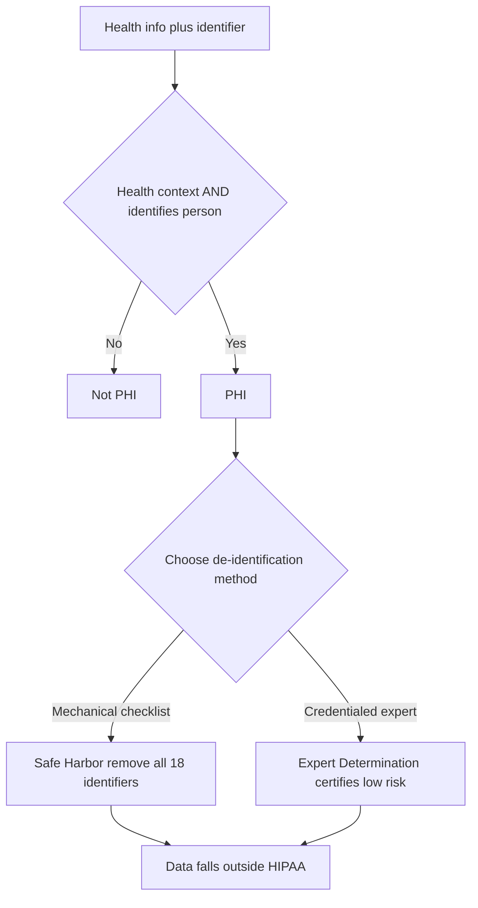

Almost every privacy question on the CEHRS exam traces back to a single concept: what counts as Protected Health Information, and what does not. Get this wrong and the rest of HIPAA becomes guesswork. PHI is individually identifiable health information held by a covered entity or business associate, and the Privacy Rule does something unusually concrete for a federal regulation — it gives you an exact list of 18 identifiers that turn ordinary health information into protected information. Strip all 18 away, and the data is no longer PHI at all. This lesson teaches the two-part test, the full list, and the two ways to legally de-identify a record.

## The two-part test for PHI

Before memorizing the list, internalize the logic. Information is PHI only when **two elements are both present**: first, it relates to health, the provision of care, or payment for care; and second, it identifies the individual — or could reasonably be used to identify them. Both halves must be true. A diagnosis floating with no name attached is not PHI. A name with no health context is not PHI. Put them together — "John Smith, lung cancer" — and you have PHI.

The exam likes to test the edges of this test, so hold the rule tightly: *health context plus identifiability equals PHI.* If either element is missing, HIPAA's protections do not attach.

## The 18 identifiers

The Privacy Rule names exactly 18 categories of identifiers. The exam expects you to recognize them, so group them into clusters rather than memorizing a flat list of 18:

- **The obvious personal ones:** name, geographic data smaller than a state (this includes ZIP code), and all dates tied to the individual — admission, discharge, death — **except birth year**.
- **Contact information:** phone, fax, email.
- **Government and account numbers:** Social Security number, medical record number, health plan beneficiary number, account number, certificate or license number.
- **Physical and digital identifiers:** vehicle identifiers, device identifiers, URLs, IP addresses, biometric identifiers, full-face photographs, and finally a catch-all — **any other unique identifying number or characteristic**.

A few of these trip up test-takers. **Geographic data anything smaller than a state** counts — so a ZIP code is an identifier, but a state alone is not. For **dates**, the year of birth is allowed to remain, but specific dates connected to the person are identifiers. And the final catch-all means the list is not as finite as it looks: anything that uniquely points to one person qualifies.

## Two ways to de-identify

Remove the identifiers correctly and the data falls outside HIPAA entirely. The Privacy Rule recognizes **two methods**, and the exam tests the distinction between them.

**Method 1 — Safe Harbor.** Remove all 18 identifiers, *and* have no actual knowledge that the remaining information could identify someone. There is one numerical rule to memorize here: **ZIP codes must be generalized to the first 3 digits**, and even then only if the population of that 3-digit ZIP area exceeds 20,000 people. If it does not, the geographic data must be reduced further. Safe Harbor is mechanical — follow the checklist and you are done.

**Method 2 — Expert Determination.** A qualified statistician applies recognized methods and certifies that the **risk of re-identification is very small**. This route is more flexible than Safe Harbor — it can retain more useful data — but it requires a **credentialed expert**, which Safe Harbor does not. Memory hook: *Safe Harbor is a checklist; Expert Determination is a credential.*

## The gray areas: email and incidental disclosures

Two practical scenarios surface repeatedly, and both have nuanced answers worth knowing.

**PHI in email.** Email is permitted if the patient consents to the risk — patients are allowed to accept the risk of unencrypted communication. But when PHI travels over the internet, it **must be encrypted**, which is why most organizations route patient messaging through a secure portal like MyChart rather than ordinary email. The exam wants you to know email is not banned; it is conditional on consent and encryption.

**Incidental disclosures.** HIPAA does not demand a soundproof, leak-proof environment. It **permits incidental disclosures** — such as another patient overhearing a conversation — as long as **reasonable safeguards** are in place. A verbal confirmation at a nurses' station does not violate HIPAA if reasonable precautions were taken. The test here is reasonableness, not perfection.

## Putting it into practice

Use the lab scenario to drill the classification reflex you will need on exam day. For each data element, decide whether it is (a) PHI — and which of the 18 identifiers applies, (b) de-identified data safe to use, or (c) a limited data set requiring a data use agreement.

1. **Patient name + diagnosis** — PHI. Name is identifier #1, and the diagnosis supplies the health context. Both halves of the test are satisfied.
2. **Age 67 + ZIP 90210 + lung cancer** — PHI. The 5-digit ZIP is geographic data smaller than a state, an identifier; combined with the diagnosis it is identifiable health information. Generalizing the ZIP to 3 digits would be the de-identification step.
3. **IP address + login time** — the IP address is identifier #16. Paired with health-system access it points toward PHI; standing alone it is an identifier without health context.
4. **Death date + cause** — PHI. A death date is a date tied to the individual (an identifier), and the cause supplies health context.
5. Now reverse the exercise: for each PHI element, state what removal or generalization would de-identify it under Safe Harbor, and which scenarios might instead justify Expert Determination.

## Key takeaways

- PHI requires **both** elements: it relates to health, care, or payment for care, **and** it identifies the individual or could reasonably identify them. Miss either and it is not PHI.
- There are exactly **18 identifiers** — including the often-missed ones: geographic data smaller than a state (ZIP counts), dates tied to the individual (birth *year* is allowed), IP addresses, biometrics, full-face photos, and a catch-all for any unique identifier.
- **Safe Harbor** de-identification removes all 18 identifiers with no actual knowledge of re-identifiability; ZIP codes generalize to 3 digits only if the area population exceeds 20,000.
- **Expert Determination** lets a credentialed statistician certify that re-identification risk is very small — more flexible than Safe Harbor but requires an expert.
- Email with PHI is allowed with patient consent but must be **encrypted** over the internet; **incidental disclosures** are permitted when reasonable safeguards are in place.
