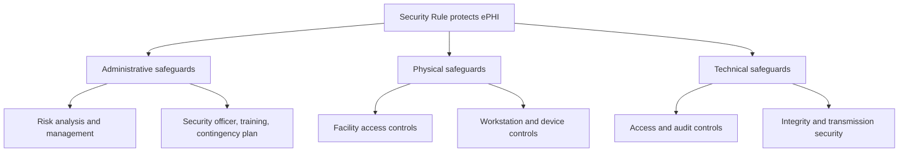

The Privacy Rule answers the question of *who* may see protected health information. The Security Rule answers a different one: *how* electronic protected health information — ePHI — is actually protected from being stolen, altered, or destroyed. The Rule does not hand you a checklist of products to buy. Instead, it organizes everything into three safeguard categories — administrative, physical, and technical — and insists that all three be present. Drop any one category and you are out of compliance, no matter how good the other two look. The exam tests this structure relentlessly, so the first job is to make the three categories, and what lives inside each, second nature.

## Administrative safeguards: the policies and people

Administrative safeguards are the **policies and procedures** that govern how an organization manages security — the human and managerial layer. They are the largest category and, on the exam, the most heavily weighted.

The cornerstone is the **security management process**, which has two halves: **risk analysis** and **risk management**. Risk analysis is required by HIPAA and means systematically identifying *where ePHI lives*, the *threats* to it, the *vulnerabilities* that could be exploited, and the *current controls* already in place. This is the single most important administrative obligation, and there is a memory hook worth burning in: **failure to conduct a risk analysis is the most commonly cited HIPAA violation.** If a question describes an organization that "never assessed its risks," it is pointing here.

The rest of the administrative category fills out the management picture: an **assigned security officer** (a named person accountable for security), **workforce training**, **information access management** (deciding who gets access to what), and a **contingency plan** built from three parts — **data backup, disaster recovery, and emergency mode operation**. Think of administrative safeguards as everything written in a binder and owned by a person.

## Physical safeguards: the building and the hardware

Physical safeguards protect the **tangible things** — buildings, server rooms, workstations, laptops, and media. If administrative safeguards are the binder, physical safeguards are the lock on the door.

Three groups to remember:

- **Facility access controls** — badge readers, locked server rooms, visitor logs. These keep unauthorized people physically away from the systems that hold ePHI.
- **Workstation use policies** — screen locks, positioning monitors away from public view, and the rule that PHI does not sit on unsecured workstations.
- **Device and media controls** — encrypted laptops, mobile device management, and procedures for disposing of or reusing drives so old ePHI cannot be recovered.

The exam likes to test whether you can sort a control into the right bucket. A *badge reader* is physical; a *training program* is administrative; an *automatic logoff* is technical. Practice the sorting and the questions become easy.

## Technical safeguards: the controls inside the system

Technical safeguards are the protections **built into the systems themselves** — the automated controls that operate without a human in the loop. There are four to know:

- **Access controls** — **unique user IDs and passwords** so every action ties to one person, plus **automatic logoff** that ends idle sessions.
- **Audit controls** — **logging all access to ePHI** so you can later reconstruct who saw what and when.
- **Integrity controls** — mechanisms such as **hash verification** to detect whether data has been tampered with or altered.
- **Transmission security** — **encryption for ePHI in transit** so data intercepted on the wire is unreadable.

A useful hook: technical safeguards are the things a computer does automatically; administrative safeguards are the things people decide and document.

## Required vs. addressable, and the encryption question

One distinction the exam reliably tests is **required versus addressable**. A **required** safeguard must be implemented, full stop. An **addressable** safeguard must be **implemented OR** the entity must **document why implementing it is not reasonable and what equivalent alternative it put in place instead.** "Addressable" never means "optional" — it means "implement it, or justify an equivalent in writing." A question that frames addressable as "you can skip it" is wrong.

Encryption is where this gets practical. **HIPAA does not specify an encryption algorithm.** It points to guidance: **NIST recommends AES-256 for data at rest and TLS 1.2 or higher for data in transit.** The payoff is one of the most testable facts in the whole domain: **if an encrypted device is lost or stolen, no breach notification is required**, because properly encrypted ePHI is considered unreadable and therefore not "compromised." Encryption is the safe harbor that turns a potential breach into a non-event.

## Putting it into practice

Turn the three categories into a sorting drill you can run from memory.

1. Draw three columns labeled **Administrative, Physical, Technical.** Under each, write its defining sentence: policies/people, building/hardware, controls-inside-the-system.
2. Fill in the signature items: Administrative = risk analysis + risk management, security officer, training, contingency plan; Physical = facility access, workstation use, device/media controls; Technical = access controls, audit controls, integrity, transmission security.
3. Write the rule on a flashcard: **risk analysis is required, and skipping it is the most-cited violation.** On the back, write **required vs. addressable** in your own words.
4. Add an encryption card: no mandated algorithm, NIST suggests AES-256 (rest) and TLS 1.2+ (transit), and **encrypted lost device = no breach notice.**
5. Self-test by sorting ten controls (badge reader, password, screen lock, training, audit log, locked server room, automatic logoff, backup plan, hashing, TLS) into the right column without looking.

## Key takeaways

- The Security Rule protects ePHI through **three safeguard categories — administrative, physical, and technical** — and all three must be present for compliance.
- **Administrative** = policies and people: the security management process (risk analysis + risk management), security officer, workforce training, information access management, and a contingency plan (backup, disaster recovery, emergency mode).
- **Risk analysis is required**, and **failing to conduct one is the most commonly cited HIPAA violation** — the single highest-yield fact in this lesson.
- **Physical** = facility access controls, workstation use policies, and device/media controls; **Technical** = access controls (unique IDs + automatic logoff), audit controls, integrity (hash verification), and transmission security (encryption in transit).
- **Required** safeguards must be implemented; **addressable** ones must be implemented or justified in writing with an equivalent alternative — addressable is never optional.
- HIPAA mandates no specific algorithm; **NIST recommends AES-256 at rest and TLS 1.2+ in transit**, and a **lost or stolen encrypted device requires no breach notification.**
