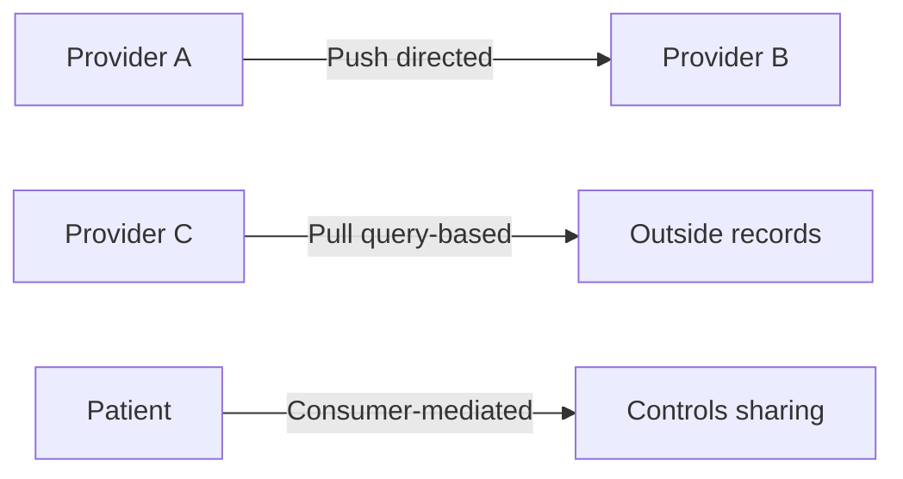

A FHIR API exposes one organization's data, but connected care across the country needs something larger: networks that link thousands of organizations so a record created in one hospital can be found and retrieved in another. Health Information Exchanges (HIEs) are the organizations that make that sharing happen, and they range from a single regional exchange serving one metropolitan area to national frameworks that stitch entire health systems together. For a CEHRS specialist, this is not abstract infrastructure — many of you will serve as HIE coordinators, managing how your facility connects, what it sends, and how patient consent is honored. The exam expects you to know the exchange models and the major national networks by name.

## The three HIE exchange models

Every HIE fits one of three models, and the exam tests them by description. The trick is to think about the *direction* the data moves.

- **Directed exchange** is a *push.* One provider sends information directly to another, like secure email for labs and referrals. Think of it as handing a document to a named recipient.
- **Query-based exchange** is a *pull.* One provider looks up and retrieves records from another organization — the classic "this patient was treated across town; let me find their chart" scenario.
- **Consumer-mediated exchange** puts the **patient in control** of the sharing. The patient decides what gets shared and with whom.

A clean memory hook: push (directed), pull (query), patient (consumer-mediated). If a question describes a doctor *sending* a referral, that is directed; if it describes a doctor *looking up* an outside record, that is query-based.

## Directed exchange and the Direct Protocol

Directed exchange is the most common model in **transitions of care.** The everyday examples are a referral to a specialist with records attached, or a discharge summary sent to the patient's primary care provider. The technology underneath is the **Direct Protocol**, which is essentially **SMTP-based secure email built for healthcare.**

The reason directed exchange dominates care transitions is that the sender already knows exactly who the recipient is — there is no searching involved, just a secure delivery to a known address. On the exam, connect *directed exchange* and the *Direct Protocol* and the phrase *secure email for healthcare*; they travel together.

## Carequality and CommonWell — the national networks

Two national efforts are the headline names to know, and the exam may ask you to distinguish them.

**Carequality** is a national interoperability *framework* that connects thousands of organizations and enables **query-retrieve** across health systems. The key fact is its breadth of participation: **Epic Care Everywhere, CommonWell, and most state HIEs** all participate in Carequality. Picture it as the common rulebook that lets otherwise separate networks talk to one another.

**CommonWell Health Alliance** is a health IT *industry group* — founded by vendors including **Cerner, Allscripts, and Athena** — that built a national network focused on **patient identity matching and record sharing.** Crucially, CommonWell is **interoperable with Carequality**, so the two are partners rather than rivals. The distinction worth holding: Carequality is the framework/agreement; CommonWell is a vendor-founded network that connects through it, with a particular strength in matching patients across organizations.

## State HIEs and their role

Beneath the national layer, **each state has at least one HIE.** The examples named in your material are **NY eHealth, the Texas Health Services Authority, and CalHIE.** These state exchanges are described as *critical for Medicaid programs and public health reporting* — they are how state agencies receive the data they need for population health and program administration.

For the exam, you do not need to memorize every state's exchange, but you should recognize that state HIEs exist universally, that they sit below the national networks, and that their special importance lies in Medicaid and public health reporting. If a scenario involves a state Medicaid program needing clinical data, a state HIE is the likely conduit.

## Consent models in HIEs

How a patient's records flow through an HIE depends on the consent model, and this **varies by state.** There are two models to contrast:

- **Opt-in:** the patient must *actively consent* before their records are shared. Nothing flows by default.
- **Opt-out:** records are shared *unless the patient objects.* Sharing is the default.

A subtle but exam-relevant point: **HIPAA permits both models** under the *treatment* permissible use. In other words, the choice between opt-in and opt-out is a state-law and policy decision, not a HIPAA prohibition — HIPAA already allows treatment-related disclosures, so the HIE's consent model is layered on top of that permission. The memory hook is simple: opt-*in* means the patient must say *yes first*; opt-*out* means sharing happens until the patient says *no.*

## Putting it into practice

1. Build a three-column table of HIE models — directed (push), query-based (pull), consumer-mediated (patient-controlled) — with one example use case in each column. Practice classifying scenarios by the direction of the data.
2. Memorize the directed-exchange chain: most common in *transitions of care*, used for *referrals and discharge summaries*, runs on the *Direct Protocol* (secure SMTP-based email).
3. Write a two-line distinction between Carequality (national framework enabling query-retrieve; Epic Care Everywhere, CommonWell, and most state HIEs participate) and CommonWell (vendor-founded — Cerner, Allscripts, Athena — focused on patient identity matching; interoperable with Carequality).
4. Make an opt-in versus opt-out card: opt-in = consent required first; opt-out = shared unless the patient objects; HIPAA allows both under the treatment permissible use.

## Key takeaways

- The three HIE models are **directed** (push — secure delivery to a known recipient), **query-based** (pull — looking up outside records), and **consumer-mediated** (the patient controls sharing).
- **Directed exchange** is most common in transitions of care (referrals, discharge summaries) and runs on the **Direct Protocol**, a secure SMTP-based email standard for healthcare.
- **Carequality** is a national framework enabling **query-retrieve**; Epic Care Everywhere, CommonWell, and most state HIEs participate in it.
- **CommonWell Health Alliance** is a vendor-founded network (Cerner, Allscripts, Athena) focused on **patient identity matching and record sharing**, and it is interoperable with Carequality.
- **State HIEs** exist in every state (e.g., NY eHealth, Texas Health Services Authority, CalHIE) and are critical for **Medicaid programs and public health reporting.**
- HIE consent is **opt-in** (consent required first) or **opt-out** (shared unless the patient objects), varies by state, and **HIPAA permits both** under the treatment permissible use.
