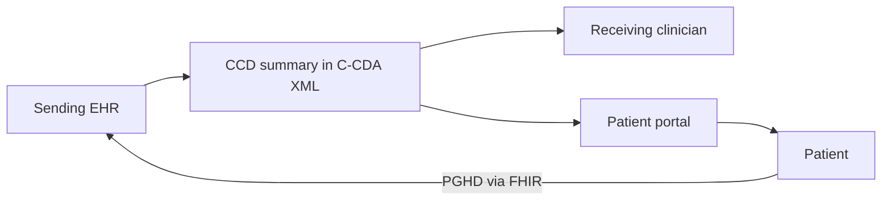

Networks and APIs move data, but at the moment a patient transfers from a hospital to a rehab facility, or from a primary care office to a specialist, the receiving clinician needs a single, structured summary of who this patient is and what matters about their health. That summary is the Continuity of Care Document. And increasingly, the patient themselves is a destination for their own data — through patient portals like MyChart and FollowMyHealth that put records, results, and messaging directly in their hands. CEHRS specialists manage both ends of this: the structured documents that travel between organizations, and the portals that serve patients. The exam expects you to know the document format, the regulatory access timelines, and the role portals play in modern care.

## The CCD and the C-CDA format

When a patient moves between care settings, a structured document carries their health summary. The standard format is the **Continuity of Care Document (CCD)**, which is built using the **C-CDA (Consolidated Clinical Document Architecture)** — an **XML-based** format.

What it *contains* is high-yield, because the exam may ask you to identify the components of a CCD. The summary includes: **patient demographics, allergies, medications, the problem list, vital signs, immunizations, lab results, and procedures.** A useful memory hook is that a CCD is the portable snapshot of a patient — the things a brand-new provider would most want to see first: who you are, what you are allergic to, what you take, what conditions you carry, and your recent results.

Keep the acronyms straight: CCD is the *document*, C-CDA is the *architecture/standard* it is built on, and XML is the underlying *file format.* They nest inside one another.

## Why C-CDA is required — the regulatory link

The CCD is not just a convenience; it is mandated. **C-CDA is required by Meaningful Use / Promoting Interoperability** — and recall from earlier in the program that these are two names for the same lineage of federal incentive rules. The specific requirements are that a certified system must **provide a summary of care record (the CCD) at referrals and care transitions**, and must **transmit it electronically on request.**

This is the regulatory thread tying this lesson back to the rest of the interoperability domain: the same federal push that drove FHIR APIs also requires that a structured summary of care travel with the patient at every handoff. If an exam question asks what document must accompany a referral or transition under Promoting Interoperability, the CCD is the answer.

## Patient portal access requirements

Patient portals are governed by concrete, testable timelines. Certified EHRs must **provide patients online access to their health information within 4 business days of that information becoming available.** They must also **enable download of a clinical summary**, and the **FHIR API must be accessible** — connecting this lesson directly to the FHIR standard from earlier.

The number to lock in is **4 business days** for online access to newly available information. Pair that with the two functional requirements — downloadable clinical summary and an accessible FHIR API — and you have the portal compliance picture the exam is testing. The FHIR requirement is what allows portals to feed apps like Apple Health, which is the bridge to the next point.

## MyChart, FollowMyHealth, and patient-generated data

The most widely used patient portal is **MyChart (Epic)**, serving **130 million-plus patients.** It enables a broad set of patient functions: **scheduling, messaging, bill pay, record access, and result viewing** — and it **integrates with Apple Health via FHIR.** That last detail is the practical payoff of the FHIR mandate: a standardized API lets a patient pull their hospital data into a consumer health app.

Portals are also an *inbound* channel. **Patient-generated health data (PGHD)** — data from wearables, home monitoring devices, and patient-reported outcomes — flows in *through* the portal and is increasingly integrated into clinical workflows via FHIR. So a portal is not only a window for patients to look in; it is a doorway for patient-collected data to enter the record.

## The access gap and the CEHRS role

Portals only deliver value if patients can actually use them, and that is where the human side of the job appears. **Portal adoption faces real challenges:** elderly patients, patients with disabilities, and patients with limited English proficiency may need help getting in and finding what they need. The lesson is explicit that **CEHRS staff often assist with portal enrollment and navigation** — registering patients for the portal and walking them through how to use it.

This matters for the exam because it frames the CEHRS specialist not just as a back-office data handler but as a frontline enabler of patient access. When a scenario describes a patient who cannot reach their records online, the appropriate response is assistance with enrollment and navigation, not a refusal or a referral elsewhere.

## Putting it into practice

1. Make a single card for the CCD: format = C-CDA (XML-based), and list its eight contents — demographics, allergies, medications, problem list, vital signs, immunizations, lab results, procedures. Recite the list until it is automatic.
2. Write the regulatory link in one line: C-CDA is required by Meaningful Use / Promoting Interoperability, which mandates a summary of care record at referrals and transitions, transmitted electronically on request.
3. Memorize the portal timeline — **4 business days** for online access to newly available information — plus the two functional requirements: downloadable clinical summary and an accessible FHIR API.
4. Note MyChart's facts (Epic; 130M+ patients; scheduling, messaging, bill pay, records, results; Apple Health integration via FHIR) and the CEHRS duty to assist elderly, disabled, and limited-English patients with enrollment and navigation.

## Key takeaways

- The **Continuity of Care Document (CCD)** carries a patient's health summary across care settings; it uses the **C-CDA (Consolidated Clinical Document Architecture)**, an XML-based format.
- A CCD contains demographics, allergies, medications, problem list, vital signs, immunizations, lab results, and procedures.
- **C-CDA is required by Meaningful Use / Promoting Interoperability:** certified systems must provide a summary of care record at referrals and transitions and transmit it electronically on request.
- Certified EHRs must give patients online access to new health information within **4 business days**, enable download of a clinical summary, and keep the **FHIR API accessible.**
- **MyChart (Epic)** is the most widely used portal (130M+ patients), offering scheduling, messaging, bill pay, and record access, and integrating with Apple Health via FHIR; **patient-generated health data** flows inbound through portals via FHIR.
- **CEHRS staff assist with portal enrollment and navigation**, especially for elderly patients, patients with disabilities, and patients with limited English proficiency.
