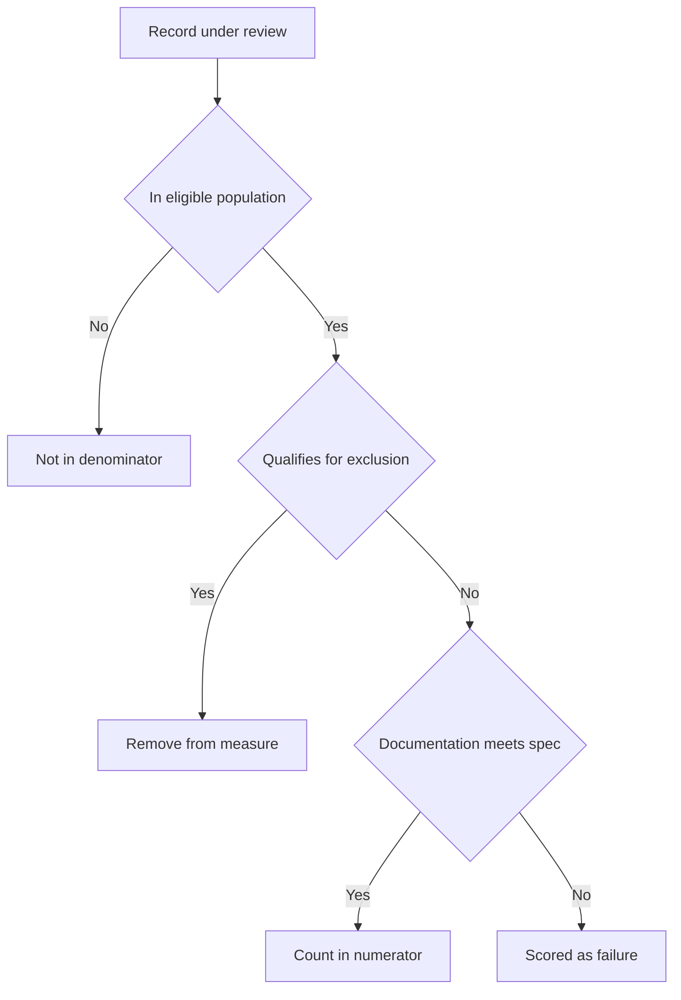

Quality measures are the scorecards of modern healthcare. They determine how much a health plan gets paid, whether it keeps its accreditation, and how it ranks against competitors when patients shop for coverage. Every one of those scores traces back to something concrete: a documented mammogram result, a lab value sitting in the EHR, an immunization recorded in a registry. That is where the CEHRS specialist enters the picture. You are often the person who reviews the record, confirms whether a measure was actually met, and pulls the data that feeds the report. This lesson covers the two measurement systems the exam expects you to distinguish — HEDIS and MIPS — and the documentation discipline that makes both of them work.

## HEDIS: how payers grade health plans

**HEDIS** stands for the **Healthcare Effectiveness Data and Information Set**, and it is maintained by the **NCQA (National Committee for Quality Assurance)**. The memory hook is simple: *HEDIS grades health plans, not individual doctors.* It contains **more than 90 measures** spread across domains including preventive care, chronic disease management, and behavioral health. Health plans submit their HEDIS data to NCQA **annually** to maintain accreditation, which makes this an ongoing operational obligation rather than a one-time event.

What the exam wants you to internalize is that HEDIS measures live or die on EHR documentation. Three classic examples make this concrete:

- **Breast cancer screening** — credit requires a *documented mammogram result*, not just an order or a referral.
- **Diabetes HbA1c control** — requires the *lab value plus the correct coding* in the record.
- **Childhood immunization status** — pulled from the *immunization registry combined with the EHR*.

In every case, if the documentation is missing or incomplete, the measure is scored as a failure even when the care was actually delivered. The exam loves this gap between "care happened" and "care was documented in a way that counts."

## MIPS: how CMS grades clinicians

Where HEDIS evaluates plans, **MIPS** — the **Merit-based Incentive Payment System** — is the CMS program that evaluates **individual Medicare physicians.** Keep the two straight: *HEDIS = NCQA + health plans; MIPS = CMS + clinicians.*

MIPS scores clinicians across four areas: **quality measures, promoting interoperability, improvement activities, and cost.** The combined score produces a **payment adjustment that can be positive or negative** — a clinician can earn a bonus or take a cut depending on performance. That positive-or-negative swing is the detail to remember; MIPS is not pass/fail, it is a sliding scale tied directly to reimbursement.

## Data abstraction: the CEHRS core skill

The hands-on task that ties these programs to your job is **data abstraction** — manually reviewing records to determine whether a measure's criteria were met. Doing this correctly requires understanding **measure specifications**: precisely what counts as the **numerator** (the patients who met the measure), the **denominator** (the eligible population), and the **exclusions** (patients who shouldn't be counted at all).

If you abstract a record and miss that a patient qualified for an exclusion, you can wrongly count them as a failure and drag down the score. If you count someone in the numerator without the documentation to back it, you create an audit liability. The exam treats abstraction as a precision activity governed by the specification, not by your clinical judgment about whether the care was "good enough."

## CDI timing and Stars: where documentation meets money

Two related concepts round out the lesson. **Clinical Documentation Improvement (CDI)** can be **retrospective** or **prospective.** Retrospective CDI happens *after discharge* through coding queries — you catch gaps once the patient is gone. Prospective CDI happens *in real time during the stay*, with a CDI specialist rounding alongside the care team. The exam point is that **prospective CDI improves quality scores and captures revenue before the patient leaves** — fixing documentation while it can still change the record beats chasing it afterward.

Finally, **Stars ratings** apply to **Medicare Advantage plans**, which CMS rates from **1 to 5 stars** on quality. **High-star plans receive bonus payments**, so the financial stakes are direct. The closing connection ties the whole lesson together: **documentation gaps — missed HEDIS measures, uncoded chronic conditions — directly reduce star ratings.** Every measure you fail to capture is money the plan does not earn.

## Putting it into practice

Build a two-column comparison you can reconstruct under exam pressure, then drill the abstraction logic.

1. Draw two columns headed **HEDIS** and **MIPS**. Under HEDIS, write: NCQA, health plans, 90+ measures, annual submission, accreditation. Under MIPS, write: CMS, individual clinicians, four categories (quality, interoperability, improvement activities, cost), payment adjustment (+/-).
2. List the three HEDIS examples — mammogram result, HbA1c lab value plus coding, immunization registry plus EHR — and beside each note the exact documentation that earns credit.
3. Define **numerator, denominator, and exclusion** in your own words, then invent a quick scenario and label which patient falls into which bucket.
4. Write one sentence linking documentation gaps to Stars ratings and bonus payments, and one sentence contrasting retrospective versus prospective CDI. If you can produce both from memory, you own this lesson's exam material.

## Key takeaways

- **HEDIS** (maintained by **NCQA**) grades **health plans** with **90+ measures** across preventive care, chronic disease, and behavioral health; plans submit data annually to keep accreditation.
- **MIPS** (run by **CMS**) grades **individual Medicare clinicians** on quality, promoting interoperability, improvement activities, and cost, producing a payment adjustment that can be positive or negative.
- HEDIS credit depends on specific EHR documentation — a documented mammogram result, an HbA1c lab value with coding, immunization registry plus EHR — not merely on care being delivered.
- **Data abstraction** is a core CEHRS task: applying the measure specification to classify each record by **numerator, denominator, and exclusions.**
- **Prospective CDI** (real-time, during the stay) improves scores and captures revenue before discharge, unlike **retrospective CDI** (after discharge, via coding queries).
- **Stars ratings** rate Medicare Advantage plans 1-5; high-star plans earn bonus payments, and documentation gaps directly lower those ratings.
