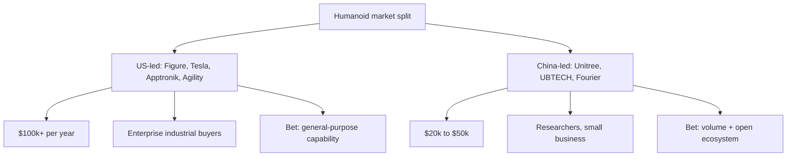

For most of the last fifty years, the humanoid robot was a research curiosity — an expensive demonstration of what was *almost* possible. Between 2023 and 2024 that changed. Robots moved off the lab bench and onto factory floors, single funding rounds crossed a billion dollars, and the largest banks on Wall Street started publishing market forecasts in the tens of billions. This lesson maps that shift, because you cannot design a competitive humanoid without first understanding the terrain everyone else is already fighting over.

## Why 2024 was the inflection point

Two technologies matured at the same moment, and their convergence is what made the field suddenly credible.

The first is the **electric quasi-direct-drive (QDD) actuator**. For decades, powerful robots meant hydraulics — strong but noisy, leak-prone, and impractical for a machine meant to work next to people. QDD electric actuators changed the economics: they are quiet, clean, backdrivable, and cheap enough to put dozens into a single body.

The second is the **transformer-based vision-language-action (VLA) model** — a single neural network that maps camera pixels and a natural-language instruction directly to motor commands. Before VLAs, every new task meant months of hand-engineering. After them, a robot could begin to *generalize*.

Put a capable body together with a model that can be taught rather than programmed, and you have, for the first time, a machine worth manufacturing at scale. That is why so many credible prototypes — from Tesla, Figure, 1X, Apptronik, Agility, and Unitree — all appeared in the same narrow window of 2023–2025.

## The numbers that moved the money

Investor enthusiasm is not sentiment; it is a forecast about deployment. Goldman Sachs's 2023 analysis projected roughly **250,000 humanoid units shipped per year by 2030, rising to 1.4 million by 2035 — a market on the order of $38 billion.** Numbers like these are what justify billion-dollar raises, and they reset expectations across the whole industry.

It is worth treating these figures as a *thesis* rather than a certainty. They assume that unit costs fall, that reliability rises, and that early deployments prove out the economics. Every team in this lesson is, in effect, making a bet on which of those assumptions it can deliver first.

## How the money actually changes hands

The dominant commercial model is **robots-as-a-service (RaaS)**, not hardware sales. Rather than selling a robot outright, a company leases it — Figure, for instance, has indicated pricing around **$100,000 per unit per year**. RaaS aligns incentives neatly: the vendor keeps the robot reliable and updated, while the customer pays an operating expense comparable to a wage, with none of the capital risk.

The first customers are not consumers but large industrial anchors — **Amazon, BMW, and Hyundai** among them. Their value is twofold. They provide revenue, but more importantly they provide *real-world data*: every shift a robot works in a real warehouse or assembly line generates the demonstrations that improve the next model. Early access is traded for training data, and that data compounds.

## Two geographies, two strategies

A clear split has formed along price and customer.

US-led companies — Figure, Tesla, Apptronik, Agility — target **$100,000-plus enterprise contracts**, betting on general-purpose capability sold to deep-pocketed industrial buyers.

Chinese manufacturers — **Unitree, UBTECH, and Fourier** — target the **$20,000–$50,000 researcher and small-business segment**, betting on volume and an open ecosystem. As later lessons will show, that low price point has quietly become one of the most important forces in the field, because it determines who gets to do research at all.

For G1, this map is the starting point: the enterprise segment is crowded and well-funded, the low-cost segment is a volume game, and — as Module 1 will keep returning to — there are application areas that *no one* has locked down yet.

## Putting it into practice

Build a comparison matrix of six major platforms so the landscape becomes concrete rather than abstract.

1. Choose six platforms — for example Figure 02, Tesla Optimus, Boston Dynamics Atlas (electric), Agility Digit, Unitree G1, and one more of your choice.
2. Create a row for each and twelve columns: degrees of freedom (DOF), payload, battery life, walking speed, hand DOF, on-board compute, price, deployment status, primary use case, actuator type, perception stack, and AI architecture.
3. Fill in every cell you can from public sources, and explicitly mark the gaps — *what a company doesn't publish is itself information.*
4. Now read the matrix as a strategist: cluster the platforms by business model (enterprise general-purpose vs. low-cost open vs. task-specific). Which dimension best predicts the cluster a robot belongs to?

Keep this matrix; the next five lessons fill in the rows one company at a time, and you will return to it when defining G1's position.

## Key takeaways

- Humanoid robotics crossed a credibility threshold in 2023–2024 as lab demos became factory deployments and funding rounds topped $1B.
- The breakthrough was a convergence: electric QDD actuators (a capable body) plus transformer-based VLA models (a teachable brain).
- Goldman Sachs projects ~250,000 units/year by 2030 and ~$38B by 2035 — treat this as the industry's guiding thesis, not a guarantee.
- The business model is RaaS (~$100k/unit/year), and early enterprise customers trade access for the real-world data that improves each model.
- The market has split: US firms chase $100k+ enterprise contracts; Chinese firms chase the $20k–50k researcher market — and open application areas remain.
