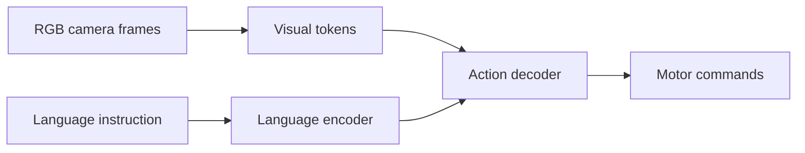

If the previous lesson mapped the industry, this one zooms into the company that best embodies its central bet. In February 2024, Figure AI raised **$675 million at a $2.6 billion valuation**, backed by an unusually telling roster — Microsoft, OpenAI, NVIDIA, and Amazon. That investor list is the thesis in miniature: cloud, frontier models, compute, and a deployment customer, all wagering on the same machine. Figure 02, announced that August, is the clearest expression in the industry of a single idea — *treat the robot as a compute platform first and a mechanical system second.*

## A body designed around its brain

Figure 02 stands **1.68 m tall, weighs 60 kg, and carries a 20 kg payload** — proportions tuned for warehouse and manufacturing work rather than spectacle. The most consequential engineering, though, is in the hands: **16 degrees of freedom each, with tactile sensing on the fingertips.** That specification sounds abstract until you see what it enables — Figure has shown the robot picking up a loose USB-C cable and plugging it in *without external guidance*. Inserting a small connector requires sensing contact, correcting alignment, and applying just enough force; it is a genuine test of dexterity, not a scripted pose.

Behind the body sits a **custom NVIDIA Orin-based compute stack** running a multimodal neural network the company calls Heliogen, responsible for end-to-end task execution. The phrase "end-to-end" is the whole point, and the next section explains why it matters.

## What "end-to-end" actually means

Most classical robots are pipelines: a perception module identifies objects, a planner decides what to do, and a controller moves the joints — each stage hand-built and hand-tuned. Figure's **OpenAI collaboration** replaces that pipeline with a single **Vision-Language-Action (VLA) policy**. In one forward pass, the network takes a natural-language instruction and a stream of sensory observations and emits motor commands directly.

Concretely, the data flows like this: RGB camera frames are encoded into visual tokens, a language encoder ingests the instruction, and an action decoder produces the joint targets — all learned jointly rather than wired together by an engineer. The model described in Figure's *Helix* technical report is the embodiment of this approach: one network for generalist humanoid control.

The payoff is generalization. A pipeline must be re-engineered for every new task; a VLA can, in principle, be *taught* a new task from examples. That difference is what turns a robot from a fixed-function tool into a platform.

## Proof on a real factory floor

Architecture is a promise; deployment is the test. In 2024, Figure put 02 to work at the **BMW Spartanburg plant**, performing parts-transfer tasks. The reported result is the detail worth remembering: the robot reached **human-comparable cycle times after roughly 24 hours of in-context learning.** Not months of reprogramming — about a day of adapting to the specific station.

That number is the entire RaaS economic argument made concrete. If a robot can be dropped into a new task and brought up to speed in a day, then leasing it for a yearly fee comparable to a wage starts to pencil out.

## The bet: scale data, not engineering

Every company in this module is making one core wager, and Figure's is the most explicit: **scale data, not engineering.** Rather than hand-crafting controllers, collect teleoperation demonstrations at large scale and train general-purpose policies that improve as the dataset grows. It is the same scaling philosophy that produced large language models, pointed at physical action.

For G1, Figure 02 is the benchmark to study closely. Its hand (16 DOF, fingertip tactile sensing) sets a dexterity bar that any robot aiming at fine manipulation must meet, and its end-to-end VLA stack is the architecture the rest of this book builds toward. Where G1 will differ — safety, battery life, and the application it targets — only becomes a meaningful strategy once you understand precisely how strong the Figure approach already is.

## Putting it into practice

Trace Figure 02's end-to-end architecture so the data path stops being a slogan and becomes a diagram you can reason about.

1. Sketch the pipeline left to right: RGB cameras → tokenized vision features → language encoder (the instruction) → action decoder → motor commands.
2. For each block, label whether it is most likely **off-the-shelf** (e.g., the NVIDIA Orin compute, standard vision backbones) or **custom** (the jointly trained VLA policy, the hand controllers).
3. Mark where *learning* happens versus where *fixed engineering* happens. The boundary between them is the company's real intellectual property.
4. Finally, ask the design question: if you wanted to add a brand-new task, which blocks would you retrain, and which would stay frozen? Your answer is the difference between an end-to-end system and a classical pipeline.

## Key takeaways

- Figure raised $675M at a $2.6B valuation from Microsoft, OpenAI, NVIDIA, and Amazon — an investor list that is itself the industry thesis.
- Figure 02 (1.68 m, 60 kg, 20 kg payload) treats the robot as a compute platform first; its 16-DOF hands with fingertip tactile sensing can plug in a USB-C cable unaided.
- Its OpenAI-partnered VLA policy maps instruction + observation → motor commands in a single forward pass, replacing the classical perception-plan-control pipeline.
- At BMW Spartanburg, Figure 02 reached human-comparable cycle times after ~24 hours of in-context learning — the RaaS economics made concrete.
- Figure's defining bet is "scale data, not engineering," and its hand and VLA stack set the benchmark G1 must understand to differentiate against.
