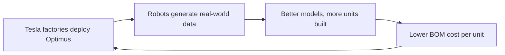

Figure bets on data; Tesla bets on the factory. Tesla's approach to humanoid robotics is inseparable from the company it grew out of, and that is the whole strategic point. Optimus is not being designed in isolation — it is being designed by a company that already builds custom silicon, manufactures its own actuators, and operates one of the largest real-world robotics fleets on Earth in the form of its vehicles. The thesis is simple and hard to copy: **use manufacturing scale as the moat.**

## Gen 2: lighter, faster, more dexterous

Optimus Gen 2, shown in December 2023, is a measurable step up from its predecessor. It **weighs 57 kg — 11 kg lighter than Gen 1 — walks roughly 30% faster, and carries redesigned 22-DOF hands with tactile sensing on every finger.** Weight reduction matters more than it sounds: a lighter robot needs less actuator torque, drains less battery, and is safer around people. Faster walking and richer hands push the platform toward real work rather than demonstration.

Tesla has framed the dexterity goal in deliberately human terms — handling an egg without cracking it, threading a needle — capabilities shown in late-2023 demos. These are not parlor tricks; they are proxies for the fine force control that any general-purpose manipulator must eventually master.

## The silicon advantage

Where Tesla diverges most sharply from its rivals is compute. Optimus runs inference on Tesla's **custom FSD (Full Self-Driving) chip** — the same silicon that processes **1,000-plus TOPS** in Tesla vehicles. Owning the chip means owning the cost curve and the software stack on top of it, instead of renting both from a supplier.

That ownership extends to perception. Tesla has **ported its Autopilot neural-network architecture directly to the robot**, reusing the *occupancy network* approach developed for FSD — the same method that lets a car build a 3D model of the space around it from cameras. A humanoid navigating a cluttered factory faces a strikingly similar problem, so the transfer is natural rather than forced.

## Scale as the real product

The most important Optimus number is not a spec; it is a manufacturing target. Tesla manufactures **its own actuators**, which it projects reduces bill-of-materials cost by **roughly 40% versus buying off-the-shelf**, putting a **sub-$20,000 unit cost** within reach at volume. Elon Musk has projected **1,000 Optimus units inside Tesla factories by the end of 2025, scaling to "millions" by 2030.**

Treat those projections with the same caution as any roadmap, but understand the logic. Tesla's plan is to use its own factories as both the first customer and the training environment: every shift a robot works generates data, and every unit built drives the cost down the manufacturing learning curve. If it works, vertical integration becomes a flywheel no one without a car company can match.

## What G1 should learn from it

Tesla's lesson for G1 is sobering and clarifying. You cannot out-scale Tesla on manufacturing, and you should not try. The takeaway is that **cost and capability at volume are a structural advantage, not a feature you can bolt on later** — which is exactly why G1's strategy, developed across this module, competes on a different axis (safety and a healthcare application that Tesla is not pursuing) rather than on raw unit economics.

## Putting it into practice

Reason about why vertical integration matters by working the actuator math.

1. Start from the claim that in-house actuator manufacturing cuts BOM cost ~40%. If a competitor's actuators account for, say, half of a robot's parts cost, estimate the overall unit-cost advantage Tesla gains.
2. Now connect cost to capability: a lighter 57 kg body needs less torque per actuator. Sketch qualitatively how reducing mass relaxes the actuator (and therefore battery) requirements — a virtuous cycle.
3. Map the FSD-to-Optimus transfer: list two perception problems a car and a humanoid genuinely share (e.g., 3D occupancy of surrounding space) and one they do not, and decide whether reusing the occupancy network is a shortcut or a constraint.
4. Conclude with a strategy note for G1: if you cannot win on unit cost, name the axis you *can* win on. Carry that answer into Lesson 1.6.

## Key takeaways

- Tesla's moat is manufacturing: custom silicon, in-house actuators, and a fleet of real-world data give it advantages tied to being a carmaker.
- Optimus Gen 2 (57 kg, ~30% faster, 22-DOF tactile hands) targets human-level fine control — handling eggs, threading needles.
- It runs on Tesla's FSD chip (1,000+ TOPS) and reuses the Autopilot occupancy-network architecture for perception.
- In-house actuators cut BOM cost ~40%, putting sub-$20k units in reach; Musk projects 1,000 units by end of 2025 and "millions" by 2030.
- The strategic lesson for G1: you cannot out-scale Tesla, so compete on a different axis — safety and an application Tesla is not chasing.
