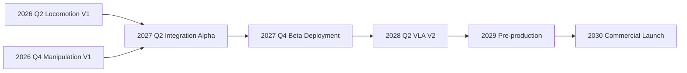

A roadmap earns its keep when every milestone answers two questions without argument: how will we know it is done, and what must be true first. Vague milestones ("improve manipulation") let a program drift; milestones with a "done when" definition and a named dependency force honesty about progress. This lesson lays out the G1's path from prototype to commercial launch as a sequence of measurable checkpoints from 2026 to 2030. Read it as a template as much as a plan — the structure is reusable for any hardware program.

## 2026: prove the legs, then the hands

The first year is about establishing that each half of the robot works in isolation before anyone asks them to work together.

**2026 Q2 — Locomotion V1.** Done when the G1 **walks 500 m continuously on varied indoor terrain** (carpet, tile, linoleum) without a fall, **climbs standard 7-inch-riser stairs at 0.3 m/s**, and **passes ISO/TS 15066 contact tests**. The choice to demand all three together is deliberate: continuous distance proves endurance and reliability, stairs prove the hard locomotion case, and the contact standard proves the robot is safe to be near. The key dependency is the RL-plus-MPC locomotion stack from Lesson 10.1 reaching deployable maturity.

**2026 Q4 — Manipulation V1.** Done when the G1 **completes five benchmark manipulation tasks at over 80% success**: pick-and-place, open/close a door, pour a liquid, hand an object to a human, and carry a tray while walking. These five are chosen to span the manipulation difficulty space — static and dynamic, rigid and fluid, solo and human-facing. The 80% bar is intentionally short of "reliable"; this milestone proves capability exists, not that it is production-grade.

## 2027: put the halves together and into the field

The second year is where the program's hardest integration and its first contact with reality both happen.

**2027 Q2 — Integration Alpha.** Done when the G1 sustains **combined loco-manipulation for 30 minutes of autonomy in a simulated hospital room**, **maintains ISO 10218-2 compliance throughout**, and holds **battery life above 4 hours at a low-activity profile**. Walking and manipulating at the same time is qualitatively harder than either alone — moving disturbs the arm, manipulating shifts the center of mass — so this is the milestone where the architecture's coherence is tested. The 30-minute, hospital-room framing keeps the target grounded in the actual deployment.

**2027 Q4 — Beta Partner Deployment.** Done when **three units are deployed at one to two pilot hospital partners for monitored daily use**, the program **collects over 1000 hours of real-world data**, and it **tracks failure modes and resolution time**. This is the milestone that starts the data flywheel from Lesson 10.2's sim-to-real mitigation. The dependency is the data-collection and teleop infrastructure being ready before the robots ship, not after — otherwise the deployment generates anecdotes instead of training data.

## 2028: turn field data into a better policy

**2028 Q2 — VLA V2.** Done when a **foundation model fine-tuned on real-world G1 data** demonstrates **generalization to new tasks within a 30-minute teleoperation demo** and reaches **90% success on the benchmark suite**. This is the payoff of the 2027 deployment: the 1000+ hours of real data become a measurably better policy. The leap from V1's 80% to V2's 90% is the difference between "capable" and "trustworthy," and the 30-minute teleop generalization test proves the model can pick up new tasks quickly rather than only the ones it was trained on. The dependency is squarely the beta data from 2027 Q4.

## 2029–2030: scale, certify, and launch

**2029 — Pre-production.** A **50-unit production run**, **full regulatory submission**, **clinical trial completion**, and **finalized commercial pricing** — converging the hardware, regulatory, and business tracks that have been running in parallel. The 50-unit run is the bridge between the hand-built prototype and a manufacturable product, exercising the custom-actuator and production supply chain decisions from Lesson 10.1. Regulatory submission and clinical trial completion here are only possible because the notified-body engagement and trial planning from Lesson 10.2 started years earlier.

**2030 — Commercial launch.** The program's terminal milestone, gated on everything above succeeding. It is named, not detailed, because its content is simply the sum of the milestones that precede it — which is exactly how a roadmap should resolve.

## Putting it into practice

Turn this sequence into a tracking artifact your team updates weekly.

1. Create a timeline with one entry per milestone, in order, from 2026 Q2 to 2030.
2. For each, write the **"done when"** criterion exactly as stated — measurable, with numbers (500 m, 80%, 4 hours, 90%).
3. For each, name the **key dependency** — the one thing that must be true first (locomotion stack maturity, teleop infrastructure, 2027 beta data).
4. Draw the **dependency arrows**: Manipulation V1 and Locomotion V1 feed Integration Alpha; Beta Deployment feeds VLA V2; everything feeds Pre-production.
5. Mark each milestone **not started / in progress / done**, and refuse to mark "done" until the measurable criterion is met — no partial credit.
6. Review the timeline at a fixed cadence and let slipped dependencies cascade visibly, so a delay early is seen for what it is rather than absorbed silently.

## Key takeaways

- 2026 proves each half alone: Locomotion V1 (500 m without falling, 7" stairs at 0.3 m/s, ISO/TS 15066) in Q2; Manipulation V1 (five tasks at >80%) in Q4.
- 2027 integrates and deploys: Integration Alpha (30-min loco-manipulation, ISO 10218-2, >4 hr battery) in Q2; Beta Deployment (3 units, 1000+ hours of data) in Q4.
- 2028 VLA V2 converts field data into a fine-tuned policy hitting 90% on the benchmark suite with fast task generalization.
- 2029 pre-production runs 50 units, completes regulatory submission and clinical trials, and finalizes pricing for a 2030 commercial launch.
- Every milestone carries a measurable "done when" and a named dependency — that pairing is what makes the roadmap trackable rather than aspirational.
- The dependency chain (V1s → Integration → Beta → VLA V2 → Pre-production) means early slips cascade, so they must be surfaced, not buried.
