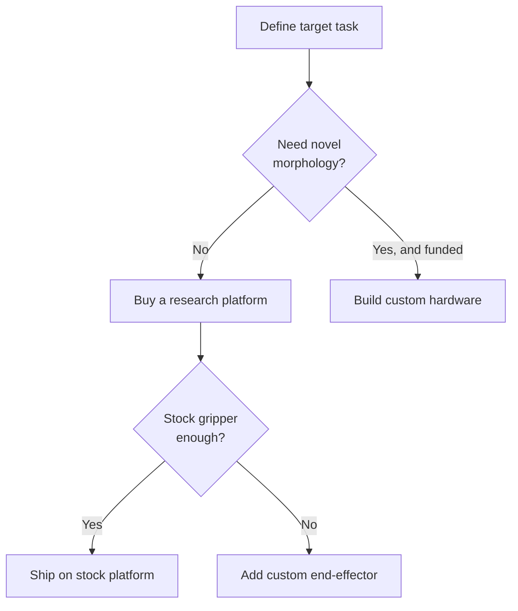

This is a decision lesson, not a tutorial. By the end you should be able to answer one question with confidence: for the robot you actually want to build, do you design custom hardware or buy a research platform? For nearly everyone outside a funded hardware team, the answer is buy — and the rest of this lesson is about why, and what to buy. The reason is simple: a humanoid body is a multi-person, multi-year, capital-intensive program (mechanical design, fabrication, electronics, firmware), while the differentiation you care about — perception, policies, manipulation — lives in the brain.

## The two paths, and what each one costs you

There are exactly two paths, and they trade the same currency: where your engineering time goes.

**Build custom hardware — only when morphology is the product.** Designing a humanoid from scratch means owning mechanical design, fabrication, custom electronics, and firmware before you write a single line of perception code. It is not a solo or first-project undertaking; it is a team effort measured in years and significant capital. You take this path only when your target task genuinely requires a body no platform provides — a novel limb arrangement, an unusual scale, a specialized end-effector that cannot be bolted on.

**Buy a research platform — the default for almost everyone.** Buying a standard humanoid lets you point all your engineering at the brain: perception, learned policies, VLA manipulation, the parts where most differentiation actually lives. You inherit a working body, a maintained SDK, and an ecosystem of other people solving the same bring-up problems. This is the recommended path for nearly all developers, and you should treat "build" as the exception you must justify.

**The recommendation:** buy. Unless you can state, in one sentence, a task that no existing platform's morphology can perform, you are better served buying a platform and spending your time on the policies that make it useful.

## The accessible platform: Unitree G1

The G1 is the platform that put humanoid research within reach. At roughly $16k it is an order of magnitude cheaper than enterprise humanoids, and it is specified for exactly this audience: 1.32 m tall, 35 kg, 43 DOF, and — critically — it ships with an SDK and ROS 2 support. That last point is what makes it a *research* platform rather than a demo: you can read its state and command it from your own code.

The ecosystem matters as much as the spec sheet. Over 200 research papers appeared using Unitree H1/G1 as the platform within a year of the G1's release, which means the bring-up problems you will hit have almost certainly been hit — and documented — by someone else. When you buy into a platform, you are also buying into the body of work around it, and the G1's is large and active.

## De-risk before you commit

You do not have to start on a humanoid, and you probably should not. The perception and learning stack — sensor fusion, SLAM, RL training, sim-to-real transfer — is largely the same whether it runs on two legs or four, so validate your skills on cheaper hardware first.

A quadruped like the Unitree Go2 or a tabletop manipulator costs a fraction of a humanoid and exercises the same software pipeline you will eventually run on the G1. You learn the SDK conventions, the DDS communication model, and the sim-to-real loop on hardware where a mistake is cheap, then carry that knowledge up to the humanoid. Treat the humanoid as the final platform, not the learning platform.

## The hybrid path

Buying is not all-or-nothing. The most common real-world configuration is to buy the base platform and customize only the part the stock hardware cannot handle — almost always the hands. The G1 ships with a simple gripper by default; if your task needs dexterity it does not provide, you add an aftermarket dexterous hand rather than redesigning the whole robot. Spend your custom-hardware budget at the single point where the stock platform falls short of your task, and nowhere else.

## Putting it into practice

Make the build-vs-buy call for your own project, on paper, before you spend money.

1. **Write the one-sentence morphology test.** State your target task in one sentence, then ask: does any existing platform's body perform it? If yes, you are buying — proceed. If no, write down *exactly* which physical capability is missing; that sentence is the only thing that justifies building.
2. **Score the decision criteria.** Rate your project on each of the five criteria — budget, target task, novel-vs-standard morphology, team size, and time-to-first-result. A build is only defensible when most of these point the same way (large budget, novel morphology, multi-person team, long horizon).
3. **Plan your de-risking ladder.** List the cheaper hardware you will validate on first — a quadruped (Go2) and/or a tabletop arm — and name the specific skill each one lets you prove (SDK fluency, SLAM, an RL-trained policy) before you commit to the humanoid.
4. **Specify the hybrid configuration.** Assuming you buy a G1, decide whether the stock gripper meets your task. If not, identify the one aftermarket end-effector you would add, and confirm everything else stays stock.

## Key takeaways

- Build vs buy is the biggest decision you will make; for nearly everyone outside a funded hardware team, buy is correct.
- Building a humanoid body from scratch is a multi-person, multi-year, capital-intensive effort — justify it only when your task needs a morphology no platform provides.
- Buying lets you focus engineering on the brain — perception, policies, VLA, manipulation — where the differentiation actually lives.
- The Unitree G1 (~$16k; 1.32 m, 35 kg, 43 DOF) is the accessible humanoid research platform: it ships with an SDK and ROS 2 support and has a 200+ paper ecosystem.
- Validate your stack on cheaper hardware first — a Go2 quadruped or a tabletop arm exercises the same perception and learning pipeline at a fraction of the cost.
- Prefer the hybrid path: buy the base platform and add custom end-effectors only where the stock gripper cannot do your task.
