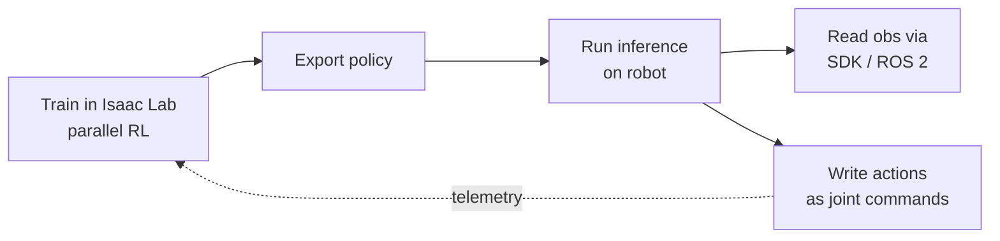

This is the payoff lesson — where a policy born in simulation moves onto the robot you brought up in 11.2. You will train a locomotion policy in Isaac Lab, harden it for transfer using the techniques from Module 7, and run it on real hardware. Get this loop working once, and you have the G1 development loop in miniature: every real-world rollout produces data that improves the next policy, the data flywheel that compounds capability over time.

## The pipeline, end to end

Sim-to-real is a chain, and the chain is only as strong as its interface matching. Train in Isaac Lab with massively parallel RL, export the trained policy, then run inference on the robot — feeding observations in from the SDK or the ROS 2 bridge, and writing the policy's actions back out as joint commands.



Concretely, training a G1 locomotion policy uses Isaac Lab's RSL-RL workflow (PPO under the hood) against a shipped velocity task:

```bash
# Train a G1 velocity-tracking policy, headless and massively parallel
./isaaclab.sh -p scripts/reinforcement_learning/rsl_rl/train.py \
  --task Isaac-Velocity-Flat-G1-v1 --headless --num_envs 4096
```

The `Isaac-Velocity-Flat-G1-v1` task ships with the G1 robot already configured; swapping `Flat` for `Rough` changes the terrain curriculum without touching code. Unitree also maintains `unitree_rl_lab`, an Isaac Lab-based RL repository specifically for its robots, which is a good starting point when you want G1 reward and observation definitions that already match the platform.

## Harden the policy before it ever touches metal

A policy that is excellent in a clean simulator will fail on hardware unless you deliberately train for the reality gap. This is where Module 7's techniques earn their keep, and they are not optional.

**Domain randomization** is the core tool: randomize mass, friction, latency, and sensor noise during training so the policy learns a behavior robust across the distribution of reality rather than overfitting to one idealized world. **An actuator model that matches the real motors** is the partner technique — the model sitting between the policy's action and the joint torque must reflect how the G1's actual actuators behave, or the policy commands torques the real motors cannot deliver. Together, randomization plus a faithful actuator model are what make zero- or few-shot transfer work; skip them and the gap stays open.

## Match the interfaces exactly, or fail silently

This is the failure mode that wastes the most time, because nothing crashes — the robot just behaves wrong. The observation vector, the action space, and the control rate used in simulation must *equal* what the SDK provides on hardware.

If simulation feeds the policy joint angles in one order and the SDK delivers them in another, or the policy was trained at one control rate and runs at a different one on the robot, the policy receives inputs it never saw in training and produces garbage — with no error message. Before you deploy, write down the exact observation layout, action layout, and control rate on both sides and confirm they are identical. Treat any mismatch as a bug to fix before the robot moves, not a parameter to tune afterward.

## Deploy incrementally, with the e-stop in reach

You earn authority on hardware in stages; never go straight from a trained checkpoint to a free-running robot.

First validate in the **digital twin** — the synchronized simulation of the real robot — where a failure costs nothing. Then run on **hardware suspended**, so the policy drives real motors but the robot cannot fall or hurt anyone. Then run **on the ground at reduced authority** — limited speed or torque — before full operation. Each stage is a checkpoint: if the policy misbehaves, you catch it where the blast radius is smallest. This is the same caution from 11.2, applied to a policy that now moves on its own.

## Close the loop and turn the flywheel

Deployment is not the end of the pipeline; it is the start of the next iteration. Log on-robot performance and compare it against what simulation predicted. The *gap* between them is the most valuable signal you have — it tells you exactly where your randomization was too narrow or your reward was mis-shaped, and it drives the next training round.

That is the flywheel: train → deploy → measure the gap → randomize or reshape → retrain. Every real-world rollout produces data that improves the next policy. At scale this is the entire G1 development strategy — many deployed robots generating real-world data that compounds capability faster than any pure-simulation effort could.

## Putting it into practice

Take a locomotion policy from Isaac Lab onto your platform, and quantify the gap.

1. **Train with randomization.** Train a G1 locomotion policy in Isaac Lab (for example `Isaac-Velocity-Flat-G1-v1` via the RSL-RL `train.py`) with domain randomization over at least mass, friction, latency, and sensor noise, plus an actuator model matched to the real motors.
2. **Match the interfaces.** Write down the observation vector, action space, and control rate from simulation, and confirm each one equals what the SDK or ROS 2 bridge provides on hardware. Fix any mismatch before proceeding.
3. **Deploy in the digital twin.** Run the exported policy in the synchronized simulation first; confirm it behaves as it did in training.
4. **Deploy on hardware, staged.** Run on the real robot suspended, then on the ground at reduced authority, with an e-stop in reach at every stage.
5. **Measure and record.** Log on-robot performance, record the sim-to-real performance gap against simulation expectations, and name one specific change — a wider randomization range or a reward adjustment — that would close it.

## Key takeaways

- The pipeline: train in Isaac Lab (parallel RL) → export the policy → run inference on the robot, feeding observations from the SDK/ROS 2 bridge and writing actions back as joint commands.
- Train a G1 locomotion policy with the RSL-RL workflow against a shipped velocity task (e.g. `Isaac-Velocity-Flat-G1-v1`); Unitree's `unitree_rl_lab` provides G1-matched definitions.
- Transfer hardening is mandatory: domain randomization over mass, friction, latency, and sensor noise, plus an actuator model that matches the real motors, is what makes zero- or few-shot transfer work.
- Match interfaces exactly — observation vector, action space, and control rate in sim must equal what the SDK provides, or the policy fails silently.
- Deploy incrementally: digital twin → hardware suspended → ground at reduced authority → full operation, with an e-stop in reach.
- Close the loop with telemetry; the sim-to-real gap drives the next training round, and that flywheel is the G1 development loop in miniature.
