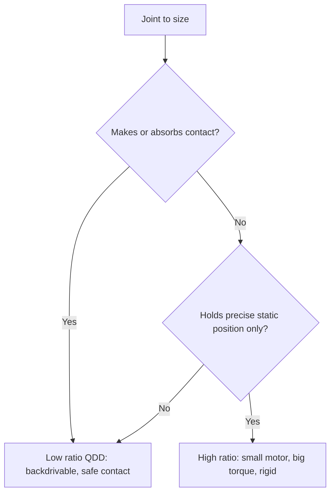

Every motion your robot makes is a torque delivered through an actuator, so the actuator choice quietly determines what the robot can and cannot do — how hard it can push, how safely it can touch, how long it can run. This lesson gives you a working decision framework for the single most important actuator question of the 2020s: how much gear reduction to put between the motor and the joint. Get this right and contact becomes safe and controllable; get it wrong and your robot is either too weak or dangerously rigid.

## Why hydraulics lost (and what replaced them)

Boston Dynamics' hydraulic Atlas could do backflips, but hydraulics are loud, leak, and need bulky pumps and accumulators — a non-starter for a robot meant to work quietly next to people. The replacement, proven at robot scale by **MIT's Mini Cheetah (2018)**, is the **quasi-direct-drive (QDD)** electric actuator: a high-torque brushless motor with only a small gear reduction. Mini Cheetah used a **6:1 planetary gear ratio**, twelve motors, and weighed just **14 kg** — and crucially, it was *backdrivable*.

The deep idea, developed in the MIT Cheetah work (Bledt et al., IROS 2018) and the low-cost manipulation work (Bhatt et al., ICRA 2021), is that **transparency to external force is a design goal, not an accident.** A QDD joint can feel and yield to contact because little gearing stands between the joint and the motor.

## The gear ratio decision — your most important knob

This is the trade-off to internalize, because you will make it for every joint:

- **Low ratio (QDD, ~3:1 to 9:1):** the motor spins slowly, directly coupled to the joint. Backdriving it requires only small forces, so contact is inherently safe and force is easy to estimate from motor current. The cost: you need a physically larger, heavier motor to hit a given torque.
- **High ratio (100:1+, e.g., harmonic drives):** small motor, big torque — but **non-backdrivable**. A force on the output cannot spin the motor, so the joint is rigid and, in a collision, unforgiving. Great for a position-controlled industrial arm behind a fence; dangerous for a humanoid in contact with people.

**Decision rule:** if a joint regularly makes or absorbs contact (legs in locomotion, arms near humans), bias toward QDD. If it holds a precise position under static load and never touches a person, a high ratio is acceptable. Most of your humanoid's major joints want low ratios.

## The numbers you size against

Two specifications govern actuator selection. Keep them on a card.

**Torque density (Nm of joint torque per kg of actuator):** QDD lands around **10–20 Nm/kg**, series-elastic actuators around **5–15 Nm/kg**, and hydraulics above **100 Nm/kg**. Hydraulics still win raw torque-to-weight — which is *why* Atlas could backflip — but at roughly 10× the cost and complexity. For an electric, human-safe robot, QDD is the sweet spot.

**Peak vs. continuous torque:** a QDD motor can briefly produce **3–5× its continuous rating** before its windings overheat. This headroom is not a bonus — it is load-bearing design margin for heel-strike impacts and dynamic maneuvers. **Size the continuous rating for the average task and rely on the peak rating for transients**, then verify the thermal duty cycle (Lesson 2.5).

## Sourcing: you do not have to build the motor

A practical reality that saves months: you can buy QDD actuators off the shelf. **T-Motor (China)** supplies QDD units used by Unitree and many startups; **Moog and Parker** serve the industrial high end; Boston Dynamics designs in-house. For a first build, integrating a known QDD module (with its driver and encoder) is almost always the right call over designing a motor from scratch — you spend your engineering budget on control and integration, where the real differentiation lives. Reserve custom actuator design for the joints where an off-the-shelf part genuinely cannot meet your torque-density or form-factor target.

## Putting it into practice

Turn the trade-off into a concrete selection for one joint.

1. Pick a joint — say a knee — and estimate its **peak torque** from a simple static model (body mass × gravity × moment arm at the worst pose). Add a dynamic factor of 3–5× for impact.
2. Convert to a **continuous** requirement using your expected duty cycle (what fraction of the time is the joint near peak?).
3. Browse a real QDD actuator datasheet (e.g., a T-Motor unit). Find one whose *continuous* torque covers your continuous need and whose *peak* covers your impact case.
4. Compute the resulting torque density (joint torque ÷ actuator mass) and check it against the 10–20 Nm/kg band. If you are far off, your gear ratio or motor size is wrong.
5. State, in one sentence, whether this joint should be backdrivable and why — and confirm your chosen ratio matches that answer.

## Key takeaways

- The actuator's gear ratio is the master trade-off: low ratio (QDD) buys backdrivability and safe contact; high ratio buys torque but rigidity and danger in collisions.
- MIT's Mini Cheetah (2018) proved QDD at robot scale — 6:1 ratio, 12 motors, 14 kg, backdrivable — and made force-transparency a design goal.
- Size against two numbers: torque density (QDD ≈ 10–20 Nm/kg) and the 3–5× peak-over-continuous headroom that covers impacts.
- Default to QDD for any joint that makes contact (legs, arms near people); reserve high ratios for fenced, position-only joints.
- Buy QDD modules off the shelf (T-Motor, Moog, Parker) for a first build; design custom actuators only where no part fits.
