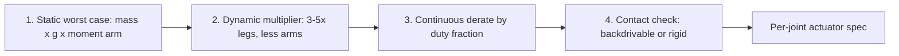

You now know the two actuator families and when to use each. This lesson is where you apply that judgment across a whole body. A humanoid has **40–50 joints**, and they are not interchangeable: the ankle lives a different mechanical life than the wrist. The deliverable here is a complete, defensible actuator map for your robot — the document every other subsystem (power, thermal, control) depends on.

## Read the body as a torque map

Work from the ground up, because the loads do too. For each joint class, the question is the same — *what is the worst-case torque, how often does it occur, and does this joint touch anything?* — but the answers differ sharply.

**Ankle.** Highest *impact* loads in the robot: heel strike can hit **3–5× body weight**. It needs a stiff, high-torque, fast actuator — a QDD unit with **200+ Nm peak** is the recommendation. Compliance here would sabotage locomotion.

**Knee.** Highest *continuous* torque, so it usually carries the biggest motor in the machine: plan for **150–250 Nm continuous and 400+ Nm peak**. This joint dominates your thermal and power budgets, so size it first.

**Hip (3 DOF each).** Abduction/adduction, flexion/extension, and rotation, with a combined budget around **300 Nm**. Mechanically you choose between a compact ball-joint arrangement and a three-actuator universal joint — the classic packaging-versus-serviceability trade.

**Shoulder (3–4 DOF).** The human shoulder is the most complex joint, and its redundancy buys reach and dexterity. Target roughly **80 Nm** to raise a 5 kg arm. As established in Lesson 2.2, this is SEA territory.

**Fingers.** Either micro-actuators at each joint or — more commonly — **tendon-driven** designs with the motors moved proximally into the forearm. Torques are small (**1–5 Nm per joint**), but **cable routing and friction are the real engineering challenge**, and they make or break hand reliability.

**Spine.** Frequently underspecified and then regretted. Give it at least **2–3 DOF (pitch, roll, yaw)**; it is essential for whole-body motion and balance, and low-ratio harmonic drives are a common fit.

## The pattern: match topology to duty, not to convenience

Notice the through-line: you are matching *actuator topology to the joint's duty cycle and contact role*, not standardizing on one part to simplify the BOM. Standardizing is tempting and almost always wrong for a humanoid — it overbuilds the wrists and underbuilds the knees. The right discipline is to compute each joint's requirement, then pick the smallest actuator (and the cheapest ratio) that satisfies it with sane margin.

## A reusable sizing recipe

For any joint, the same four steps give you a defensible number:

1. **Static worst case:** the torque to hold the heaviest pose (mass × gravity × moment arm).
2. **Dynamic multiplier:** scale up for acceleration and impact — roughly 3–5× for legs, less for arms.
3. **Continuous derate:** multiply by the fraction of time the joint sits near that load to get a continuous rating.
4. **Contact check:** decide backdrivable (QDD/SEA) or rigid, per Lessons 2.1–2.2.

Run those four steps per joint and the actuator map writes itself.

## Putting it into practice

Build the artifact this whole module is aiming at.

1. Make a table with one row per joint for G1's ~40-joint system, and columns: joint name, DOF, estimated peak torque, continuous torque, speed requirement, recommended actuator type (QDD/SEA/harmonic/tendon), and a mass budget per joint.
2. Use the four-step recipe to fill the torque columns; use the contact check to fill the type column.
3. Sum the mass column — that number is your actuator mass budget, and it feeds directly into the power and battery sizing of the next lesson.
4. Find your three heaviest, hottest joints (almost certainly the knees and hips). Flag them: they will dominate Lessons 2.4 (power) and 2.5 (thermal).

Keep this table. It is the backbone document the rest of the robot is designed around.

## Key takeaways

- A humanoid's 40–50 joints have sharply different duties; size each one, don't standardize the BOM.
- Legs carry the extremes — ankle (200+ Nm peak, impact-driven), knee (150–250 Nm continuous, the biggest motor); hips ~300 Nm across 3 DOF.
- Arms are lighter and compliant — shoulders ~80 Nm (SEA); fingers 1–5 Nm, usually tendon-driven, where cable routing is the hard part.
- Don't forget the spine: 2–3 DOF, often low-ratio harmonic drives, critical for whole-body motion.
- Use one recipe per joint — static worst case → dynamic multiplier → continuous derate → contact check — and the actuator map becomes the document power, thermal, and control all build on.
