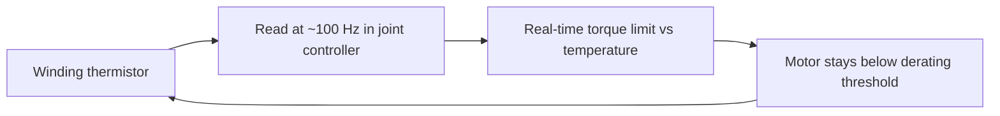

A robot that looks powerful in a one-minute demo can quietly fail over an eight-hour shift, and the usual culprit is heat. Motors turn current into torque, but they also turn current into heat, and at high duty cycles **winding temperature — not torque or battery — becomes the binding constraint** on sustained performance. This lesson gives you the model and the design options to keep your robot working at hour eight as well as it did at minute one.

## The model you design against

One relationship governs everything here:

> winding temperature rise ≈ **I²R losses × thermal resistance**

Torque costs current; current squared times the winding resistance is heat; that heat times the path's thermal resistance to ambient is how hot the copper gets. A typical **Class F insulation limit is 150 °C** at the winding. Cross it and you cook the insulation and shorten the motor's life — permanently.

Because the loss term is **I²**, heat scales with the *square* of torque. Doubling torque quadruples heating. This is exactly why Lesson 2.1's peak-vs-continuous distinction exists: the peak rating is a short thermal sprint, the continuous rating is the pace you can hold forever.

## Derating is the failure mode to prevent

When a motor approaches its limit it protects itself by **thermal derating** — most must cut torque by about **50% once the winding reaches ~120 °C**. From the outside this looks like the robot mysteriously getting weaker as the day goes on, then faulting out. Your job is to design so the hot joints (the knees and hips you flagged in Lesson 2.3) never reach that regime under their real duty cycle.

## Your cooling options, cheapest first

Pick the lightest method that keeps your hottest joint below its derating threshold — escalate only as needed:

- **Passive:** an aluminum housing with fins. Free in mass and complexity, adequate for low-duty joints (wrists, fingers). Try this first.
- **Active air:** miniature fans inside the joint housings. A modest mass and noise cost; good for medium-duty joints.
- **Liquid:** a water/glycol loop run through hollow motor shafts. The heaviest and most complex option, reserved for the few joints that genuinely need it. **Figure 02 uses liquid-cooled actuators in its high-load joints** — about **+2 kg**, but it buys *sustained operation without derating*, which for a working robot is worth the weight.

The discipline mirrors the actuator-selection logic: match the cooling tier to the joint's thermal duty, don't blanket the robot in liquid cooling.

## Close the loop and design for life

Thermal management is not just mechanical — it's a control loop. Put a **thermistor in each motor winding**, read it at ~**100 Hz** in the joint controller, and feed it into a **real-time limit on the torque command**. That way the robot trades a little performance to stay alive instead of faulting, and you get telemetry to find your true hot spots in the field.

Finally, design for the long run. Commercial humanoid actuators should target **10,000+ hours MTBF**, and the **ball bearings are usually the first wear item** — heat accelerates their failure, which closes the loop: good thermal design is also good reliability design.

## Putting it into practice

Thermally validate your hottest joint.

1. Take the knee from your Lesson 2.3 table. Using its continuous current, winding resistance, and an estimated thermal resistance to ambient, compute the steady-state winding temperature from `ΔT ≈ I²R × R_thermal`.
2. Compare to the 120 °C derating point and 150 °C limit. Is it safe at full continuous load, or does it derate?
3. If it derates, step through the cooling ladder — passive → active air → liquid — and find the cheapest tier that brings it under threshold. Note the mass each tier adds.
4. Specify the protection loop: thermistor placement, sample rate, and the torque-limit curve versus temperature.
5. State your bearing-life assumption and how your chosen operating temperature affects the 10,000-hour MTBF target.

## Key takeaways

- At high duty cycles, winding temperature — not torque or battery — limits sustained performance; design against `ΔT ≈ I²R × thermal resistance`, with a ~150 °C Class F limit.
- Heat scales with torque squared, which is why peak ratings are short sprints and continuous ratings are the all-day pace.
- Prevent thermal derating (≈50% torque cut near 120 °C) on your hottest joints — typically the knees and hips.
- Match cooling to duty: passive fins → active air → liquid loops; Figure 02 liquid-cools only its high-load joints (+~2 kg) to avoid derating.
- Close the loop: per-winding thermistors at ~100 Hz feeding a real-time torque limit; design for 10,000+ hours MTBF, where bearings (accelerated by heat) fail first.
