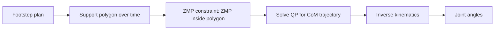

Before a humanoid can run, recover from a shove, or climb a stair, someone had to answer a deceptively simple question: what does it even mean for a walking machine to be "stable"? For roughly thirty years the answer was the Zero Moment Point, and ASIMO, HRP-2, and the early ATLAS robots all stood on it. Modern robots have moved past pure ZMP control, but you cannot understand *why* they moved on — or what their replacements are still quietly protecting against — without first owning the classical theory. This lesson builds that foundation: the support polygon, the ZMP criterion, the Linear Inverted Pendulum, and the capture point that survives into today's controllers as a last line of defense.

## Standing still is already a control problem

Stand on one foot and you discover the core difficulty of bipedalism: your body is a tall mass balanced over a small patch of ground. The patch your feet cover — the convex hull of all ground-contact points — is the **support polygon**. Statically, you stay upright as long as the vertical line through your **center of mass (CoM)** falls inside that polygon. Lean far enough that the line exits the polygon and gravity produces a moment you cannot cancel, and you tip.

But walking is not static. The body accelerates, the legs swing, and inertial forces join gravitational ones. We need a criterion that accounts for motion, not just position. That criterion is the Zero Moment Point.

## The Zero Moment Point criterion

The **Zero Moment Point (ZMP)**, introduced by Miomir Vukobratović in 1969 and refined in his later work with Borovac (*Biped Stability Conditions with Ankle, Hip and Foot Rotation Indicators*, 2004), is the point on the ground where the net moment of the inertial and gravitational forces has **no component along the horizontal axes**. In plain terms: it is the point where the ground reaction can fully balance the robot without the foot rotating about an edge.

The rule that governs everything classical:

> **If the ZMP stays strictly inside the support polygon, the gait is dynamically balanced.** The instant the ZMP reaches the edge of the polygon, the foot begins to roll about that edge — and you are falling.

Notice how this generalizes the static case. When the robot is motionless, the ZMP coincides with the ground projection of the CoM, and the criterion collapses back to "CoM over the support polygon." Add motion and the ZMP shifts to account for inertial forces. This is why ZMP is the right object to plan against: it is the single point that tells you whether the current motion is supportable by the current contact.

## The Linear Inverted Pendulum: making it computable

The ZMP criterion is exact but the full multi-body dynamics of a 40-joint robot are far too heavy to plan with in real time. The classical escape is a brutal, useful simplification: the **Linear Inverted Pendulum Model (LIPM)**. It approximates the entire robot as a single **point mass riding on a massless leg**, with the mass constrained to move at constant height.

That constraint linearizes the dynamics — hence "Linear" — and the payoff is enormous. CoM trajectory planning under the ZMP constraint becomes a **convex optimization**, specifically a **quadratic program (QP)** you can solve fast enough to run in the control loop. The planning recipe that dominated the 2000s falls out directly:

1. Decide where the feet will land (the footstep plan), which fixes the support polygon over time.
2. Demand that the ZMP stay inside that moving polygon.
3. Solve a QP for the CoM trajectory that satisfies the ZMP constraint.
4. Use inverse kinematics to turn the CoM and foot trajectories into joint angles.

This is, in essence, how ASIMO walked.

## Why ZMP was not enough

The same property that makes ZMP tractable is what limits it. Keeping the ZMP safely inside the support polygon forces a **slow, flat-footed gait**. Honda's ASIMO walked at about **2.7 km/h on flat ground** — graceful in a lobby, useless on a loose rug. The fundamental problem: a ZMP controller plans motions it can already support, so it cannot deliberately let the ZMP reach the polygon edge to run, jump, or take a recovery step. Worse, ASIMO **failed completely under any unexpected perturbation or terrain variation** — a small push or an unseen bump took the real state outside the planned envelope, and there was no plan for the unplanned.

The first crack in that wall is **capture point theory** (Pratt et al., *Capture Point: A Step toward Humanoid Push Recovery*, Humanoids 2006). The capture point is, intuitively, *where you would have to step right now to come to a complete stop.* It extends ZMP reasoning from "keep the ZMP inside the current polygon" to "if I am pushed, where must I place my next foot to absorb it?" — a single-step recovery law. This matters for you as a builder for a practical reason: even in modern reinforcement-learning robots, capture-point-style logic survives as a **fallback** that fires when the learned policy loses confidence. The classical theory did not die; it retreated to the safety layer.

## Putting it into practice

Build the planner's heart — a ZMP-constrained CoM trajectory for a single step — and feel the trade-off in your own numbers.

1. **Set the model.** Choose a CoM height *z* (say 0.8 m) and compute the LIPM time constant from gravity and height: ω = √(g/z). This single number governs the pendulum's dynamics.
2. **Define the footstep.** Place a single support foot and write down its support polygon as a rectangle on the ground (the foot's footprint). This is your ZMP constraint region for the step.
3. **Specify the reference.** Pick a desired ZMP trajectory that stays inside the footprint (the simplest choice: hold it at the foot center, then shift toward the next foot near step's end).
4. **Solve for the CoM.** Using the LIPM relation between CoM acceleration and ZMP, set up a small QP: minimize CoM jerk (or deviation from a nominal path) subject to the ZMP staying inside the footprint across the horizon. Solve it.
5. **Compute the capture point** at a few instants as CoM position plus CoM velocity divided by ω. Note where it lies relative to the foot — this is the recovery step location you would need if pushed at that moment.
6. **Make the trade-off concrete.** Now shrink the footprint (smaller feet) and re-solve. Watch the feasible CoM speed drop. You have just reproduced, in miniature, exactly why ZMP forces slow, flat-footed walking — and why the field moved to MPC and RL.

## Key takeaways

- Stability for a walker is not "CoM over the feet" but the **ZMP criterion**: the gait is balanced only while the Zero Moment Point stays strictly inside the support polygon.
- The **Linear Inverted Pendulum Model** reduces the robot to a constant-height point mass, turning ZMP-constrained CoM planning into a real-time **quadratic program** — the engine behind ASIMO-era walking.
- ZMP's tractability is also its ceiling: it demands a **slow, flat-footed gait** (ASIMO ~2.7 km/h) and breaks under unexpected pushes or terrain.
- **Capture point theory** (Pratt, 2006) extends ZMP to single-step push recovery and survives in modern robots as the fallback when learned policies fail.
- Master this classical layer not because you will ship it as your main controller, but because every controller you *will* ship is still implicitly protecting the ZMP and the support polygon.
