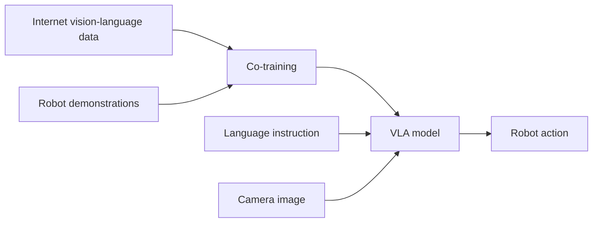

Before 2022, teaching a robot a new manipulation skill meant building a new controller from scratch. A grasp controller and a pouring controller shared almost nothing — different state estimators, different motion primitives, different tuning. This lesson is about the moment that assumption broke. The insight that reshaped language models — scale the data and the model enough and one network learns to do everything — turned out to apply to robots too. Your job in this lesson is to understand *why* that shift happened, and what it means for where you should spend your engineering effort now.

## The narrow-policy era and why it capped out

A narrow policy is a controller built for exactly one task. It works, sometimes beautifully, but it does not transfer: the representation it learned for "pick up the block" has no notion of "pour the cup," so every new skill restarts the engineering cycle. This is fine for a factory cell that does one thing forever. It is fatal for a general-purpose robot, because the number of tasks a humanoid faces is effectively unbounded, and you cannot hand-author a controller per task.

The cap was never the hardware. It was the assumption that each task needs its own program. Breaking that assumption required two things to arrive together: a model architecture that could absorb many tasks at once, and enough data to fill it.

## RT-1: one transformer, many tasks

The first proof that the assumption was wrong came from **RT-1 (Google, 2022)**. A single transformer policy, trained on **130,000 robot demonstrations**, generalized to new tasks and new objects it had not been explicitly programmed for. This matters more than the raw success numbers. RT-1 showed that a transformer — the same family of architecture behind language models — could serve as a *shared substrate* for manipulation. Tasks stopped being separate programs and became points in a learned space the network could interpolate across.

The lesson to internalize: generality is not a clever algorithm bolted onto a controller. It emerges when one model sees enough varied demonstrations that it builds a representation broad enough to cover tasks it was never told about explicitly.

## RT-2: the web changes what the robot knows

**RT-2 (Google DeepMind, 2023)** took the next step, and it is the one that should reframe how you think about robot intelligence. RT-2 was **co-trained on internet-scale vision-language data and robot demonstrations together**. The vision-language data was not about robots at all — it was the general web knowledge that powers a large multimodal model. Folding robot demonstrations into that same training produced an emergent capability: **novel semantic reasoning inside manipulation**.

The canonical example makes it concrete. Told to "place the extinct animal in front of the green object," RT-2 correctly identified a dinosaur toy as the extinct animal and placed it appropriately — **zero-shot, from language alone**. Nobody trained a "dinosaur grasp." The concept "extinct animal → dinosaur" came from web pre-training; the robot simply grounded that concept into a motor action. Web knowledge flowed straight into physical behavior.

This is the defining property of a Vision-Language-Action (VLA) model: it inherits the semantic breadth of a vision-language model and learns to emit actions in the same forward pass.

## Scale, and the cost it imposes

RT-2 was built on a **55-billion-parameter PaLM-E backbone**. The pattern that holds across this lesson is a scale law for robotics: **larger models generalize better**. But that capability has a price you will pay in hardware. A 55B-parameter model is not something you run at high frequency on a battery-powered robot's onboard compute. The generalization you want and the latency you can afford pull in opposite directions, and reconciling them is a central engineering challenge — one this module returns to when we deploy VLAs on real hardware (Lesson 5.5).

Hold both facts at once: scale buys generalization, and scale costs you the ability to run cheaply and fast. Every VLA design decision downstream is a negotiation between these two.

## Open X-Embodiment: data is the moat now

The last piece reframes the entire field. **Open X-Embodiment (Google plus 33 institutions, 2023)** pooled data across **22 different robot platforms, 527 skills, and 160,000 demonstrations**, then trained a single policy that worked across those platforms. Different arms, different grippers, different labs — one policy.

The strategic message is sharp: **the bottleneck has moved from algorithm design to data quality and quantity**. The recipe — teleoperation to collect demonstrations, internet-scale pre-training for semantics, a transformer to fuse them — is now widely known. What separates a working general policy from a non-working one is the data: how much, how varied, how clean. If you are deciding where to invest, this is the answer. Invest in data pipelines and demonstration quality, not in inventing a new policy architecture from first principles.

## Putting it into practice

You do not need a robot to internalize this shift. Build the comparison on paper, then make a decision.

1. Pick two manipulation tasks you care about — say "place a cup on a shelf" and "fold a towel." For each, sketch what a *narrow* controller would need: state representation, motion primitives, tuning parameters. Note how little they share.
2. Now sketch the *VLA* alternative: one model, one language instruction per task, the same network for both. List what you'd need instead — demonstrations and a pretrained backbone, not two controllers.
3. Tally the demonstration budget. RT-1 used 130,000 demos for broad generality; Open X-Embodiment pooled 160,000 across 22 platforms. Estimate how many demonstrations *your* two tasks would realistically need, and where they'd come from (your own teleoperation, or an open dataset like Open X-Embodiment).
4. Identify your true bottleneck. For each task, write one sentence: is the hard part the algorithm, or the data? If you wrote "data" both times, you've correctly absorbed the lesson.
5. Decide your stack posture: build narrow controllers, or adopt a general VLA and feed it data? Justify it in two sentences with your task count and data access.

## Key takeaways

- Before 2022, every manipulation task needed its own hand-built controller, with no transfer between tasks — a hard cap for any general-purpose robot.
- RT-1 (Google, 2022) showed a single transformer trained on 130,000 demonstrations could generalize to new tasks and objects, making tasks points in a shared learned space rather than separate programs.
- RT-2 (Google DeepMind, 2023) co-trained on internet vision-language data and robot demos, yielding emergent semantic reasoning — e.g., zero-shot placing the "extinct animal" (a dinosaur toy) from language alone.
- The scale law holds: larger models (RT-2's 55B PaLM-E backbone) generalize better, but cost you the hardware budget and latency you need to run onboard.
- Open X-Embodiment (2023) pooled 22 platforms, 527 skills, 160,000 demonstrations into one cross-platform policy, proving the recipe is reproducible across hardware.
- The bottleneck has shifted from algorithm design to data quality and quantity — invest your effort in demonstration pipelines, not in inventing new policy architectures.
