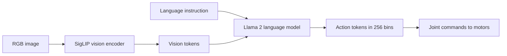

The VLA models in the last two lessons were, for most of their history, locked behind corporate labs and partnership agreements. **OpenVLA (Stanford and Berkeley, June 2024)** changed that. It was the first *fully* open-source VLA to match RT-2-X on standard benchmarks — which means any lab, including yours, can fine-tune a state-of-the-art general-purpose robot policy on its own hardware. This lesson is about turning that access into a working adaptation, and about understanding the one design choice that makes OpenVLA's openness practical: treating actions as language tokens.

## The architecture: a VLM that speaks "action"

OpenVLA is a **7.5-billion-parameter** model built on the **Prismatic VLM**, which combines a **SigLIP vision encoder** with a **Llama 2 language model**. Camera images go through SigLIP; the language instruction goes through Llama 2; the two fuse into a representation that drives action prediction.

The defining move is in how it emits actions. **Actions are tokenized as discrete language tokens.** Each continuous action dimension is **discretized into 256 bins**, and each bin is encoded as a language token. The policy literally predicts robot actions the same way a language model predicts the next word.

This sounds like a small detail. It is the central design decision, and it is worth dwelling on why.

## Why action-as-tokens is the unlock

When actions are language tokens, **you can use LLM training infrastructure directly**. Every tool the language-model community has built — tokenizers, training loops, LoRA adapters, distributed training recipes, inference servers — applies to your robot policy unchanged. You are not maintaining a bespoke robotics training stack; you are fine-tuning a language model that happens to output joint commands.

This is precisely what democratized VLA research. A small lab does not have the resources to build and maintain a novel continuous-control training pipeline, but it absolutely can run a LoRA fine-tune of a Llama-based model, because that path is paved and documented. The token abstraction converts an exotic robotics problem into a familiar language-model problem.

The trade-off, which you should name honestly: discretizing each action dimension into 256 bins throws away some precision compared to continuous-action methods like π0's flow matching (Lesson 5.2). For many manipulation tasks the bins are fine; for the most contact-rich, high-precision work, the discretization can cost you. Keep that tension in mind when you choose between OpenVLA and a continuous-action policy.

## Performance and the latency reality

On capability, OpenVLA **matches RT-2-X on the BridgeV2 benchmark and outperforms it on several manipulation tasks** — genuinely state-of-the-art, fully open. But you must hold its capability and its speed in the same view.

OpenVLA runs at **6 Hz on a single A100 GPU**, and only **1.5 Hz on an NVIDIA Orin AGX** — the kind of compute you'd actually mount on a mobile robot. Six hertz is workable for slower task-level control; **1.5 Hz on Orin is too slow for reactive, contact-rich manipulation**. This is the same scale-versus-latency tension from Lesson 5.1, now concrete. A 7.5B model is capable precisely because it is large, and large is what makes it slow on edge hardware.

The follow-up addresses exactly this. **OpenVLA-OFT (2025)** introduced an optimized fine-tuning recipe using **parallel decoding plus action chunking**, pushing inference to **25-plus Hz** and enabling contact-rich, high-frequency manipulation. The lesson here is structural: the base model gives you capability; the inference recipe gives you the frequency to use it. When you evaluate any VLA, ask about both, separately.

## Fine-tuning: the part you'll actually do

This is where OpenVLA earns its place in your stack. **LoRA fine-tuning on 200 to 500 demonstrations converges in 2 to 4 hours on a single GPU.** That is a weekend project on one consumer-class machine, not a data-center campaign — and it is what makes task-specific adaptation realistic for a small team.

Everything you need is available and permissively licensed: pretrained checkpoints are on **HuggingFace**, the code is at **github.com/openvla/openvla**, and the **Apache 2.0 license** lets you use and modify it commercially. There is no gate, no partnership agreement, no API quota. Contrast this with the more restricted access paths of some closed VLAs, and OpenVLA's strategic value becomes obvious: it is the model you can own.

## Choosing OpenVLA versus the alternatives

Make the decision explicitly. If you need a model you can **fully self-host, inspect, and fine-tune end to end on your own GPUs under a permissive license**, OpenVLA is the default — that is its entire reason for existing. If you need the **smoothest continuous whole-body control** and can accept a more restricted release, a flow-matching policy like π0 (Lesson 5.2) may serve better. If you want a humanoid-oriented open model with an integrated simulation-and-data pipeline, NVIDIA's GR00T N1 family is a credible open alternative in the 2026 landscape. Recommendation for a first serious VLA project: start with **OpenVLA plus a LoRA fine-tune**, and adopt the **OFT recipe** the moment your task needs higher control frequency.

## Putting it into practice

Plan a real fine-tune end to end, then execute the data step.

1. **Pick one task** and define its action space — e.g., 7-DOF end-effector deltas plus a gripper. Note that each dimension will be discretized into 256 bins, and judge whether that resolution is enough for your task's precision.
2. **Budget the data.** Target the 200-500 demonstration range that LoRA needs, and decide how you'll collect them (teleoperation) or whether an existing dataset covers the task.
3. **Pull the checkpoint and code** from HuggingFace and github.com/openvla/openvla; confirm the Apache 2.0 license fits your intended use.
4. **Estimate the fine-tune run:** 2-4 hours on a single GPU for LoRA. Then estimate your *inference* frequency on your target hardware — recall ~6 Hz on A100 and ~1.5 Hz on Orin AGX — and decide whether you'll need the OFT recipe to reach 25-plus Hz.
5. **Write the go/no-go.** In three sentences, state whether OpenVLA's 256-bin precision, your data budget, and your achievable control frequency clear your task's bar — and if not, which alternative you'd switch to.

## Key takeaways

- OpenVLA (Stanford and Berkeley, June 2024) is the first fully open-source VLA to match RT-2-X on benchmarks, democratizing access to state-of-the-art robot policies.
- It is 7.5B parameters on the Prismatic VLM (SigLIP vision encoder plus Llama 2), and tokenizes actions as discrete language tokens — 256 bins per dimension — so it can reuse LLM training infrastructure directly.
- That token abstraction is the openness unlock, at the cost of some precision versus continuous-action policies like π0's flow matching.
- Capability and speed must be judged separately: it matches RT-2-X on BridgeV2 but runs only ~6 Hz on A100 and ~1.5 Hz on Orin AGX; OpenVLA-OFT (2025) reaches 25-plus Hz via parallel decoding and action chunking.
- Fine-tuning is genuinely accessible: LoRA on 200-500 demonstrations converges in 2-4 hours on a single GPU.
- Checkpoints are on HuggingFace, code at github.com/openvla/openvla, under Apache 2.0 — the model you can actually own; default to it for a first VLA project and add OFT when you need higher frequency.
