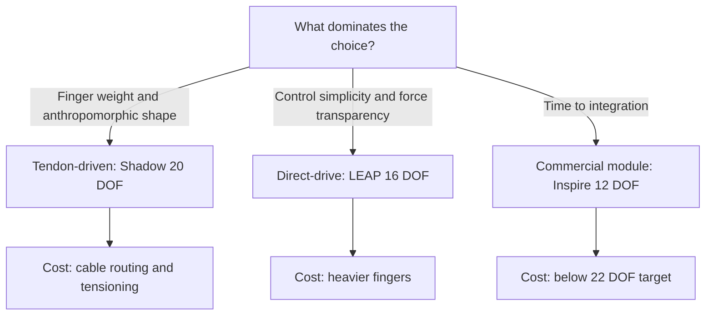

The hand is where a humanoid stops being an impressive demo and starts being useful. A robot that can walk but cannot thread a needle, pick up an egg without crushing it, or distinguish a full medication bottle from an empty one is not yet a healthcare worker. This lesson gives you a decision framework for the first and most consequential hand choice you will make: how many degrees of freedom to build, and how to actuate them. Get this right and every downstream skill — tactile sensing, grasp planning, in-hand manipulation — has a body to live in. Get it wrong and you will be fighting your own hardware for the life of the project.

## Why 22 DOF — and why not 21, or 12

Start from the biological reference. The human hand is built from 27 bones and 29 joints driven by more than 30 muscles, and when you count the *controllable* axes of motion it resolves to roughly **21 degrees of freedom**. The breakdown is worth memorizing because it tells you where dexterity actually comes from: four fingers each contribute 4 DOF — flexion/extension and abduction/adduction at the knuckle (MCP), plus flexion at the two finger joints (PIP and DIP) — for 16, and the thumb alone adds 5. The thumb is disproportionately important; it is why a human can oppose any fingertip to any other.

No robot needs to reproduce all 21 to be useful, which is why the field clusters around **16 to 22 DOF** as the practical band. Below 16 you start losing the ability to form the precision and lateral pinches that fine tasks require; above 22 you pay in weight, cost, and control complexity for capability you rarely use. The G1 healthcare target lands at **22 DOF minimum**, a number that is not arbitrary — both Figure 02 and Tesla Optimus Gen 2 independently converged on 22 DOF for their production hands. When two of the best-funded humanoid programs in the world pick the same number, treat it as a strong prior rather than a coincidence.

## Tendon-driven vs. direct-drive: the actuation fork

Every multi-fingered hand answers one question first: where do the motors live? This is the actuation fork, and it shapes everything else.

**Tendon-driven hands** put the motors in the forearm or palm and run cables — tendons — through the fingers to move the joints. The **Shadow Dexterous Hand**, with its **20 DOF**, is the canonical example. The payoff is light, slim fingers, because the heavy actuators are proximal and only thin cables travel out to the joints. Light fingers move faster, hit harder per gram, and look and feel the most human. The cost is routing complexity: cables stretch, need tensioning, can snag or wear, and the mapping from motor angle to joint angle is coupled and nonlinear. You buy anthropomorphic fingers and pay in mechanical and calibration overhead.

**Direct-drive hands** put a small actuator at (or very near) each joint. The **LEAP Hand** from Carnegie Mellon (Shaw et al., 2023) is the reference design — **16 DOF**, open-source, 3D-printable, and built from off-the-shelf parts for roughly the cost of a few thousand dollars, which is why it has spread so widely through research labs. Direct drive means heavier fingers, but in exchange you get dramatically simpler control and **more transparent force feedback**: because little stands between the motor and the joint, motor current is a clean proxy for joint torque (exactly the backdrivability logic from the actuator lessons, applied at finger scale). For a team that wants to *learn* policies rather than hand-tune tendon models, that transparency is worth a great deal.

There is a third, pragmatic option: buy a finished module. The **Inspire Hands** used in the Unitree G1 upgrade kit offer **12 DOF**, solid dexterity, ROS support, and a known price of roughly **$8k per pair**. Twelve DOF is below the healthcare target, but for early integration — getting *a* hand on the robot and writing the rest of the stack — a commercial, supported unit removes a huge amount of risk.

## How the choice flows from the task

The decision is not "which hand is best" but "which hand fits *these* tasks." Anchor on the three G1 reference tasks. Threading a needle demands fine fingertip placement and high positional resolution — it rewards DOF and clean control. Picking up an egg demands force transparency and gentle, regulated contact — it rewards backdrivable, well-sensed actuation. Handling medication demands repeatability and the ability to read grip state. Notice that all three lean toward *more* DOF and *better force feedback*, which is precisely why the G1 spec sets 22 DOF as a floor and calls for **tendon drive to keep finger weight down**, while still requiring **custom tactile sensing on all ten fingertips**. The hand spec encodes a bet: anthropomorphic finger geometry plus dense fingertip sensing is the combination healthcare manipulation needs.

That last requirement — tactile on every fingertip — is non-negotiable and shapes the mechanical design from the start. You cannot bolt good tactile sensing onto a hand that was not designed with cavities and cable paths for it. Design the sensing in, not on.

## Putting it into practice

Produce a one-page hand specification you could hand to a mechanical engineer.

1. **Set the DOF budget.** Start from 22 and justify each axis against a task. Allocate the thumb its 5 DOF first (it is your opposition workhorse), then distribute the rest across fingers. Write down which tasks die if you drop below your number.
2. **Pick the actuation strategy.** Choose tendon-driven if finger weight and anthropomorphic geometry dominate (the G1 default); choose direct-drive if control simplicity and force transparency dominate; choose a commercial module (Inspire) if time-to-integration dominates. State the one factor that decided it.
3. **Reserve the tactile real estate.** For all ten fingertips, sketch the cavity and cable routing that a fingertip tactile sensor will need. Confirm your DOF and actuation choices still hold once the sensors take up space.
4. **Reality-check against a reference.** Compare your spec line-by-line to LEAP Hand (16 DOF, direct-drive, open) and Shadow (20 DOF, tendon). If your hand claims more capability than both at lower cost, find the error.
5. **Name the riskiest item** in your spec — usually cable routing for tendon hands or finger mass for direct-drive — and write the experiment that would retire that risk first.

## Key takeaways

- The human hand resolves to ~21 controllable DOF (4 fingers × 4 + thumb × 5); robots cluster at 16–22 DOF as the cost/weight/capability compromise.
- The G1 healthcare hand targets 22 DOF minimum — the same number Figure 02 and Optimus Gen 2 chose — with tendon drive preferred and tactile sensing on all ten fingertips.
- Tendon-driven hands (Shadow, 20 DOF) give light, anthropomorphic fingers at the cost of complex cable routing; direct-drive hands (LEAP, 16 DOF, open-source, low-cost) give simpler control and transparent force feedback at the cost of heavier fingers.
- For fast integration, a commercial module like the Inspire Hands (12 DOF, ~$8k/pair, ROS support) buys time even though it sits below the 22-DOF target.
- Let the task drive the spec: needle-threading rewards DOF, egg-handling rewards force transparency — both push toward more DOF and better sensing.
- Design tactile sensing in from the start; you cannot retrofit ten fingertip sensors onto a hand that left no room for them.
