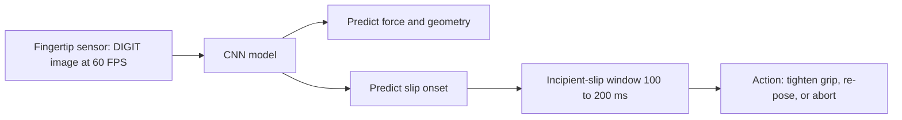

A hand without touch is a hand working blind. Vision tells your robot where an object is and roughly what shape it has, but the moment the fingers close, the camera is occluded by the very fingers doing the work — and vision never measured force in the first place. Tactile sensing is the modality that fills this gap, and in healthcare it is not optional: gentle contact with a patient, detecting the micro-slip that precedes dropping a vial, and reading how much force a fingertip is applying are all things you can only know by feeling. This lesson gives you a working understanding of the three sensor families a builder actually chooses between, what each measures, and how to turn raw tactile data into grasp decisions.

## Three sensor families, three physical principles

Tactile sensors differ at the level of physics, and that difference dictates what you can sense.

**GelSight-class optical sensors** are the dominant family. The original **GelSight** (MIT, Tao et al., 2012) is beautifully simple in concept: a soft gel elastomer covers the contact surface, internal **LEDs** light it from several angles, and a small **camera** images the gel from inside. When an object presses into the gel, the surface deforms, and from the shaded image you can reconstruct the **3D geometry of the contact at roughly 0.1 mm resolution**. The key insight is that a *camera* becomes a *touch* sensor — you inherit the entire maturity of computer vision for free, because a tactile reading is just an image.

**DIGIT** (Meta AI Research, Lambeta et al., 2020) took that idea and made it deployable. It is a GelSight redesigned for fingertip mounting: compact at **20 mm × 20 mm × 24 mm**, streaming tactile images at **60 FPS**, and — critically — **open-source in design**. DIGIT is why high-resolution tactile sensing moved from a handful of MIT benches into labs everywhere. (The family has continued evolving since; the GelSight–Meta collaboration later produced an omnidirectional fingertip sensor sensitive to forces in the millinewton range, but DIGIT remains the practical, reproducible workhorse for in-hand manipulation.)

**BioTac** (SynTouch) comes from a different lineage. Instead of imaging a gel, it is a fluid-filled silicone fingertip with **24 electrodes** that measure distributed pressure, plus channels for vibration and temperature. It does not give you a crisp geometric image, but it gives you a rich multimodal signal — and it is **FDA-cleared for medical applications**, which matters enormously the day your robot needs regulatory approval to touch a patient. Where GelSight/DIGIT win on spatial resolution, BioTac wins on modality breadth and clinical pedigree.

## What the signal buys you: slip, force, and geometry

The reason to instrument every fingertip is what these signals enable, and the highest-value one is **slip detection**. Before an object slips out of a grasp entirely (gross slip), there is a window of **incipient slip** — tiny shear micro-motions at the contact patch. A tactile sensor can see this **100–200 ms before grasp failure**, which is exactly enough time to react: tighten the grip, re-pose the hand, or abort. A robot that detects incipient slip is *proactive*; one that only knows it dropped something is hopeless. For carrying a tray of medication, this single capability is the difference between safe and unsafe.

The other signals map directly onto the healthcare reference tasks. Threading a needle needs sub-millimeter contact resolution — **under 0.5 mm** — which only the GelSight/DIGIT family delivers. Distinguishing a **full medication bottle from an empty one** comes from inferring mass through grip force during the lift. And **gentle patient contact** means regulating force below roughly **2 N**, which requires the sensor to report force in the first place. Each task is a sensing requirement in disguise.

## From tactile images to decisions: the learning layer

Raw tactile data is not directly actionable; you need a model that maps it to the quantities you care about. Because DIGIT and GelSight produce *images*, the natural tool is a **convolutional neural network** — the same architecture that revolutionized vision. Trained on labeled tactile images, CNNs predict contact forces, local object geometry, and slip onset with **greater than 95% accuracy**. This is the practical payoff of the "camera as touch sensor" decision: every advance in image learning transfers to touch, and you can collect training data simply by pressing known objects against the sensor and logging the result.

The honest recommendation for a builder follows from all of this. For **in-hand manipulation research and most healthcare prototyping**, default to **DIGIT** — it is compact enough to fit ten fingertips, open-source so you can reproduce and modify it, fast at 60 FPS, and its image output plugs straight into CNN pipelines. Reach for **BioTac** specifically when you need its multimodal signal or its FDA clearance is on your regulatory path. Reserve a bare custom GelSight build for cases where you need a sensing geometry no off-the-shelf unit provides. The mistake to avoid is treating all three as interchangeable: they measure different things, and your task — not the spec sheet — decides which difference matters.

## Putting it into practice

Build a small slip-detection pipeline conceptually, end to end.

1. **Choose your sensor against a task.** Pick one G1 task (needle, medication, patient contact). Write the sensing requirement it implies — resolution, force range, or modality — and select DIGIT, BioTac, or GelSight accordingly. Justify in one sentence.
2. **Define the data you would collect.** For slip detection, plan to grasp objects and gradually reduce grip force until they slip, logging the tactile image stream and the moment of gross slip. Your labels are "time-to-slip."
3. **Frame the learning problem.** Treat each tactile frame (or short stack of frames) as a CNN input; the output is a slip-onset probability. Note that you are exploiting the 100–200 ms incipient-slip window — your target is to fire an alarm *inside* it.
4. **Set the action policy.** Decide what the controller does when slip probability crosses threshold: increase grip force, re-grasp, or abort. Bound any force increase below your safety limit (e.g., 2 N near a patient).
5. **State your acceptance bar.** Aim for the >95% accuracy the literature reports as achievable, and define how you would measure it — held-out objects, not just the ones you trained on.

## Key takeaways

- Tactile sensing fills the gap vision cannot: force measurement and contact information at exactly the moment fingers occlude the camera — essential for gentle, safe healthcare manipulation.
- GelSight (MIT, 2012) turns a gel + internal LEDs + camera into a touch sensor that recovers 3D contact geometry at ~0.1 mm; DIGIT (Meta, 2020) makes it compact (20×20×24 mm), fast (60 FPS), and open-source.
- BioTac (SynTouch) uses a fluid-filled fingertip with 24 electrodes for distributed pressure, vibration, and temperature — lower spatial resolution but multimodal and FDA-cleared for medical use.
- Incipient-slip detection is the killer capability: tactile sensors see micro-motion 100–200 ms before grasp failure, enabling proactive grip adjustment instead of after-the-fact drops.
- Because DIGIT/GelSight output images, CNNs predict force, geometry, and slip onset at >95% accuracy — and data collection is as simple as pressing known objects against the gel.
- Default to DIGIT for in-hand prototyping; choose BioTac when multimodal sensing or FDA clearance is required; match the sensor to the task's resolution and force needs, not to the spec sheet.
