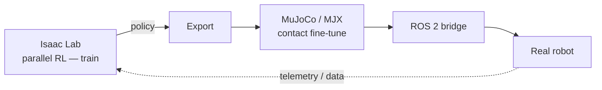

This is a build lesson, not a survey. By the end you should have a clear decision rule for which simulator to use when, the exact commands to stand each one up, and a concrete sense of how G1's policies move from a GPU training farm to real hardware. Physics simulation is where G1's neural policies are actually born — you will run thousands of simulated robots in parallel, train a policy against them, and only then touch metal.

## The two platforms that matter, and when to use each

The field has consolidated around two stacks with different strengths. Your job is to know which problem each one solves.

**Isaac Lab (NVIDIA) — for scale.** Isaac Lab is the open-source robot-learning framework built on Isaac Sim; as of 2026 it tracks **Isaac Sim 4.5** and is actively maintained (the repo saw releases as recently as May 2026). It exists to run *massively parallel* reinforcement learning — thousands of environments on a single GPU — and ships **30+ ready-to-train environments**, including Unitree G1 locomotion tasks, that plug into RL libraries like **RSL-RL, SKRL, RL-Games, and Stable-Baselines3**. Reach for it when you are training locomotion or whole-body policies that need billions of simulation steps.

**MuJoCo (DeepMind) — for contact precision.** MuJoCo is the gold standard for accurate contact dynamics. Since version 3 it ships **MJX**, which compiles the simulator through **JAX/XLA** to run thousands of parallel scenes on GPU/TPU, and the newer **MJWarp** (`mujoco_warp`) is a GPU-optimized build targeting NVIDIA hardware. Reach for MuJoCo when contact fidelity matters more than raw scale — fine manipulation, grasp tuning, anything where how fingers touch objects determines success.

**The G1 decision rule:** train locomotion at scale in **Isaac Lab**, fine-tune contact-rich manipulation in **MuJoCo/MJX**, and bridge to hardware over **ROS 2**. Use the right tool per phase rather than forcing one to do everything.



## Stand up Isaac Lab

Isaac Lab installs on top of Isaac Sim. The current path uses a pip-based Isaac Sim plus the Isaac Lab repo and its helper script:

```bash
# 1) Create an env and install Isaac Sim (4.5) via pip
conda create -n isaaclab python=3.10 -y && conda activate isaaclab
pip install --upgrade pip
pip install isaacsim==4.5.* --extra-index-url https://pypi.nvidia.com

# 2) Clone Isaac Lab and install it
git clone https://github.com/isaac-sim/IsaacLab.git
cd IsaacLab
./isaaclab.sh --install        # installs the framework + RL deps

# 3) Train a G1 locomotion policy headless, massively parallel
./isaaclab.sh -p scripts/reinforcement_learning/rsl_rl/train.py \
  --task Isaac-Velocity-Rough-G1-v0 --headless --num_envs 4096
```

Three things to notice. `--headless` disables rendering so the GPU spends its cycles on physics, not pixels. `--num_envs 4096` is the whole point — you are simulating four thousand G1s at once. And the task name encodes the robot and terrain, so swapping `Rough` for `Flat` changes the curriculum without touching code.

## Stand up MuJoCo / MJX

For contact work, MuJoCo is a `pip install` away, and MJX rides on JAX:

```bash
pip install mujoco mujoco-mjx jax[cuda12]
python -c "import mujoco, mujoco.mjx as mjx; print(mujoco.__version__)"
```

The mental model: load your robot's MJCF/URDF into a `mujoco.MjModel`, call `mjx.put_model` to move it onto the accelerator, then `jax.vmap` your step function across a batch to simulate thousands of scenes in lockstep. MJX shines precisely where Isaac Lab is heaviest — tight, repetitive, contact-rich rollouts.

## How the Isaac Lab architecture shapes your robot

The framework's design (introduced in Mittal et al., *Isaac Lab*, arXiv 2301.04195) is worth internalizing because you build directly on top of three ideas — and each is a decision point for *your* robot, not only G1.

**The environment is decomposed, so you change only what is unique to your machine.** A task splits into the *scene* (your robot's USD asset, terrain, objects), the *MDP terms* (observations, rewards, terminations), and the *actuator model*. The practical payoff: to bring up a new robot you swap the scene asset and rewrite the reward terms while the training loop, parallelism, and RL plumbing stay untouched. Don't start from a blank file — clone the closest shipped task (the G1 or ANYmal velocity task) and edit those three pieces.

**The actuator model is where sim-to-real is won or lost — and you have options.** Between the policy's action and the joint torque sits a model of the actuator, and you choose how faithful it is. A plain **PD controller** is fast and good enough for many legged tasks; an **explicit motor model** adds current/torque limits and gear friction; a **learned actuator network** trained on real motor data is the technique that made ANYmal's policies transfer cleanly. Pick the cheapest option that closes *your* reality gap, and escalate only when the robot behaves differently on hardware than in sim. There is no single correct choice — it depends on your actuators.

**Throughput is your debugging signal.** Treat the paper's reported steps-per-second at thousands of environments as a baseline. If your run is an order of magnitude slower, the cause is almost always rendering left on, too few environments to saturate the GPU, or a reward/observation computed on CPU. Knowing the expected number turns "training feels slow" into a specific, findable bug.

Because every developer is building a *different* robot, treat G1 here as the worked example, not a prescription: the decomposition, the actuator-model ladder, and the throughput check apply whether you are training a quadruped, a wheeled manipulator, or your own humanoid.

## The reality of "current"

Treat versions as moving targets. Isaac Gym, the original GPU-RL environment, is deprecated — Isaac Lab replaced it, so ignore older tutorials that import `isaacgym`. MuJoCo's GPU story is split across MJX (mature, JAX) and MJWarp (newer, NVIDIA Warp). And the ecosystem now sits under foundation models like **NVIDIA's Isaac GR00T** for generalist humanoid policies — useful context for where pretrained policies will come from, even if you train task-specific ones yourself. Always check the repo's latest release before following any guide, including this one.

## Putting it into practice

Build a minimal but real training loop and measure it.

1. **Install both stacks** using the commands above. Confirm each works: run the Isaac Lab G1 task for 50 iterations headless, and run the MJX tutorial notebook from the MuJoCo repo to confirm JAX sees your GPU.
2. **Train a short G1 locomotion policy** in Isaac Lab at `--num_envs 4096` for a few hundred iterations. Record steps/sec and compare it to the throughput reported in the Isaac Lab paper — explain any gap.
3. **Profile the trade-off.** Re-run at `--num_envs 1024` and `--num_envs 8192`. Plot environments vs. wall-clock-per-policy-update and identify where your GPU saturates.
4. **Write the decision memo.** In three sentences, state which simulator you would use for (a) training G1 to walk on rough terrain and (b) tuning a pinch grasp, and justify each with one property of the simulator.

## Key takeaways

- Two stacks, two jobs: Isaac Lab (on Isaac Sim 4.5) for massively parallel locomotion RL; MuJoCo/MJX for contact-accurate manipulation.
- The G1 pipeline: train locomotion in Isaac Lab → fine-tune contact in MuJoCo/MJX → deploy over a ROS 2 bridge.
- Isaac Lab ships 30+ environments (including G1) and works with RSL-RL, SKRL, RL-Games, and Stable-Baselines3; install via `./isaaclab.sh --install` and train with `--headless --num_envs 4096`.
- MuJoCo 3 brings MJX (JAX/XLA) and now MJWarp (NVIDIA Warp) for GPU-parallel, contact-rich rollouts.
- Isaac Gym is deprecated — ignore `isaacgym` tutorials; always verify the repo's latest release, since this stack moves monthly.
