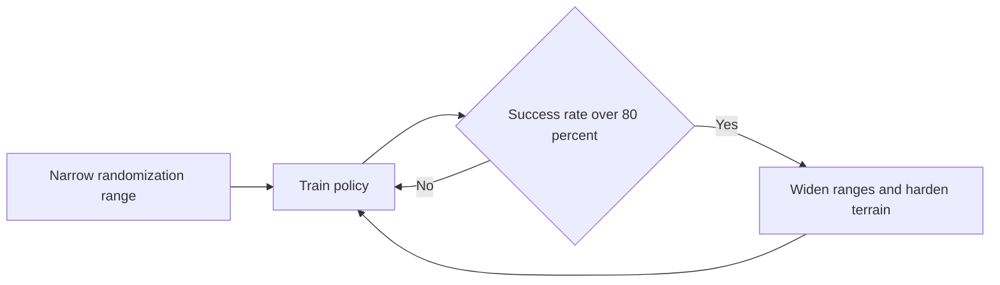

Every sim-to-real policy fails for the same reason: the simulator is wrong. Not catastrophically wrong, but wrong in a thousand small ways — a mass that is off by a few percent, a friction coefficient that drifts with temperature, a motor that lags the command by a millisecond. The accumulated error between your perfect simulated world and the messy real one is the **reality gap**, and a policy trained against a single, exact physics model learns to exploit that exact model. Put it on hardware and it collapses. Domain randomization is the most reliable known fix, and this lesson teaches you to apply it to G1 locomotion in Isaac Lab.

## Why randomization beats accuracy

The instinctive response to the reality gap is to make the simulator more accurate — measure the real friction, the real masses, the real motor curves. This is a trap. You can never measure everything, the real parameters drift, and a policy fit tightly to "correct" values is still brittle to the values you got slightly wrong.

Domain randomization inverts the goal. Instead of one accurate world, you train across a *distribution* of worlds, randomizing physics parameters every episode so the policy never sees the same dynamics twice. The policy can no longer overfit to any single set of values; to succeed across the whole distribution it must learn a strategy robust to all of them. The bet — and it is a bet that has paid off repeatedly — is that the real world falls *inside* the distribution you trained on. If it does, the real robot looks to the policy like just one more random sample it has already handled.

The defining demonstration came from **OpenAI's Dactyl** work (*Solving Rubik's Cube with a Robot Hand*, 2019), which trained in-hand cube and Rubik's-cube manipulation entirely in simulation while randomizing **100+ parameters**, then transferred *zero-shot* to a real Shadow Hand — no real-world fine-tuning at all. **Peng et al.** (*Sim-to-Real Transfer of Robotic Control with Dynamics Randomization*, ICRA 2018) established the principle on dynamics specifically: randomizing physical dynamics parameters during training produces control policies that transfer to real robots without adaptation. The lesson from both is identical — robustness, not realism, is what crosses the gap.

## What to randomize, and by how much

Randomization is only as good as the parameters you choose and the ranges you set. A practical starting set for G1 locomotion, grounded in what these results randomized:

- **Mass** — perturb link masses by about **±20%**. This covers payloads, manufacturing variance, and the inertia errors you will chase in the next lesson.
- **Friction** — sample the ground/foot friction coefficient from roughly **0.1 to 1.5** (uniform). Low friction is slick floors; high is grippy rubber. A policy that walks across that whole band will not slip on a surface it has effectively already seen.
- **Joint damping** and **motor strength** — vary these to mimic actuator wear, temperature, and unit-to-unit differences in the drivetrain.
- **Sensor noise** — inject realistic noise into IMU and encoder readings so the policy does not trust clean state it will never get on hardware.
- **Terrain height maps** — randomize the rough-terrain profile so the gait generalizes across surfaces rather than memorizing one.

For **vision-based** policies add a second category — **visual** randomization: textures, lighting, camera exposure, object color. Isaac Sim's ray-traced renderer (on Isaac Sim 4.5) makes photorealistic visual randomization practical, which matters because a vision policy overfits to pixels exactly the way a dynamics policy overfits to physics.

In Isaac Lab these are **events**. You declare each randomization as an `EventTermCfg` in your environment config, and the event manager applies it at the configured time — `startup`/`prestartup` for USD-level properties set once, `reset` for per-episode physics like mass and friction, and `interval` for in-episode perturbations such as random pushes to the torso. The framework already ships event functions for randomizing rigid-body materials, masses, and external forces; you wire them up rather than writing physics code.

## Curriculum: don't open the floodgates on day one

There is a failure mode that bites every beginner: set all ranges to maximum from the first step, and training collapses. The early policy is random, the hardest randomized worlds are unsolvable, reward never climbs, and the run dies. The fix is a **curriculum** — start with a *narrow* randomization range the nascent policy can actually handle, then widen it as the policy proves itself.

The standard trigger is a **success-rate gate**: once the policy clears some threshold — your lab uses **80%** — you advance to harder terrain or wider parameter ranges. Isaac Lab expresses this with a `CurriculumTermCfg` whose function tightens or loosens environment parameters based on a running metric. Pair the gate with terrain difficulty for locomotion: flat ground until the robot reliably walks, then progressively rougher height fields.

The sophisticated version is **Adaptive Domain Randomization (ADR)**, which automates the curriculum entirely. ADR watches per-parameter performance and *moves the boundaries automatically*: parameters where the policy succeeds get **wider** ranges (push it harder), parameters that cause failure get **narrower** ranges (back off until it copes). The randomization expands exactly as fast as the policy can absorb it, with no hand-tuned schedule. Start with a fixed success-gated curriculum because it is simple and debuggable; reach for ADR when manual range-tuning becomes the bottleneck.

## When randomization isn't enough: residual physics

Some gaps are *systematic*, not random — a consistent bias the simulator gets wrong in the same direction every time, common in contact-rich manipulation where the contact model itself is imperfect. Widening the randomization to swallow a systematic error wastes capacity and can hurt the policy. The better tool is **residual physics simulation**: train a small learned model that predicts the systematic sim-to-real *correction* and adds it to the simulator's output. The base physics handles the bulk; the residual cleans up the consistent error. It is particularly effective for the contact-rich cases where pure randomization struggles, and it composes with randomization rather than replacing it.

## Putting it into practice

Build the lab: a randomized G1 locomotion policy with a curriculum, measured against an un-randomized baseline.

1. **Define at least 8 randomized parameters** as `EventTermCfg` events in your G1 env config — mass (±20%), foot friction (0.1–1.5), joint damping, motor strength, IMU noise, encoder noise, push forces, and terrain height. Use `reset` mode for physics, `interval` mode for pushes.
2. **Add a success-gated curriculum** with a `CurriculumTermCfg`: extend terrain difficulty each time the rolling success rate exceeds **80%**, starting from flat ground.
3. **Train the randomized policy** headless and massively parallel: `./isaaclab.sh -p scripts/reinforcement_learning/rsl_rl/train.py --task Isaac-Velocity-Rough-G1-v0 --headless --num_envs 4096`.
4. **Train a baseline** with identical settings but every randomization disabled.
5. **Compare zero-shot transfer.** Evaluate both on held-out terrain and dynamics the training never saw. Report the success-rate gap and name the single parameter whose randomization mattered most.

## Key takeaways

- The reality gap kills policies trained on one exact physics model; **robustness beats realism** — train across a distribution of worlds, not the "correct" one.
- OpenAI's Dactyl randomized **100+ parameters** for zero-shot transfer to a real Shadow Hand; Peng et al. proved dynamics randomization transfers without real-world adaptation.
- A solid G1 starter set: mass ±20%, friction 0.1–1.5, damping, motor strength, sensor noise, and terrain — declared as Isaac Lab `EventTermCfg` events.
- Use a **success-gated curriculum** (widen ranges / harden terrain past 80% success) to avoid early training collapse; graduate to **ADR** when manual tuning stalls.
- For **systematic** errors that randomization can't absorb — especially contact-rich manipulation — add a learned **residual physics** correction on top of the base simulator.
