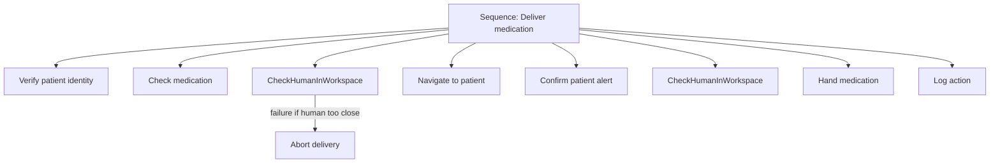

Force limits keep a single contact safe; they say nothing about whether G1 should be reaching toward the patient at all. Safety also lives at the level of *what the robot decides to do* — and that decision logic needs to be as inspectable as a torque limit. Behavior Trees (BTs) are the framework that makes task-level behavior modular, verifiable, and explicit about failure. This lesson shows how to encode G1's safety into its task structure so that "is it safe to act right now?" is checked at every step, not assumed.

## What a Behavior Tree actually is

A Behavior Tree is a directed acyclic graph built from two kinds of nodes. **Control nodes** route execution: a **Sequence** runs its children in order and fails if any one fails (do A, then B, then C — stop if any step breaks), a **Fallback** tries children until one succeeds (try plan A; if it fails, try plan B), and a **Parallel** runs children concurrently. **Leaf nodes** do the actual work: **Action** nodes command the robot (move, grasp, speak) and **Condition** nodes check the world and return success or failure.

What makes this powerful for safety is **clear failure propagation**. When a leaf returns Failure, that result flows up through the control nodes by well-defined rules — a failed Condition inside a Sequence aborts the whole sequence cleanly. There is no hidden state to reason about: you can read the tree and know exactly what happens when something goes wrong. This composability and verifiability is why BTs have largely displaced ad-hoc logic in modern robotics.

## Safety as a node, not an afterthought

The central technique is to express safety checks *as condition nodes* and wire them in as preconditions. The canonical example: a **`CheckHumanInWorkspace`** condition node that returns **Failure if a human is too close**. Place it as the first child of a Sequence that guards any motion, and the Sequence cannot proceed to the motion action while the human is in range — the failure propagates up and the robot holds.

This is a profoundly different posture from sprinkling `if (unsafe) abort()` calls through procedural code. The safety condition is a first-class, reusable node you can drop in front of *every* motion sequence, and a reviewer can confirm at a glance that no motion path lacks its guard. Safety becomes structural — visible in the tree's shape — rather than a behavior you have to trust is buried correctly in the code.

## Choosing your framework: BTs vs. state machines

You have real options here, and the choice matters for a safety-critical robot.

**BehaviorTree.CPP** is the mature open-source BT engine, with first-class **ROS 2 integration** (via the companion BehaviorTree.ROS2 wrappers, which target recent BT.CPP releases and Humble-or-newer ROS 2). Its most important endorsement is that **Nav2**, the standard ROS 2 navigation stack, uses BTs for *all* of its decision-making — meaning the framework is battle-tested on exactly the kind of real-time, safety-relevant autonomy G1 needs. If G1 navigates with Nav2, you are already in the BT ecosystem and extending it is the path of least resistance.

The alternative is classic **state machines** — frameworks like **SMACH** and **FlexBE**. They are widely used and perfectly serviceable, but **less modular than BTs**: adding a new transition can mean touching many states, and failure handling tends to be encoded implicitly in transition logic rather than propagating by uniform rules.

**The recommendation for G1:** Behavior Trees, via BehaviorTree.CPP. The deciding factor is safety-criticality. BTs' clear, uniform failure propagation is exactly the property you want when "what happens when this fails?" must have a single, auditable answer — and it is why BTs are preferred for safety-critical applications. Reserve state machines for simple, fixed sub-behaviors where a handful of states fully captures the logic.

## Proving the tree is safe

Modularity buys you something rare: **formal verification**. Because a BT has well-defined semantics, it can be **model-checked** against safety properties using formal methods — exhaustively exploring all possible execution paths to confirm a property holds on every one. The property worth proving for G1 is precisely the contact limit from Lesson 8.1: **"the robot never exceeds 65 N contact force"** across *all* reachable executions of the tree. A test suite samples some paths and hopes the rest behave; a model checker proves the claim over every path, which is the standard of evidence a safety case wants. You will not formally verify every behavior, but identifying the one or two properties that absolutely must hold — and proving them — is a high-leverage use of the BT's verifiability.

## A worked healthcare behavior

Concreteness helps. A **"Deliver medication"** BT sequences the safety-relevant steps explicitly: **verify patient identity → check medication → navigate to patient → confirm patient alert → hand medication → log action.** Read it as a Sequence where each step is a precondition for the next, so any failure halts the whole delivery cleanly. Notice how much safety is embedded in the *ordering*: identity and medication are verified *before* navigation, the patient's alertness is confirmed *before* the handoff, and the action is logged at the end for accountability. The `CheckHumanInWorkspace` guard would sit in front of every motion step, and the contact-force property from Lesson 8.1 is what you'd model-check across the tree. The tree doesn't just describe the task — it encodes the safe *order* of the task.

The tree below shows the safe ordering, with the `CheckHumanInWorkspace` guard fronting each motion step:

## Putting it into practice

Build the "Deliver medication" tree on paper and identify its safety nodes.

1. Lay out the six steps (verify patient identity, check medication, navigate to patient, confirm patient alert, hand medication, log action) as the children of a top-level Sequence.
2. Insert a `CheckHumanInWorkspace` condition node as a precondition in front of each *motion* step (navigate, hand medication). Confirm that a Failure there cleanly aborts the whole delivery.
3. Add a Fallback around the navigation step: child A is the normal path; child B is a safe-stop-and-alert behavior if A fails. This is your recovery branch.
4. Pick the one safety property you would model-check — write it as a sentence (e.g., "no execution path commands contact above 65 N") and note which nodes could violate it.
5. Decide and justify your framework in one line (BehaviorTree.CPP for ROS 2 + safety-critical failure propagation), and name one sub-behavior simple enough to leave as a small state machine instead.

## Key takeaways

- Behavior Trees compose Sequence/Fallback/Parallel control nodes with Action/Condition leaves; their clear, uniform failure propagation is what makes them auditable.
- Encode safety as condition nodes (e.g., `CheckHumanInWorkspace` returning Failure when a human is too close) and place them as preconditions on every motion sequence — safety becomes structural.
- Prefer BehaviorTree.CPP with ROS 2 for G1; it powers Nav2's decision-making and is favored for safety-critical work over less-modular state machines like SMACH and FlexBE.
- BTs can be formally model-checked: prove a property such as "never exceeds 65 N contact force" across all execution paths, not just sampled ones.
- The "Deliver medication" tree shows safety living in the *ordering* — verify identity and alertness before contact, log every action — so the tree encodes the safe sequence, not just the steps.
