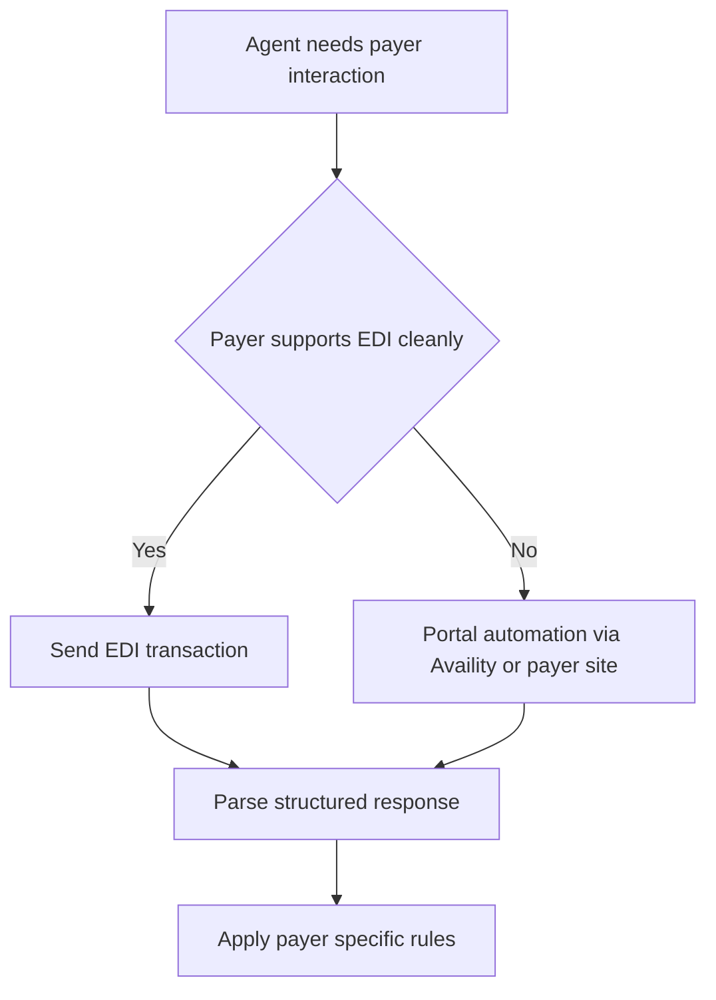

# The US Payer Landscape: Medicare, Medicaid & Commercial Insurance

**Duration:** 45 min · **Level:** Foundational · **Module:** 1. The US Healthcare Admin Crisis · **Focus:** `Medicare`, `Medicaid`, `commercial-payers`, `EDI`, `payer-landscape`

Every AI agent you build for healthcare administration runs inside a specific payer environment, and that environment is not one thing — it is hundreds of things wearing the same suit. The rules, portals, formats, and quirks vary enormously between Medicare, Medicaid, and the commercial carriers. An eligibility agent that works flawlessly against a UnitedHealth member can fail completely against a state Medicaid managed-care plan, not because the code is wrong but because the *rules* are different. Before you write a line of automation, you have to map this terrain. The payer landscape is the operating system your agents will run on top of.

## The three worlds of US payers

There are really three distinct payer worlds, and each one has a different shape.

**Medicare** is the federal program for people 65 and older and for those with qualifying disabilities — roughly 65 million beneficiaries, administered by CMS. The catch for agent-builders is that "Medicare" is no longer a single set of rules. **Medicare Advantage (MA)** — private plans that contract with CMS to deliver Medicare benefits — now covers more than half of all Medicare enrollees. And MA plans layer their own prior authorization requirements on top of what CMS mandates. So an agent targeting "Medicare" must actually distinguish between traditional fee-for-service Medicare and the specific MA plan a patient is enrolled in, because the authorization logic diverges sharply.

**Medicaid** is the joint state-federal program for low-income populations, and here the complexity multiplies. Each of the 50 states sets its own rules, formularies, and prior authorization requirements. On top of that, most states delegate day-to-day management to **managed Medicaid (MCO)** — private plans that administer the state's Medicaid program. That stacks three layers of rules on a single transaction: federal Medicaid requirements, the individual state's requirements, and the MCO's own policies. An agent built for Texas Medicaid is not portable to Florida Medicaid, and within a single state it may need different behavior per MCO.

**Commercial payers** are the third world. A handful of carriers dominate — UnitedHealth (around $90B revenue), Anthem/Elevance (~$60B), Aetna/CVS (~$55B), Cigna (~$45B), and Humana (~$36B). Together this "Big 5" covers roughly 190 million lives. Each one operates its own portal, publishes its own EDI specifications, and maintains its own prior authorization criteria. Coverage at scale means your agent must speak each carrier's dialect.

## The one thing that is standardized: EDI

If the rules are fragmented, the *transport* is not. Under HIPAA, the core payer interactions are standardized as X12 EDI transaction sets, and learning this vocabulary is non-negotiable for agent design. The ones that matter most:

- **270 / 271** — eligibility inquiry and response. Your agent sends a 270 asking "is this patient covered?"; the payer returns a 271 with coverage, copays, deductibles, and limitations.
- **278** — prior authorization request (and its response).
- **837P / 837I** — the claim itself, professional (837P) and institutional (837I) variants.
- **835** — the remittance advice: how each line of a claim was paid, adjusted, or denied.
- **277** (with its 276 partner) — claim status, telling you whether a claim is accepted, pending, or denied.

This standardization is the lever that makes healthcare automation tractable. Knowing the transaction set is essential: it defines the structured inputs and outputs your agent reads and writes. When you design an eligibility agent, you are really designing something that emits a 270 and parses a 271. The EDI layer is the closest thing to a universal contract you get in this industry — so build on it deliberately.

## Where standardization breaks down: the portals

Here is the painful reality. Even though EDI exists, a large share of real-world payer interaction still happens through fragmented web portals, not clean machine-to-machine transactions. **Availity** acts as a multi-payer hub; **CoverMyMeds** is widely used for prior authorization; clearinghouses like Waystar handle claims; and many individual payers still require manual entry through their own portals for transactions that have no smooth electronic path. The result is that an agent often cannot simply fire an EDI message — it has to behave like a human operator navigating a website, because that is the only door the payer left open.

This is the single most important thing to internalize from this lesson: payer integration is a mix of *clean EDI where it exists* and *portal automation where it does not*. Your architecture has to handle both.

## The core engineering challenge

The deepest difficulty is not any single payer — it is that the rules change quarterly and there are hundreds of them. A prior authorization criterion that was valid last quarter may be obsolete this one. Multiply that by the Big 5 commercial carriers, every state Medicaid program, every Medicaid MCO, and every Medicare Advantage plan, and you face a maintenance problem that dwarfs the initial build.

Building a maintenance-free universal payer integration layer is, frankly, the central engineering challenge of healthcare AI. There is no permanent solution you write once. The realistic goal is an architecture that *absorbs change cheaply*: a layer that normalizes EDI where available, falls back to portal automation where it is not, and isolates payer-specific rules so that updating one payer does not break the others.

## Putting it into practice

Build a payer map before you build a payer agent, so your design accounts for the real fragmentation rather than an imagined uniform "insurance."

1. Pick one target workflow — say, eligibility verification — and list every payer category it must serve: traditional Medicare, two or three Medicare Advantage plans, your state's Medicaid, one Medicaid MCO, and the Big 5 commercial carriers.
2. For each, record three things: which **EDI transaction** the workflow uses (eligibility = 270/271), whether the payer supports it cleanly or forces **portal entry** (e.g., via Availity or its own site), and where its rules live.
3. Identify the layers of rules that stack on top of each other — note specifically where Medicaid carries federal + state + MCO requirements, and where MA plans add criteria beyond CMS.
4. Write a one-paragraph integration strategy that names, for each payer, whether you will use EDI, portal automation, or both — and where the quarterly-change risk concentrates. That paragraph is the blueprint your eligibility agent will implement.

## Key takeaways

- "Medicare" is no longer one thing: traditional fee-for-service plus Medicare Advantage plans (now covering more than half of enrollees) that add their own PA requirements on top of CMS rules.
- Medicaid stacks up to three rule layers — federal, state (all 50 differ), and the managed-Medicaid MCO — so agents are rarely portable across states or plans.
- Commercial coverage concentrates in a "Big 5" (UnitedHealth, Anthem/Elevance, Aetna/CVS, Cigna, Humana) covering ~190M lives, each with its own portal, EDI specs, and PA criteria.
- HIPAA EDI is the one standardized layer — 270/271 (eligibility), 278 (PA), 837P/837I (claims), 835 (remittance), 277 (claim status) — and the transaction set defines your agent's inputs and outputs.
- Standardization breaks at the portals: Availity, CoverMyMeds, Waystar, and per-payer sites still force manual entry, so agents must combine clean EDI with portal automation.
- The core engineering challenge is rules that change quarterly across hundreds of payers — the goal is an architecture that absorbs change cheaply, not a one-time universal integration.

---

← Previous: **H1.1 The $500B Administrative Burden** · Next: **H1.3 The Digital FTE Concept: Panaversity Model Applied to Healthcare** →

*Part of Module 1: The US Healthcare Admin Crisis.*

