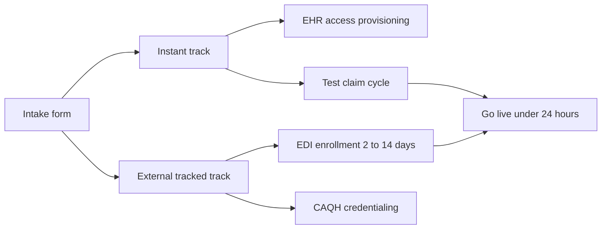

# Practice Onboarding Automation: Live in 24 Hours

**Duration:** 50 min · **Level:** Advanced · **Module:** 7. Deploying at Scale: Multi-Tenant SaaS · **Focus:** `onboarding`, `EDI-enrollment`, `automation`, `CAQH`, `practice-setup`

Once the multi-tenant architecture exists, the thing that actually limits how fast the business grows is not the technology — it is onboarding. Every new practice has to hand over credentials, get its payer integrations configured, and have its claim submission tested before the agent can touch real money. Done by hand, that work takes days of coordination per customer, and it is the bottleneck that separates a company with 100 customers from one with 10,000. The goal of this lesson is a Personal Medical Biller that goes from signed contract to live production in **under 24 hours** — and the way you get there is by automating everything that can be automated and tracking, rather than pretending to automate, everything that can't.

## What a practice has to give you

Onboarding starts with data collection, and the list is fixed enough to template. To stand up a new tenant you need:

- **Practice identity** — NPI, Tax ID, address.
- **Providers** — the individual provider NPIs that will appear on claims.
- **EHR** — which system the practice runs and the credentials to read from it.
- **Payer enrollment** — EDI enrollment with each payer (to submit claims) and ERA enrollment (to receive remittances).
- **Portal credentials** — the logins for each payer's portal.
- **Practice character** — specialty and the typical claim types the agent will handle.

The art of fast onboarding is recognizing that this list splits into two halves: data you can capture in a form and provision instantly, and external processes that run on someone else's clock. Treat them differently.

## The part you cannot fully automate: EDI and credentialing

Be honest about the slow links, because pretending they are instant is how onboarding promises break. **EDI enrollment** — registering the practice with each payer so it can submit claims electronically and receive ERAs — is a per-payer process that **takes anywhere from 2 to 14 days** and **cannot be fully automated**. What you *can* do is automate the submission and then track it. Most large payers offer online enrollment, and **Availity Payer Enrollment** lets a practice enroll ERA/EFT with multiple health plans through a single workflow, which collapses a lot of separate paperwork. Your onboarding system should fire off these enrollments, then surface their status on a dashboard so nothing stalls silently.

Credentialing runs on a parallel external track. **CAQH ProView** is the industry's universal provider credentialing database, and most payers pull from it during their credentialing process. You cannot make credentialing instant, but automating **CAQH profile maintenance** — keeping the provider's profile complete and re-attested — removes a recurring source of re-credentialing friction for every payer at once. The pattern for both EDI and CAQH is the same: automate the submission and the upkeep, and *manage* the latency you can't remove.

## The part you can automate: provisioning and testing

Two onboarding steps are genuinely automatable end to end.

**EHR read access** requires a practice administrator's approval, but the workflow around that approval can be hands-free: the system sends an approval request → the admin approves inside their EHR → API keys are generated → the agent's configuration is updated automatically. The only human action is a single click of consent; everything before and after it is code.

**Claim submission testing** is the gate that protects the practice from a bad go-live, and it should be fully automated. Before a new practice goes live, run **5–10 test claims through each active payer channel** and verify the round trip: confirm the **277 acknowledgment** comes back, confirm the **ERA returns correctly**, and **validate the dollar amounts** before anything touches production. This is non-negotiable — the worst possible onboarding outcome is silently submitting broken claims for a practice's real revenue, so the test cycle exists to catch exactly that before it can happen.

## Going live without breaking billing

Twenty-four hours to live does not mean twenty-four hours of attention. The first month is where trust is won or lost, and it needs intensive, structured monitoring rather than a hands-off launch:

- **Daily reconciliation** of claims submitted versus claims processed, so any divergence is caught the same day.
- **A daily exception report** surfacing every claim that didn't behave as expected.
- **A weekly check-in** with the practice manager to catch operational issues the metrics miss.
- An explicit target: **zero billing disruption events in the first 30 days.**

That target reframes what "onboarded" means. Onboarding isn't complete when the agent submits its first claim; it's complete when the practice has run a full month with no disruption to the revenue it depends on. The 24-hour figure gets a practice *live*; the 30-day monitoring window gets it *safe*.

## Putting it into practice

Design the onboarding pipeline for a new practice on a HIPAA-compliant agentic platform, targeting under 24 hours to live.

1. Build the intake form covering every required field: NPI, Tax ID, address, provider NPIs, EHR system and credentials, payer enrollment (EDI + ERA), portal credentials, specialty, and typical claim types.
2. Split your steps into two tracks — **instant** (EHR access provisioning, agent configuration, test-claim cycle) and **external/tracked** (EDI enrollment at 2–14 days, CAQH credentialing) — and route Availity Payer Enrollment through the tracked lane.
3. Specify the EHR access workflow as four automated steps gated by one human approval: request → admin approves in EHR → API keys generated → config updated.
4. Define the go-live test gate: 5–10 test claims per payer channel, verify the 277 acknowledgment and a correct ERA, and validate dollar amounts before production.
5. Write the first-30-days monitoring plan — daily reconciliation, daily exception report, weekly manager check-in — against the target of zero billing disruption events.

## Key takeaways

- Onboarding, not technology, is the growth bottleneck for healthcare AI SaaS; automating it to under 24 hours is what separates 100 customers from 10,000.
- Intake is a fixed checklist — practice identity, provider NPIs, EHR and credentials, EDI/ERA payer enrollment, portal credentials, specialty and claim types — that templates cleanly.
- EDI enrollment (2–14 days per payer) and CAQH credentialing can't be fully automated; automate submission and upkeep, then track status — Availity Payer Enrollment consolidates multi-payer ERA/EFT enrollment.
- EHR read access is automatable around a single admin approval: request → approve → keys generated → config updated, with no other human steps.
- Always gate go-live behind a test cycle: 5–10 test claims per payer channel, verifying 277 acknowledgments, correct ERAs, and dollar amounts before production.
- "Live" and "safe" are different milestones — 24 hours gets a practice live, but intensive first-30-days monitoring toward zero billing disruption is what completes onboarding.

---

← Previous: **H7.1 Multi-Tenant HIPAA SaaS Architecture**

*Part of Module 7: Deploying at Scale: Multi-Tenant SaaS.*

