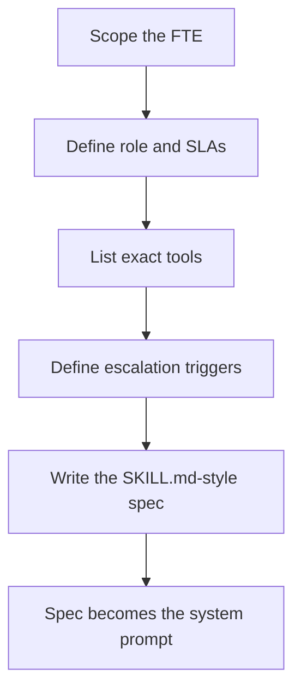

# Scope Your Digital FTE

**Duration:** 40 min · **Level:** Advanced · **Module:** 9. Capstone: Ship a Digital FTE · **Focus:** `scoping`, `Digital-FTE`, `eligibility`, `spec`

Before you write a single line of agent code, scope the agent the way you would hire a person. A Digital FTE is not a clever prompt or a demo that works once on stage — it is a worker with a defined role, a set of tools it is allowed to use, performance metrics it answers to, and a clear line at which it stops and asks a human. Skip the scoping and you get a flashy proof of concept that nobody trusts in production. Do the scoping well and you have a deployable employee. This lesson is the scoping step for the capstone: by the end you will have a written specification for one eligibility-verification FTE that becomes both your documentation and the backbone of your agent's system prompt.

## Pick one role, and pick the right one

The first decision is the most important: do exactly one job, and choose a job that is high-volume and structured. Eligibility verification is the canonical first hire. It is roughly 70–80% automatable, it runs on clean, paired 270/271 EDI transactions, and it happens at high daily volume — every scheduled appointment needs it. That combination is what makes an agent provable: enough volume to measure, enough structure to ground every answer in a real payer response.

Resist the temptation to scope a "billing agent" that does eligibility *and* coding *and* appeals. A multi-role agent multiplies the edge cases, blurs accountability, and makes shadow-mode evaluation almost meaningless because you can no longer say what "accurate" means. One role, measured cleanly, beats a generalist you cannot trust.

## Write the FTE like a job description

Scope the agent as you would write a job posting. A complete scope names six things:

- **Role** — one sentence: "Verify insurance coverage for upcoming appointments and flag problems before the visit."
- **Tools and APIs it may call** — the *exact* list, nothing open-ended: an eligibility API, an EHR read endpoint for patient and insurance context, and a logging tool. If it is not on the list, the agent cannot call it.
- **Inputs and outputs** — what it receives (a patient and appointment) and the structured result it must return (active or inactive coverage, copay, deductible remaining, prior-authorization-required flag).
- **Performance SLAs** — turnaround time and accuracy targets, expressed the same way you would judge a human specialist.
- **Escalation triggers** — the cases it must hand to a person rather than resolve itself.
- **Success metrics** — clean-result rate, escalation rate, and turnaround versus the human baseline.

Writing all six down forces the design decisions that otherwise surface as bugs in production.

## Human-in-the-loop is non-negotiable

A Digital FTE amplifies human specialists; it does not fire them. The scope must say explicitly which cases auto-complete and which route to a human. Three triggers are standard for an eligibility agent: **low model confidence** in its parse of a payer response, **dollar thresholds** above which a person must confirm, and **ambiguous payer responses** the agent cannot normalize cleanly. Everything else proceeds automatically. Define these lines now, in the spec, because they are simultaneously your safety guardrail and the thing you will measure in shadow mode — a low, stable escalation rate is how you prove the FTE is working.

## Choose the orchestration model and tools up front

Decide the shape of the agent before you build it, not while you build it. The recommended architecture for a healthcare FTE is deliberately narrow: a Claude model as the reasoning core, plus a small, explicit tool registry — an eligibility API, an EHR read, and a logging tool. The model decides *when* to act; the tools encapsulate *how*. This beats an open-ended agent that can call anything, because a constrained tool set is both easier to make HIPAA-compliant (the agent can only touch data a tool returns) and easier to audit.

## Write the scope as a structured spec

Capture all of this in a single structured file — a SKILL.md-style document with sections for role, tool permissions, escalation rules, output format, and SLAs. This is the same pattern used to define general-purpose Digital FTEs, adapted to the healthcare context. The payoff is that the file does double duty: it is the human-readable documentation of what the agent is allowed to do, and it is the literal backbone of the system prompt you will give the Claude model in the next lesson. One source of truth, no drift between "what we said the agent does" and "what the agent actually does."

Finally, define success metrics *before* you build. You cannot prove an FTE works after the fact if you never wrote down the bar. Settle on clean-result rate, escalation rate, and turnaround relative to the human baseline now, so that when you run the agent in shadow mode you are measuring against a target you committed to in advance.

## Putting it into practice

Scope your eligibility Digital FTE on paper, as a structured spec, before any code.

1. Write the **role** in one sentence and pick eligibility verification as the single job.
2. List the **exact tools** the agent may call — eligibility API, EHR read, logging — and nothing else.
3. Define the **inputs and outputs**: the patient/appointment record in, and the structured coverage result out (active/inactive, copay, deductible remaining, PA-required flag).
4. Write the **escalation triggers**: low confidence, dollar thresholds, and ambiguous payer responses route to a human; everything else auto-completes.
5. Set the **performance SLAs and success metrics**: turnaround, accuracy, clean-result rate, and escalation rate versus the human baseline.
6. Assemble all of the above into a **SKILL.md-style spec** that will serve as both documentation and the agent's system prompt.

You now have a deployable job description for one worker — the foundation the reference build stands on.

## Key takeaways

- Scope the agent like a hire: one role, defined tools, metrics it answers to, and a clear escalation line — that is what separates a deployable FTE from a demo.
- Pick one high-volume, structured role first; eligibility verification (~70–80% automatable, clean 270/271, high daily volume) is the best starting point.
- Human-in-the-loop is non-negotiable: specify which cases auto-complete and which route to a human (low confidence, dollar thresholds, ambiguous payer responses).
- Choose the orchestration up front — a Claude model as the reasoning core plus a small, explicit tool registry beats an open-ended agent and is easier to secure and audit.
- Write the scope as a SKILL.md-style spec (role, permissions, escalation, output format, SLAs); it becomes both your documentation and the agent's system prompt.
- Define success metrics — clean-result rate, escalation rate, turnaround versus the human baseline — before building, so shadow mode can prove the FTE works.

---

Next: **H9.2 Reference Build: An Eligibility Agent End to End** →

*Part of Module 9: Capstone: Ship a Digital FTE.*

