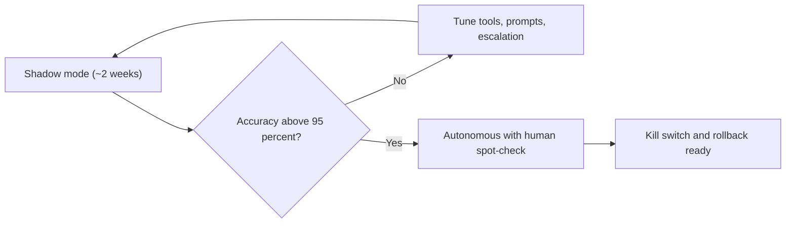

# Going Live: Production Checklist for a Healthcare Agent

**Duration:** 45 min · **Level:** Advanced · **Module:** 9. Capstone: Ship a Digital FTE · **Focus:** `production`, `HIPAA`, `go-live`, `capstone`

A working agent on your laptop is not a production Digital FTE. The reference build from the previous lesson can submit a 270, parse a 271, and return a clean answer on a test patient — but trusting it with real patients and real money requires a different discipline. This lesson is the go-live checklist: the HIPAA controls, the safety guardrails, the rollout sequence, the monitoring, and the incident response that turn a prototype into a worker you can deploy. Run through every section before the agent touches a live payer connection.

## The HIPAA technical baseline

Nothing else matters if the compliance floor is not in place. Before go-live, confirm the technical baseline: **encryption in transit and at rest**, **least-privilege access** so the agent's identity can reach only the APIs its role requires, a **signed Business Associate Agreement with every vendor in the data path** (cloud, the LLM provider, the clearinghouse, the database), and **PHI handling controls** — detection and masking where appropriate so that no real PHI leaks into logs or error messages. The eligibility agent reads member IDs, dates of birth, and coverage details; every hop those touch must be covered by a BAA and encrypted. Treat this as a gate, not a checklist item: if any vendor in the path is unsigned, you do not go live.

## Start in shadow mode

Do not flip an untested agent to autonomous. Run it in **shadow mode**: in parallel with the existing human workflow for about two weeks, the agent generates its eligibility determinations while humans continue doing the work for real. You compare the agent's output to the human decisions case by case, measuring how often it agrees. The agent graduates to autonomous operation only when its accuracy clears your threshold — a common bar is **above 95%** — and even then you keep a human spot-check. Shadow mode is how you earn trust with data rather than asserting it, and it is the reason you defined a clean-result rate target back in the scoping lesson.

## Escalation, kill switch, and rollback

Autonomy without brakes is a liability. Carry the **escalation triggers** from your scope straight into production: explicit dollar and confidence thresholds route cases to a human rather than letting the agent decide. On top of that, build a **kill switch** and a **rollback plan** so you can revert instantly if behavior degrades — stop the agent from processing, revoke its credentials, and fall back to the human workflow without losing the day's work. For an eligibility agent the irreversible-action surface is small, but the principle holds: every automated decision needs a fast, tested path back to a human.

## Monitoring: watch for drift, not just failures

A production FTE needs a **per-agent dashboard**. Track volume, clean-result rate, escalation rate, turnaround, and cost versus the pre-automation baseline — the same metrics you committed to during scoping, now live. The crucial design choice is to **alert on drift, not only on outright failures**. An agent that quietly starts escalating twice as often, or whose clean-result rate slips three points over a week, is failing slowly; that is exactly the signal a payer changed a response format or a plan changed its rules. Catching the slow degradation is more valuable than catching the loud crash, because the slow one is the one that silently turns "covered" answers into denied claims weeks later.

## Incident response

Decide in advance what counts as an incident and who handles it. For an eligibility agent, the two that matter are **wrong coverage determinations** (the agent said active when the patient was terminated) and **PHI exposure** (member data surfaced where it should not be). Write down: what triggers an incident, **who is paged**, and the steps to **contain and remediate** — stop processing, revoke credentials if PHI is involved, assess scope, and notify the privacy officer on the breach timeline. A runbook written before the incident is worth far more than improvisation during one. Then dry-run it: walk one simulated incident through the whole process so you find the gaps while the stakes are zero.

## Iterate from real data

Going live is the start of the improvement loop, not the end. The **logs the agent produces are the richest source of edge cases** you have — every escalation and every disagreement in shadow mode is a payer quirk, a parsing gap, or a missing rule waiting to be fixed. Feed those misses back into the tools, the prompts, and the escalation rules each cycle. The agent you ship in month one should be measurably better in month three because you mined its own audit trail for the cases it got wrong.

## Putting it into practice

Write the go-live checklist for your eligibility agent, then pressure-test it.

1. List the **HIPAA controls**: encryption in transit and at rest, least-privilege agent identity, a signed BAA for every vendor in the data path, and PHI detection/masking.
2. Write the **shadow-mode plan**: roughly two weeks running in parallel with humans, comparing outputs, with an explicit graduation threshold (for example, accuracy above 95%).
3. Design the **escalation and kill switch**: dollar and confidence thresholds that route to humans, plus a kill switch and rollback plan to revert instantly.
4. Define the **monitoring dashboard**: volume, clean-result rate, escalation rate, turnaround, and cost versus baseline — with alerts on drift.
5. Write the **incident-response runbook**: what counts as an incident (wrong coverage, PHI exposure), who is paged, and the containment and remediation steps.
6. **Dry-run one simulated incident** through the runbook end to end and fix whatever gaps it exposes.

Complete this and you have done what the book set out to teach: not just built an agent, but shipped a Digital FTE you can trust with real patients and real money.

## Key takeaways

- A working prototype is not a production FTE; going live is a discipline of HIPAA controls, guardrails, monitoring, and rollout — run the full checklist before touching a live payer.
- Confirm the HIPAA baseline first: encryption in transit and at rest, least-privilege access, a signed BAA with every vendor in the data path, and PHI detection/masking.
- Start in shadow mode for about two weeks, compare the agent to human decisions, and graduate to autonomous only when accuracy clears your threshold (for example, above 95%).
- Build brakes: dollar and confidence thresholds that escalate to humans, plus a kill switch and rollback plan to revert instantly if behavior degrades.
- Monitor with a per-agent dashboard (volume, clean-result rate, escalation, turnaround, cost vs baseline) and alert on drift, not just on outright failures.
- Treat the agent's own logs as the richest source of edge cases and feed misses back into tools, prompts, and escalation rules every cycle.

---

← Previous: **H9.2 Reference Build: An Eligibility Agent End to End**

*Part of Module 9: Capstone: Ship a Digital FTE.*

