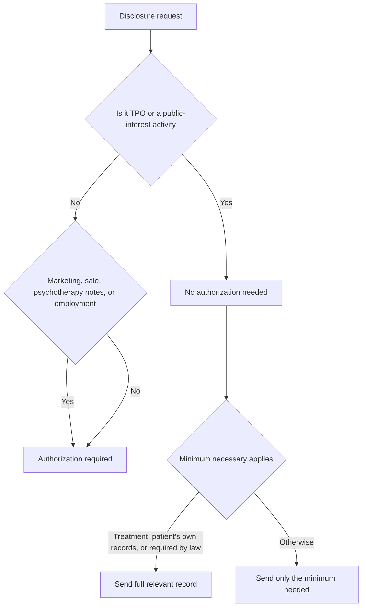

# Permitted Uses, Disclosures & the Minimum Necessary Standard

**Duration:** 55 min · **Level:** Intermediate · **Module:** 5. HIPAA Privacy Rule · **Focus:** `minimum-necessary`, `TPO`, `authorization`, `ROI`, `NPP`

Patients are sometimes surprised to learn how much of their health information moves without their signature. HIPAA permits a defined set of uses and disclosures of PHI **without patient authorization** — and knowing exactly where that line falls is the heart of Release of Information (ROI) work. The exam tests one skill above all others in this domain: can you tell, in a given scenario, whether authorization is required or not? Layered on top of that is the **minimum necessary standard**, which governs *how much* information may flow even when a disclosure is permitted. This lesson maps both: the permission boundary, and the volume limit.

## When no authorization is required

The largest category of permitted disclosures travels under the shorthand **TPO — Treatment, Payment, and Operations.** Sharing records to treat the patient, to get a claim paid, or to run the business of healthcare (quality review, training, administration) needs no signature. TPO is the everyday machinery of care, and HIPAA deliberately keeps it friction-free.

Beyond TPO, the Privacy Rule permits disclosure without authorization for a list of **public-interest activities**:

- **Public health activities** — reporting to health authorities.
- **Victims of abuse or neglect** — disclosures to appropriate agencies.
- **Health oversight activities** — audits, investigations of the healthcare system.
- **Judicial and administrative proceedings** — responding to court orders.
- **Law enforcement** — within defined limits.
- **Decedents** — to coroners, medical examiners, funeral directors.
- **Research with an IRB waiver** — when an Institutional Review Board has approved.
- **Serious threats to health or safety** — to prevent imminent harm.

When a scenario fits one of these buckets, the answer is *no authorization needed.* The memory hook: *TPO plus the public-interest list flows freely.*

## When authorization IS required

The exceptions are where exam questions concentrate. Authorization is **required** for:

- **Marketing** (most marketing communications).
- **Sale of PHI.**
- **Psychotherapy notes** — these are held to a **separate and more protective** standard than the rest of the record; they almost always need their own authorization.
- **Any disclosure not covered by another permissible use** — and this explicitly includes **most employment purposes.**

That last point catches people. If an employer wants an employee's health records, that is generally *not* TPO and *not* on the public-interest list, so it **requires authorization.** Treat employment disclosures as authorization-required unless a specific exception (covered in the ROI lesson) applies. Psychotherapy notes deserve their own mental flag: *they live behind an extra door.*

## The minimum necessary standard

Permission to disclose is not permission to over-disclose. The **minimum necessary standard** requires limiting PHI to the **minimum amount needed to accomplish the purpose** of the disclosure. If an insurer requests records for a specific claim, you send **only the records tied to that claim** — not the entire chart. If HR requests a return-to-work clearance, you send **only the clearance** — not the patient's full medical history. The standard is a discipline of restraint applied to every permissible disclosure.

But it has **three explicit exceptions** the exam tests directly. Minimum necessary does **NOT** apply to:

1. **Treatment disclosures among healthcare providers** — a specialist can receive the **full relevant record**, because under-sharing could harm care.
2. **A patient's request for their own records** — patients get everything.
3. **Legally required disclosures** — when the law mandates it, the law defines the scope.

Memory hook: *minimum necessary applies everywhere except treatment, the patient themselves, and the law.*

## The Notice of Privacy Practices

Tying the whole framework together for the patient is the **Notice of Privacy Practices (NPP).** Covered entities must provide the NPP **at the first delivery of service.** It must describe all uses and disclosures of PHI, lay out the patient's rights, and give contact information for the **privacy officer.** One detail the exam tests precisely: the patient's signature on the NPP **acknowledges receipt — it is not agreement or consent** to the disclosures described. You are documenting that the patient *got* the notice, nothing more. Confusing acknowledgment with consent is a classic distractor.

## Putting it into practice

Drill the authorization decision until it is automatic, because that is exactly how the exam presents it.

1. Make two columns: **No Authorization** and **Authorization Required.** Populate the left with TPO and the eight public-interest categories; populate the right with marketing, sale of PHI, psychotherapy notes, and employment/other purposes.
2. Run live scenarios and place each: a hospital faxing records to a referred specialist (no auth — treatment); an insurer asking for claim records (no auth — payment, but apply minimum necessary); an employer requesting full medical history (authorization required); a researcher with an IRB waiver (no auth).
3. For each "no authorization" scenario, add the **minimum necessary** check: does this disclosure get the full record or only the relevant slice? Mark the three exceptions where the full record is appropriate.
4. Practice the NPP rule as a one-liner: *NPP at first service; signature = receipt, not consent.* Write it from memory.
5. Self-test: cover both columns and re-sort five mixed scenarios. If you place all five correctly and apply minimum necessary to each, you have mastered the core of ROI decision-making.

## Key takeaways

- **No authorization** is required for **TPO** (Treatment, Payment, Operations) plus the public-interest list: public health, abuse/neglect, health oversight, judicial/administrative, law enforcement, decedents, IRB-waiver research, and serious threats to safety.
- **Authorization IS required** for most **marketing**, **sale of PHI**, **psychotherapy notes** (separate, more protective standard), and disclosures not otherwise permitted — including **most employment purposes.**
- The **minimum necessary standard** limits disclosures to the least PHI needed — send only the claim records, only the clearance — not the whole chart.
- Minimum necessary has **three exceptions**: treatment among providers (full relevant record allowed), a patient's request for their own records, and legally required disclosures.
- The **Notice of Privacy Practices** must be given at first service and describe uses, rights, and the privacy officer; the patient's signature **acknowledges receipt, not consent.**

---

← Previous: **C5.2 Patient Rights Under HIPAA — All Six Rights** · Next: **C5.4 Business Associates & Release of Information Workflows** →

*Part of Module 5: HIPAA Privacy Rule.*

