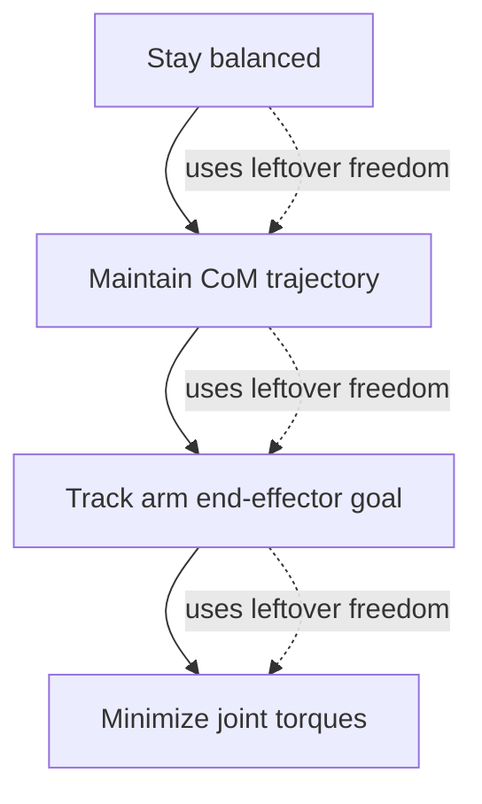

# Whole-Body Control: Moving & Working Simultaneously

**Duration:** 60 min · **Level:** Advanced · **Module:** 3. Bipedal Locomotion & Whole-Body Control · **Focus:** `WBC`, `loco-manipulation`, `control`, `QP`

A humanoid that can walk beautifully but must stand frozen the moment it reaches for a cup is not useful. Every task worth doing — folding laundry, carrying a tray, opening a door while keeping your balance — requires the legs and arms to act as one system. Whole-Body Control is the framework that makes that possible. It treats all forty-odd joints as a single coupled problem and resolves the constant conflict between competing goals — *stay balanced* versus *reach that handle* — by ranking them. This lesson teaches the hierarchy-of-tasks idea, the null-space trick that lets the arms move without toppling the robot, and why the whole thing is fast enough to run in a real control loop.

## The problem WBC solves

Control the arms and legs independently and you get a contradiction the moment they interact. The arm reaches forward; that shifts the center of mass and the inertia; the legs, unaware, fail to compensate; the robot tips. You cannot fold laundry while standing if your arms and legs are controlled in separate boxes — the act of folding *is* a balance disturbance.

Whole-Body Control fixes this by refusing to separate them. It solves for **all joint accelerations simultaneously** in one optimization, so the leg commands already account for what the arms are about to do. The unifying insight, going back to Sentis and Khatib's *Whole-Body Control of a Mobile Manipulator Using Hierarchical Tasks* (ICRA 2005), is that a robot is asked to do several things at once, those things conflict, and the way to reconcile them is a **strict priority hierarchy** solved as a **hierarchical quadratic program (QP)**.

## Tasks, priorities, and the cascade

In WBC you express each goal as a **task** — a desired behavior of some quantity, like "keep the CoM here" or "put the hand there." Then you rank them. A representative humanoid hierarchy:

1. **Stay balanced** (highest priority — never negotiable)
2. **Maintain the desired CoM trajectory**
3. **Track the arm end-effector goal**
4. **Minimize joint torques** (lowest priority — a tiebreaker)

The QP solves these as a **cascade**: it satisfies the highest-priority task as well as possible, then satisfies the next task *only using freedom left over* from the first, and so on down. Balance is never sacrificed to reach a cup; reaching the cup happens with whatever movement remains after balance is guaranteed. This ordering is the safety argument and the capability argument in one structure.

## The null-space trick

The mechanism that makes "use only the leftover freedom" precise is **null-space projection**, and it is worth understanding directly because it is the conceptual heart of WBC.

A high-priority task — say, holding the CoM fixed — does not consume *all* the robot's freedom. There is typically a whole space of joint motions that leave the CoM exactly where it is: the **null space** of the balance task. WBC **projects every lower-priority task into that null space.** Concretely, the arm's motion is restricted to the set of motions that *do not move the CoM*. The arm can swing, reach, and track its target — and by construction it **cannot disturb balance**, because it is only ever allowed to use motions the balance task is indifferent to.

This is the elegant resolution of the laundry problem. The arms get real freedom to work; the legs get a guarantee that the arms' work will not topple them; and it falls out of one piece of linear algebra rather than a tangle of hand-tuned compensations.

## Contact, payloads, and why it runs in real time

Two refinements make WBC deployable.

**Contact-consistent control.** A real robot pushes on the ground, and how hard each foot pushes is part of what keeps it up. Contact-consistent WBC **models foot contact forces as explicit optimization variables**, so the controller reasons directly about how to distribute force across the feet. The benefit is graceful handling of terrain with **varying friction** — the solver allocates more force where there is grip and less where the floor is slick, rather than assuming a uniform ground.

**Payloads and loco-manipulation.** The real test is moving and working at the same time. CMU's loco-manipulation work (2023–2024) demonstrated a humanoid **carrying objects while navigating**, with WBC enabling **stable walking while holding a 10 kg payload in extended arms** — a configuration that throws the CoM well forward and would topple any controller that treated legs and arms separately. (The broader simultaneous-locomotion-and-manipulation problem is framed in Sleiman et al., *LOCO-MANI*, ICRA 2023.) The legs lean and step to compensate for exactly the load the arms are bearing, because both are in the same optimization.

And it is fast. A **full WBC QP for a 40-DOF humanoid solves in roughly 0.5 ms** on a modern CPU — comfortably inside a **2 kHz control loop**. That speed is what makes WBC a real-time controller rather than a planning tool: it can re-solve the entire whole-body problem two thousand times a second, reacting to contact and disturbance as they happen.

## Where WBC sits in the stack

Connect this to Lesson 3.2. Centroidal MPC plans the *strategy* — where the CoM should go, how hard each foot should push, over a horizon. WBC is the *execution* layer that turns that strategy into actual joint commands every tick, enforcing the task hierarchy and contact model. MPC decides; WBC does. Together they are the model-based backbone that even RL policies (Lesson 3.3) often sit on top of or fall back to.

## Putting it into practice

Build the task hierarchy and watch null-space projection protect balance.

1. **Set up a simplified model.** Use a fixed-base or planar humanoid in simulation (PINOCCHIO + a QP solver is the standard toolchain). Expose CoM position and one hand's end-effector position as task quantities.
2. **Define two tasks.** Task A (high priority): hold the CoM at a fixed point. Task B (low priority): move the hand to a target that is far enough away to *want* to drag the CoM with it.
3. **Build the cascade.** Solve for Task A first; compute its null-space projector; restrict Task B to that null space; solve Task B within it. The result is joint accelerations for the whole body.
4. **Test the guarantee.** Command the hand to a distant target and log the CoM. With null-space projection on, the CoM should barely move while the hand tracks as far as it can. Turn the projection *off* (let Task B use all DOF) and rerun — now watch the CoM drift as the hand pulls the body. You have just demonstrated, numerically, why WBC keeps a reaching robot upright.
5. **Add a payload.** Attach a simulated mass to the hand and confirm the balanced solution shifts the body to compensate — the loco-manipulation behavior in miniature.

## Key takeaways

- WBC treats **all joints as one coupled system** and solves for every joint acceleration at once, because reaching and balancing physically interfere — you cannot control arms and legs in separate boxes.
- Goals are expressed as **prioritized tasks** in a **hierarchical QP**: balance overrides CoM tracking overrides arm tracking overrides torque minimization, solved as a cascade.
- **Null-space projection** lets the arms move only through motions that do not disturb the CoM — capability for the arms and a balance guarantee for the legs, from one linear-algebra construction.
- **Contact-consistent** WBC models foot forces explicitly (handling varying friction), and the framework supports real payloads — CMU showed stable walking with a **10 kg** load in extended arms.
- A 40-DOF WBC QP solves in **~0.5 ms**, fast enough for a **2 kHz** loop; in the stack, MPC plans the strategy and WBC executes it as joint commands.

## References

- **Whole-Body Control of a Mobile Manipulator Using Hierarchical Tasks** — Sentis and Khatib (2005). *ICRA 2005*
- **LOCO-MANI: Simultaneous Locomotion and Manipulation** — Sleiman et al. (2023). *ICRA 2023*

---

← Previous: **3.3 Reinforcement Learning for Locomotion** · Next: **3.5 Terrain Adaptation & Push Recovery** →

*Part of Module 3: Bipedal Locomotion & Whole-Body Control.*

