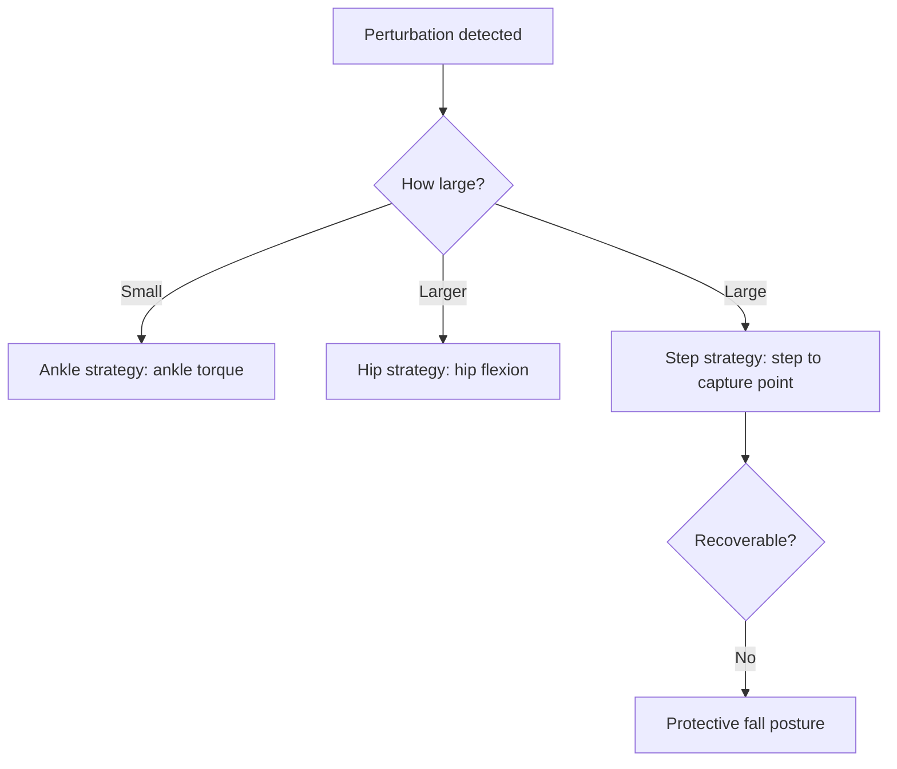

# Terrain Adaptation & Push Recovery

**Duration:** 50 min · **Level:** Advanced · **Module:** 3. Bipedal Locomotion & Whole-Body Control · **Focus:** `terrain`, `push-recovery`, `footstep-planning`, `robustness`

The controllers in the previous lessons assume something the real world refuses to provide: a known, level floor and no one bumping into you. A robot that works in a hospital meets wet tile, a loose rug, an uneven threshold, a staircase, and a nurse who brushes past it without looking. It cannot fall in any of these situations — a falling 35 kg machine is a danger to the people it is meant to help. This lesson assembles the robustness layer that turns a controller that *walks* into a robot that *survives*: terrain perception, footstep planning over that terrain, a graded set of push-recovery reflexes, and a protective fall response for when recovery is impossible.

## Seeing the ground before you step on it

Robust walking starts with knowing what is underfoot. The standard approach **fuses three sources** into a real-time picture of the local terrain:

- a **depth camera** (typically downward-facing) for the geometry of the ground ahead,
- the **IMU** for the robot's own orientation, so the elevation map is referenced correctly even as the body pitches and rolls,
- and **proprioceptive foot-contact** sensing — what the feet actually felt on the last step, which grounds the visual estimate in physical truth.

Fused together, these produce a **local elevation map updated at 100 Hz**. The high rate matters: at walking speed, a map that lags is a map of where the ground *was*, and the swing foot needs to know where it *is*.

## Planning where the feet land

An elevation map is only useful if it changes where you step. **Footstep planning** projects **safe landing zones** out of the elevation map — flat-enough, solid-enough patches that respect the robot's **slope limits** — and then searches for a sequence of footholds across them. The search is commonly **A\*** over the candidate footholds or an **MPC** formulation that folds the footstep choice into the optimization. Either way the planner avoids obstacles and refuses footholds on terrain too steep to support a stable stance.

This is the deliberate, look-ahead half of robustness: choose good footholds and many disturbances never happen. But planning cannot anticipate the nurse's elbow. For that you need reflexes.

## Push recovery: three reflexes for three magnitudes

When something pushes the robot, the right response depends on *how hard*. Modern controllers carry a graded set of strategies — a hierarchy you should think of as escalating from cheap to drastic:

1. **Ankle strategy (small perturbation).** Apply **ankle torque** to shift the ground reaction and pull the CoM back over the feet. No stepping, minimal motion — the reflex of choice for a light nudge.
2. **Hip strategy (larger perturbation).** Use **hip flexion** to rapidly redirect upper-body momentum and generate a counter-rotation that helps arrest the fall — the kind of waist-bend a person makes when shoved harder.
3. **Step strategy (large perturbation).** When the push is too big to absorb in place, **take a step** to a new support polygon. This is capture-point logic from Lesson 3.1 made real: place the foot where it must go to come to rest.

The escalation matters because over-reacting is its own failure — taking a recovery step for a tiny nudge wastes motion and can itself destabilize. The controller should reach for the smallest reflex that suffices, and escalate only when the perturbation demands it.

The state of the art does not script these reflexes by hand. **MIT's Terrain-Adaptive Atlas (2023)** trained an **RL policy on diverse terrain in simulation** and deployed it **zero-shot** across grass, gravel, stairs, and slippery surfaces — the recovery behaviors *emerged* from training on enough variety, the same domain-randomization principle from Lesson 3.3 applied to disturbance and terrain rather than just dynamics.

## When you cannot recover: falling well

Sometimes the push or the slip is simply unrecoverable, and the only remaining objective is to fail safely. This requires **early detection**: a good controller can recognize an impending fall at **more than 500 ms before impact** — half a second is a great deal of time at control rates, enough to act deliberately. On that trigger the robot enters a **protective posture**: tuck and shield the head, and **distribute the impact across large body areas** rather than landing on a vulnerable joint or the hardware-dense torso. The goal shifts entirely — from staying up to minimizing damage to the robot and, above all, to nearby people.

## Turning robustness into a spec

These behaviors only matter if they are held to a number, and the G1 program states two concrete acceptance criteria you should design and test against:

- **Withstand a lateral push of 150 N at hip height without falling.** This is the push-recovery hierarchy's pass/fail line — ankle, hip, and step strategies must between them absorb a 150 N shove to the hip.
- **Recover from an unexpected 20° slope while walking at 1 m/s.** This is the terrain-perception-and-footstep-planning line — the robot must detect and adapt to a sudden 20-degree grade at a realistic walking speed without going down.

Write these into the test plan as binary gates. A robustness layer without a measured threshold is a hope, not a specification.

## Putting it into practice

Build the perception-to-recovery pipeline in simulation and validate it against the G1 numbers.

1. **Build the elevation map.** In your simulator, fuse a downward depth sensor with the IMU to maintain a local height map of the ground around the robot, updating at 100 Hz. Verify it reads a step or slope correctly as the robot approaches.
2. **Plan footsteps on it.** Implement a simple foothold search (A\* over candidate landing patches) that rejects patches exceeding a slope limit, and feed the chosen footholds to your walking controller from earlier lessons.
3. **Implement the recovery hierarchy.** Code the three reflexes as a threshold ladder on the measured perturbation: small → ankle torque, medium → hip flexion, large → trigger a recovery step (place the foot at the capture point).
4. **Test the 150 N gate.** Apply a lateral impulse equivalent to a **150 N push at hip height** and confirm the robot recovers. Sweep the magnitude up until it fails, and record the margin above 150 N — that margin is your safety headroom.
5. **Test the 20° slope gate.** Set the robot walking at **1 m/s** into an **unexpected 20° incline** and confirm the elevation map detects it and the footstep planner adapts without a fall.
6. **Add the fall response.** Implement an impending-fall detector that fires when the predicted state is unrecoverable, and on trigger drive the robot into a protective posture. Confirm it engages with margin before impact rather than at the last instant.

## Key takeaways

- Robust walking begins with a **100 Hz local elevation map** fusing **depth camera + IMU + proprioceptive foot contact**, then **footstep planning** (A\* or MPC) that selects safe footholds respecting slope limits.
- **Push recovery is a graded hierarchy** — **ankle** (small), **hip** (larger), **step** (large) — and the controller should use the smallest sufficient reflex; the step strategy is Lesson 3.1's capture point in action.
- The current best practice trains recovery via **RL on diverse simulated terrain** (MIT Terrain-Adaptive Atlas, 2023) and deploys **zero-shot** across grass, gravel, stairs, and slippery floors.
- When recovery is impossible, **detect the fall >500 ms early** and enter a **protective posture** — shield the head, spread the impact — shifting the objective from balance to damage minimization.
- Hold the robustness layer to **measured gates**: withstand a **150 N lateral hip push** and **recover from an unexpected 20° slope at 1 m/s**, written as binary pass/fail tests.

---

← Previous: **3.4 Whole-Body Control: Moving & Working Simultaneously**

*Part of Module 3: Bipedal Locomotion & Whole-Body Control.*

