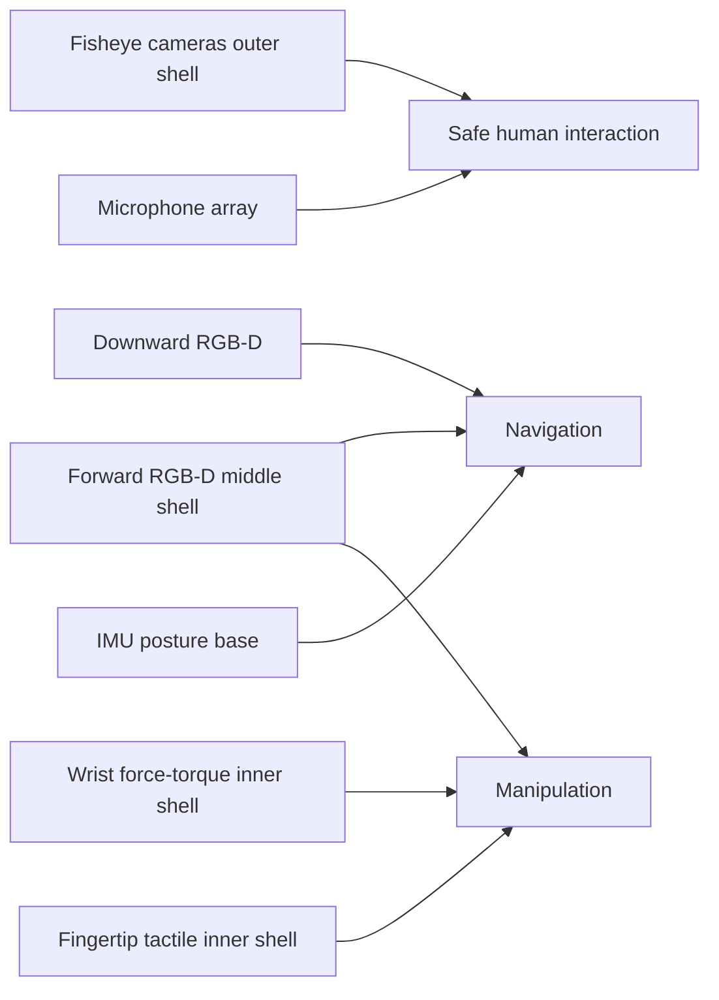

# Sensor Suite Design for Humanoids

**Duration:** 45 min · **Level:** Intermediate · **Module:** 4. Perception & Spatial Intelligence · **Focus:** `sensors`, `perception`, `hardware`, `design`

A humanoid is only as capable as its senses. Before G1 can walk a hospital corridor or hand someone a pill bottle, it has to see the corridor, feel the bottle, and notice the person stepping into its path. This lesson gives you a working framework for the first design decision in perception: what sensors to put on the robot, and where. Get the suite right and every downstream system — SLAM, scene understanding, manipulation — starts from clean, sufficient data. Get it wrong and no amount of clever software recovers the information you never captured.

## Three jobs, one sensor budget

A humanoid's sensors exist to serve three distinct jobs, and the tension between them drives every choice. **Navigation** needs to know where the floor is, where walls and furniture are, and where the robot itself is in the room. **Manipulation** needs precise geometry and contact information close to the hands. **Safe human interaction** needs the widest possible awareness — a person can approach from any direction, and a robot that only looks forward is a hazard.

These jobs pull in different directions, and you pay for all of them out of the same budget of size, weight, and power. A sensor that helps manipulation (a fingertip tactile pad) does nothing for peripheral awareness; a fisheye that watches the whole room gives you poor depth for grasping. The 2024 consensus configuration — which is the baseline you should start from — resolves this not by finding one perfect sensor but by combining four complementary classes: RGB-D cameras, wide-angle fisheye cameras, an IMU, and force/torque sensors at the wrists, with tactile and audio added where the application demands.

## Vision: depth where you act, width where you watch

The workhorse of humanoid vision is the **RGB-D camera** — a unit that returns a color image and a per-pixel depth estimate. Practical choices in this class are the Intel RealSense D435i, the Microsoft Azure Kinect, and the Orbbec Astra. A sensible layout uses two forward-facing RGB-D cameras to give stereo coverage and depth of the workspace ahead, plus one downward-facing unit dedicated to foot placement. That downward camera matters more than beginners expect: locomotion lives or dies on knowing exactly where the next footfall lands, and a forward camera's grazing view of the floor is far less reliable than a dedicated top-down one.

Forward depth alone leaves you blind to the sides, which is unacceptable around people. That is the job of **fisheye or wide-angle cameras**, which deliver a 180-degree-plus field of view for peripheral awareness. Their specific purpose is detecting humans approaching from the side — exactly the situation where a collision is most likely and most dangerous. Fisheye depth is poor, but you are not asking it to grasp; you are asking it to notice motion in your blind spots, and for that a wide cheap lens beats a narrow precise one.

A subtle but important point: depth cameras give you geometry, not identity. They tell you something is 1.5 meters away; they do not tell you it is a chair. Identity comes later, from the foundation models in Lesson 4.4. Your sensor suite's job is to capture enough raw signal that those models have something to reason over.

## Proprioception and contact: knowing your own body and what it touches

Vision tells the robot about the world; **proprioceptive and contact sensors** tell it about itself and its physical interactions. At minimum, one high-quality **IMU** (inertial measurement unit) at the pelvis provides the orientation and acceleration signal that balance estimation depends on. The stronger configuration uses two IMUs — pelvis and head — which improves balance estimation by decoupling head motion from body motion. The pelvis IMU anchors the body frame; the head IMU stabilizes the cameras' understanding of their own movement.

At the hands, **6-DOF force/torque sensors** at each wrist provide manipulation force feedback — the signal that lets the robot push, pull, and insert with controlled force rather than blind position commands. Off-the-shelf units like the ATI Mini45 work, or you can use custom piezoelectric designs. One level finer, **tactile fingertip sensors** of the GelSight or DIGIT family on each fingertip detect contact itself; these are essential for dexterous manipulation in healthcare, where the difference between gripping and crushing is a few newtons (we build on these in Module 6).

Finally, for a robot that listens and speaks in a clinical environment, a **microphone array** of four to eight microphones in a circular arrangement on the head enables sound-source localization and noise-robust speech recognition — important when the robot must understand a spoken request over the hum of a ward.

## How the suite fits together

Think of the suite as concentric shells of awareness. The fisheye cameras form the outer shell — wide, low-resolution, watching for anything that moves. The forward RGB-D cameras form the middle shell — the focused workspace where navigation and reaching happen. The wrist force/torque and fingertip tactile sensors form the inner shell — the millimeters around the hands where contact is made. The IMU runs underneath all of it as the robot's sense of its own posture, and the microphone array adds a non-visual channel for human intent.

The design discipline is to ask, for every sensor you add, which of the three jobs it serves and whether a cheaper or lighter sensor already covers that need. Weight on a humanoid is precious — every gram in the head is a gram the neck actuators must hold steady. Redundancy is good where safety demands it (peripheral human detection) and wasteful where it does not.

## Putting it into practice

Design G1's sensor suite as a concrete, defensible bill of materials.

1. **List the three jobs** — navigation, manipulation, safe human interaction — as column headers. You will check every sensor against them.
2. **Place the vision sensors.** Specify two forward RGB-D units (name a real model, e.g. RealSense D435i), one downward RGB-D for foot placement, and at least two fisheye cameras for 180-degree-plus side coverage. Note which job each serves.
3. **Place the proprioceptive sensors.** Commit to either one pelvis IMU or the stronger pelvis-plus-head pair, and justify the choice against your balance requirements.
4. **Place the contact sensors.** Add a 6-DOF wrist force/torque sensor per arm and decide whether fingertip tactile (DIGIT-class) is in scope for your first build or deferred to Module 6.
5. **Add the audio channel** if clinical speech interaction is a requirement: a four-to-eight-mic head array.
6. **Audit the table.** Confirm every one of the three jobs is covered by at least one sensor, flag any sensor that serves none, and write one sentence per sensor on its size/weight/power cost. The result is the input contract for every later perception lesson.

## Key takeaways

- A humanoid sensor suite serves three competing jobs — navigation, manipulation, and safe human interaction — out of one shared size, weight, and power budget.
- The 2024 baseline combines RGB-D cameras (two forward for workspace depth, one downward for foot placement), 180-degree-plus fisheye cameras for peripheral human awareness, an IMU, and wrist force/torque sensors.
- Depth cameras give geometry, not identity; recognizing *what* an object is comes later from foundation models, so the suite's job is to capture sufficient raw signal.
- Proprioception (one pelvis IMU, ideally a pelvis-plus-head pair) underpins balance; wrist 6-DOF force/torque and DIGIT-class fingertip tactile sensors underpin safe, dexterous contact.
- Design by concentric shells of awareness — wide fisheye outer, focused RGB-D middle, tactile inner — and justify every sensor against at least one of the three jobs.

---

Next: **4.2 Real-Time SLAM for Indoor Navigation** →

*Part of Module 4: Perception & Spatial Intelligence.*

