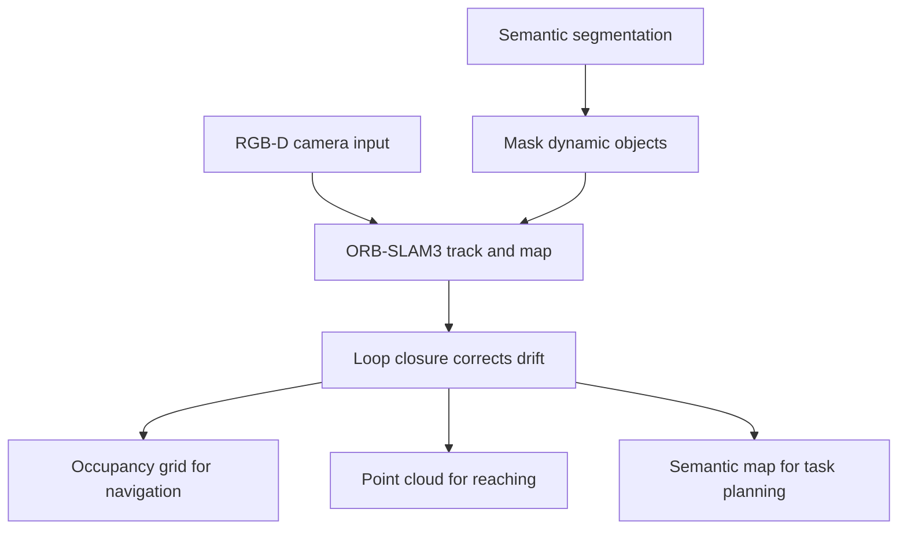

# Real-Time SLAM for Indoor Navigation

**Duration:** 55 min · **Level:** Intermediate · **Module:** 4. Perception & Spatial Intelligence · **Focus:** `SLAM`, `localization`, `mapping`, `navigation`

Drop G1 in an unfamiliar hospital room with no GPS and one question dominates everything else: where am I, and what does this room look like? Solving both at once — building a map while figuring out your place in it — is the problem of Simultaneous Localization and Mapping, or SLAM. This lesson gives you a working decision framework for choosing and deploying a SLAM stack indoors, where centimeter-level localization is both achievable and necessary. The chicken-and-egg structure is the whole difficulty: you need a map to localize, and you need to know where you are to build the map. SLAM resolves the two together, incrementally, as the robot moves.

## The two roads: visual SLAM and LiDAR SLAM

There are two mature families of indoor SLAM, and your hardware budget largely decides between them.

**Visual SLAM** uses cameras you already have on the robot. The reference implementation is **ORB-SLAM3** (Campos et al., 2021), a state-of-the-art open-source library that runs in real time on a CPU and supports monocular, stereo, and RGB-D input. Two properties make it the default choice for a lightweight humanoid. First, it is robust to dynamic scenes — people walking through the frame do not break it. Second, it reuses the cameras already specified in your sensor suite (Lesson 4.1), adding capability without adding weight. ORB-SLAM3 remains actively maintained as an open library, which matters when you are betting a product on it.

**LiDAR SLAM** uses a spinning laser scanner instead of cameras. Stacks like **LIO-SAM** and **FAST-LIO2** deliver centimeter accuracy across large environments and are largely immune to lighting and texture problems that trip up cameras. The catch is physical: LiDAR units are heavy and expensive, which is exactly what a lightweight humanoid cannot afford. So LiDAR SLAM is the right call for industrial deployments — a wheeled warehouse robot — and the wrong default for G1, where every gram in the head taxes the neck actuators.

**Recommendation:** for an indoor humanoid, start with RGB-D visual SLAM on ORB-SLAM3. Reach for LiDAR only if you hit a wall — large, textureless spaces where vision alone cannot localize reliably — and even then, treat it as a supplement rather than a replacement.

## Beyond geometry: semantic SLAM

Classic SLAM gives you a metric map: a cloud of 3D points and your pose within it. Useful, but impoverished. A robot that knows it is "at coordinate (3.2, 1.1, 0.0)" cannot reason about tasks the way a robot that knows it is "3 meters from the kitchen counter and 1.5 meters from the chair" can.

**Semantic SLAM** closes that gap by attaching object labels to the metric map. The localization and mapping machinery is the same; the addition is a recognition layer (drawing on the foundation models of Lesson 4.4) that tags map regions with what they are. The payoff is task planning expressed in human terms — "go to the counter," "avoid the chair" — instead of bare coordinates. For a healthcare or home robot that takes spoken instructions, this is not a luxury; it is the bridge between perception and the language-conditioned policies you will build later.

## The drift problem and loop closure

Every SLAM system accumulates error. Each frame's pose estimate is computed relative to the last, so tiny per-frame errors compound into a slowly growing drift. Over a long shift, a robot relying on raw odometry will believe it is meters from where it actually stands.

The fix is **loop closure**: detecting when the robot returns to a previously visited place, recognizing "I have been here before," and correcting the accumulated drift across the whole trajectory at once. The instant a loop is closed, the map snaps back into global consistency. ORB-SLAM3 implements robust loop closure as a core feature, and it is precisely what makes long-duration operation viable. When you evaluate any SLAM stack for G1, loop closure quality is a first-tier criterion — without it, your beautiful map slowly warps into nonsense over an eight-hour day.

## Dynamic worlds and the maps you actually keep

The classic SLAM assumption — a rigid, static world — is false in a hospital. People move, doors swing, furniture gets rearranged. Naively, every moving person becomes a smear of phantom obstacles baked into your map.

The modern remedy uses **semantic segmentation to mask dynamic elements** out of map updates: identify the pixels belonging to people or moving objects and exclude them from the persistent map, while still treating them as live obstacles for navigation right now. The map records the wall behind the person, not the person. This is where semantic understanding feeds back into geometric SLAM — recognition and mapping are not separate pipelines but a loop.

Finally, G1 needs not one map but three, maintained in real time and serving different consumers. The **occupancy grid** answers "where can I step and drive?" for navigation. The **point cloud** captures detailed 3D geometry for reaching and obstacle avoidance. The **semantic map** holds object labels and positions for task planning. They are different projections of the same sensed reality, and a complete perception stack keeps all three current as the robot explores.

## Putting it into practice

Stand up a working indoor SLAM pipeline and prove it holds together over a loop.

1. **Choose your stack.** For a lightweight humanoid, select RGB-D visual SLAM on ORB-SLAM3 over LiDAR, and write one sentence justifying it on weight and cost grounds.
2. **Feed it real input.** Wire your forward RGB-D camera (from Lesson 4.1) into ORB-SLAM3 in RGB-D mode and drive the robot — or a handheld rig — through a room while it builds a map and tracks pose.
3. **Force a loop closure.** Walk a closed path that returns to the start. Watch the trajectory before and after closure; the visible "snap" when drift is corrected is the feature doing its job.
4. **Stress it with people.** Have someone walk through the frame and confirm tracking survives. Note where phantom obstacles appear, and identify where a semantic mask would remove them.
5. **Extract the three maps.** Export an occupancy grid, a point cloud, and (if you add a recognition layer) a semantic map. Confirm each is usable by its intended consumer — navigation, reaching, task planning.
6. **Measure drift.** Return to a known start position and compare SLAM's reported pose against ground truth. The residual error, with and without loop closure, tells you whether this stack meets a centimeter-level indoor target.

## Key takeaways

- SLAM solves localization and mapping together because each needs the other; indoors, centimeter-level accuracy is both achievable and required.
- Default to RGB-D visual SLAM (ORB-SLAM3) for a lightweight humanoid — it is real-time on CPU, robust to moving people, and reuses existing cameras; reserve LiDAR SLAM (FAST-LIO2, LIO-SAM) for heavier industrial platforms.
- Semantic SLAM attaches object labels to the metric map, turning bare coordinates into task-usable knowledge like "3 meters from the counter."
- Loop closure corrects accumulated drift when the robot revisits a place and is essential for long-duration operation; treat it as a first-tier selection criterion.
- Mask dynamic objects with semantic segmentation so people do not pollute the persistent map, and maintain three live map types — occupancy grid, point cloud, and semantic map.

## References

- **ORB-SLAM3: An Accurate Open-Source Library for Visual, Visual-Inertial and Multi-Map SLAM** — Campos et al. (2021). *IEEE T-RO 2021*

---

← Previous: **4.1 Sensor Suite Design for Humanoids** · Next: **4.3 3D Gaussian Splatting for Robot Scene Understanding** →

*Part of Module 4: Perception & Spatial Intelligence.*

