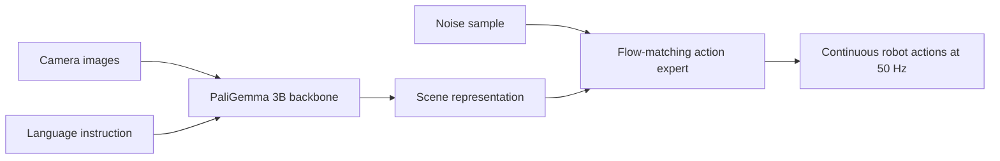

# π0 — Diffusion-Based Whole-Body Control

**Duration:** 75 min · **Level:** Advanced · **Module:** 5. Foundation Models & VLA Architecture · **Focus:** `pi0`, `diffusion`, `flow-matching`, `physical-intelligence`

If RT-2 proved that a single network can carry web knowledge into action, **π0 (Physical Intelligence, October 2024)** proved that the same network can produce motion smooth and precise enough for real whole-body manipulation — folding laundry, packing eggs, clearing a table. The trick that makes it work is a change in how actions are generated. Instead of predicting discrete action tokens like a language model, π0 learns a continuous *flow* from noise to action. This lesson unpacks that idea and ends with you implementing a miniature version of it yourself.

## The architecture: a VLM backbone with an action expert

π0 is built as two coupled parts. A **PaliGemma 3B vision-language backbone** reads the camera images and the language instruction and forms a representation of what to do. A **flow-matching action expert** takes that representation and generates the actual sequence of robot actions. The whole system is about **3 billion parameters** and runs at **50 Hz on the robot** — fast enough for continuous, reactive control rather than slow step-by-step planning.

The split matters. The backbone supplies semantic understanding (the same lineage as the VLA models from Lesson 5.1); the action expert supplies smooth, physically realistic motion. Keeping them as distinct-but-joined modules is what lets π0 inherit a strong pretrained vision-language model while still emitting continuous control.

## Flow matching: why not just diffusion, and why not regression

To understand the action expert you need to understand the spectrum of ways to generate an action.

- **Direct regression** predicts a single action — the mean of what the demonstrations did. Fast, but it collapses multimodal behavior: if two valid trajectories exist, regression averages them into a third that may be invalid (more on this failure in Lesson 5.4).
- **Diffusion (DDPM)** generates an action by starting from noise and denoising it over many steps. It represents full distributions, but classic diffusion needs **50-plus function evaluations** per action — too slow for 50 Hz control.
- **Flow matching**, which π0 uses, learns a **velocity field that transforms noise into action** in continuous time. It is a continuous-time generalization of diffusion, and its decisive advantage is sampling speed: **1 to 3 function evaluations** instead of 50-plus, while still producing **smoother trajectories**.

The intuition: diffusion learns *where to step* at each of many discrete denoising stages; flow matching learns the *whole velocity field* once, so you can integrate from noise to action in just a few steps. For a robot that must act at 50 Hz, that difference between "a few" and "fifty" evaluations is the difference between running on the robot and not.

## The data and what it bought

π0 was trained on **10,000-plus hours of teleoperation data across 7 robot platforms**, spanning tasks like laundry folding, box assembly, table clearing, and egg packaging. Two results from that investment are worth carrying with you.

First, the headline: π0 **fine-tuned on one hour of data reached 70-percent-plus success on laundry folding** — the hardest manipulation benchmark — where the previous state of the art sat around **30 percent**. Laundry is brutal because cloth is deformable and the action space is enormous; more than doubling the success rate is a genuine step change.

Second, and more useful to you as a builder: **fine-tuning efficiency**. Adapting the pretrained π0 to a new task takes **1 to 10 hours of task-specific demonstrations**, versus the **1,000-plus hours** that earlier approaches needed. This is the practical payoff of foundation models for robotics — the expensive, broad pretraining is done once by someone with a data fleet, and you specialize it cheaply.

That economic logic is exactly why Physical Intelligence **raised a $400M Series B in 2024 at a $2B valuation**, pursuing the "foundation model for physical AI" market: own the pretrained model, and every downstream task becomes a small fine-tune.

## Where π0 sits in the 2026 landscape

It helps to place π0 among the options you can actually reach today. Physical Intelligence has open-sourced model weights through its **openpi** repository (π0 and a faster autoregressive variant, π0-FAST), and has since shipped **π0.5** with stronger open-world generalization. If you need a *fully* open, self-hostable VLA to fine-tune end to end on your own hardware, OpenVLA (Lesson 5.3) is the cleaner choice; if you want the flow-matching whole-body quality π0 is known for and can work within its release terms, openpi is the reference. NVIDIA's **GR00T N1** family takes a closely related route — a vision-language System 2 feeding a diffusion-transformer System 1 — which is essentially the same backbone-plus-continuous-action-expert pattern π0 popularized. Recommendation: study flow matching here because it is the technique underneath the whole-body results, then pick the implementation by how open and self-hostable it needs to be.

## Putting it into practice

This is the module's flow-matching lab. Build the mechanism in miniature so the math stops being abstract.

1. **Define a 2D toy action space.** Let an "action" be a point in the plane, and create 100 demonstration trajectories — for instance, samples drawn from two separated clusters so the distribution is genuinely multimodal.
2. **Implement the conditional flow-matching loss.** Sample a noise point and a target action, interpolate linearly between them at a random time `t`, and train a small network to predict the velocity that moves the interpolant toward the action.
3. **Train on the 100 trajectories** until the loss flattens. Keep the network tiny — this is about the idea, not scale.
4. **Sample by integration.** Start from random noise and step along the learned velocity field in just a few steps (echoing π0's 1-3 evaluations). Confirm the samples land on your demonstration clusters.
5. **Visualize the vector field.** Plot the learned velocities as arrows over the plane and watch noise get carried into the action distribution. Then answer in one sentence: why would direct regression have failed on your two-cluster data, and why did flow matching not?

## Key takeaways

- π0 (Physical Intelligence, Oct 2024) pairs a PaliGemma 3B vision-language backbone with a flow-matching action expert — about 3B parameters total, running at 50 Hz on the robot.
- Flow matching learns a velocity field from noise to action, needing only 1-3 function evaluations per action (versus 50-plus for DDPM diffusion) while producing smoother trajectories.
- Trained on 10,000-plus hours across 7 platforms, π0 reached 70-percent-plus on laundry folding after just one hour of fine-tuning, versus the ~30 percent prior state of the art.
- The builder's payoff is fine-tuning efficiency: 1-10 hours of demonstrations to adapt the pretrained model, down from the 1,000-plus hours earlier methods required.
- The same economics drove Physical Intelligence's $400M Series B at a $2B valuation — own the pretrained "foundation model for physical AI," sell the cheap fine-tunes.
- The backbone-plus-continuous-action-expert pattern is now widespread (openpi's π0/π0.5, NVIDIA GR00T N1); choose among them by how open and self-hostable you need the model to be.

## References

- **π0: A Vision-Language-Action Flow Model for General Robot Control** — Black et al., Physical Intelligence (2024). *arXiv 2410.24164*

---

← Previous: **5.1 From Narrow Policies to General-Purpose Robot Brains** · Next: **5.3 OpenVLA — The Open-Source VLA Ecosystem** →

*Part of Module 5: Foundation Models & VLA Architecture.*

