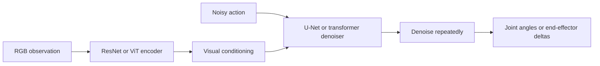

# Diffusion Policy — Visuomotor Control via Denoising

**Duration:** 60 min · **Level:** Advanced · **Module:** 5. Foundation Models & VLA Architecture · **Focus:** `diffusion-policy`, `visuomotor`, `bimanual`, `manipulation`

There is a quiet failure mode that haunts every robot policy trained by simple regression, and once you see it you cannot unsee it. Ask a robot to "place the cup somewhere on the table" and demonstrate it going left half the time and right half the time. A regression policy, trained to predict the average action, learns to drive *straight into the middle* — a place neither demonstration ever went, and possibly a place with an obstacle. **Diffusion Policy (Chi et al., RSS 2023)** exists to fix exactly this. This lesson is about why representing a *distribution* of actions, not a single action, is the right default for contact-rich manipulation.

## The multimodality problem, stated precisely

Many manipulation tasks have **multiple correct trajectories**. "Place the cup somewhere on the table" has a left solution and a right solution, both valid. "Reach around the obstacle" can go clockwise or counterclockwise. The set of good actions is not a single point — it is multimodal.

**Direct regression predicts a single mean action.** When the true distribution is bimodal, the mean falls in the empty valley between the modes. The policy confidently outputs an action that no expert ever demonstrated and that may be wrong or unsafe. This is not a tuning bug; it is structural. Regression can only represent one answer, so it cannot represent a question with two answers.

**Diffusion policy predicts a distribution** instead. It learns a **score function** — the gradient of the data distribution — and generates actions by denoising from noise toward high-probability regions. It can land on the left mode *or* the right mode, never the invalid middle. For contact-rich tasks where several valid solutions coexist, this is the difference between a policy that works and one that fails in ways that are hard to debug.

## How the denoising policy is built

The architecture has three parts you should be able to name.

- **Conditioning:** the policy is conditioned on RGB observations encoded by a **ResNet or ViT** visual backbone, so generated actions depend on what the camera sees.
- **Denoising network:** a **U-Net or transformer** that, given noisy actions and the visual conditioning, predicts how to denoise toward a clean action.
- **Action space:** the outputs are **joint angles or end-effector deltas** — the actual commands the robot executes.

Start from noise, denoise repeatedly using the conditioned network, arrive at an action drawn from the learned distribution. The score-function view is what gives the method its power: by learning the gradient of the action distribution, it can represent arbitrarily shaped, multimodal action sets.

## The speed trade-off you must choose

Diffusion's strength — many denoising steps to sculpt a rich distribution — is also its cost. There are **two variants, and the choice is yours to make**:

- **DDPM-based** diffusion policy: **100-step denoising**, slow, but the most expressive.
- **Consistency policy**: **1-to-4-step denoising**, dramatically faster, with a small expressiveness trade-off.

The decision rule is clean: **for real-time control, prefer the consistency policy.** A 100-step DDPM may be fine for offline analysis or a slow task, but a robot closing a control loop cannot afford 100 network evaluations per action. This mirrors the flow-matching speed argument from Lesson 5.2 — the field keeps converging on the same conclusion, that few-step sampling is what makes generative policies deployable.

Diffusion Policy is **state-of-the-art on RoboMimic, RLBench, and BridgeV2**, and is **particularly strong on bimanual and contact-rich manipulation** — the regime where multimodality and contact richness make regression most fragile.

## Action chunking and the ALOHA result

A closely related thread leads to one of the most striking practical demonstrations in the field. **ACT (Action Chunking with Transformers, Zhao et al., 2023)** predicts actions in *chunks* — short sequences at a time rather than one step — which smooths motion and reduces compounding error. ACT is the policy behind the **Stanford ALOHA** bimanual system.

The payoff: **ALOHA 2 (Stanford, 2024)**, a **14-DOF bimanual system trained with ACT on just 50 demonstrations**, achieved tasks including cooking and surgery simulation at **90-percent-plus success**. Fifty demonstrations is astonishingly few. It works because chunked prediction plus a well-designed teleoperation rig captures clean, consistent demonstrations, and because the policy represents the structure of the task rather than memorizing single steps.

The takeaway for your own builds: **action chunking is a cheap, high-leverage technique.** Whether you use diffusion or a transformer policy, predicting short action chunks instead of single steps tends to smooth motion and cut compounding error — and it showed up again in OpenVLA-OFT (Lesson 5.3) as a key to higher control frequency.

## Choosing your policy class

Put the options side by side. **Plain regression** is simplest but breaks on multimodal tasks. **Diffusion policy (consistency variant)** represents multimodal distributions, is strong on contact-rich and bimanual work, and is fast enough for real time at 1-4 steps. **Flow matching (π0)** is a continuous-time cousin with similarly few-step sampling, favored for whole-body control. **ACT / action chunking** pairs with any of the above when you have few demonstrations and want smooth, low-drift motion. Recommendation: default to a **consistency-based diffusion policy with action chunking** for contact-rich manipulation, and drop to plain regression only when you've confirmed the task is genuinely unimodal.

## Putting it into practice

Make the multimodality failure tangible, then design around it.

1. **Construct a bimodal toy task.** Create demonstrations that solve one task two ways — e.g., reach a target by going left or right around an obstacle, roughly half each.
2. **Train a regression baseline** to predict a single action. Plot its output and confirm it lands in the invalid middle between the two modes. This is the failure you're defending against.
3. **Specify a diffusion policy** for the same task: choose a visual encoder (ResNet or ViT), a denoising network (U-Net or transformer), and an action space (joint angles or end-effector deltas).
4. **Pick your variant against a latency budget.** Decide your control frequency, then choose DDPM (100 steps) only if you have the time, or consistency policy (1-4 steps) for real time. Justify the choice in one sentence.
5. **Add action chunking.** Decide a chunk length and explain, referencing the 50-demonstration ALOHA 2 result, why chunked prediction should improve smoothness and sample efficiency on your task.

## Key takeaways

- Direct regression predicts a single mean action and so collapses on multimodal tasks, outputting an averaged action no expert demonstrated — a structural failure, not a tuning bug.
- Diffusion Policy (Chi et al., RSS 2023) learns a score function and predicts a full action distribution, landing on a valid mode rather than the invalid average — essential for contact-rich tasks with multiple valid solutions.
- It conditions on RGB via ResNet/ViT, denoises with a U-Net or transformer, and outputs joint angles or end-effector deltas; it is state-of-the-art on RoboMimic, RLBench, and BridgeV2, especially for bimanual work.
- Choose the variant by latency: DDPM (100 steps) for expressiveness, consistency policy (1-4 steps) for real-time control — prefer consistency on a robot.
- ACT (Zhao et al., 2023) and action chunking power Stanford ALOHA; ALOHA 2 (2024), a 14-DOF bimanual system, reached 90-percent-plus on cooking and surgery-simulation tasks from just 50 demonstrations.
- Default to a consistency-based diffusion policy with action chunking for contact-rich manipulation; reserve plain regression for tasks you've confirmed are unimodal.

## References

- **Diffusion Policy: Visuomotor Policy Learning via Action Diffusion** — Chi et al. (2023). *RSS 2023*
- **Learning Fine-Grained Bimanual Manipulation with Low-Cost Hardware** — Zhao et al. (2023). *RSS 2023*

---

← Previous: **5.3 OpenVLA — The Open-Source VLA Ecosystem** · Next: **5.5 Deploying VLAs on G1: Architecture & Integration** →

*Part of Module 5: Foundation Models & VLA Architecture.*

