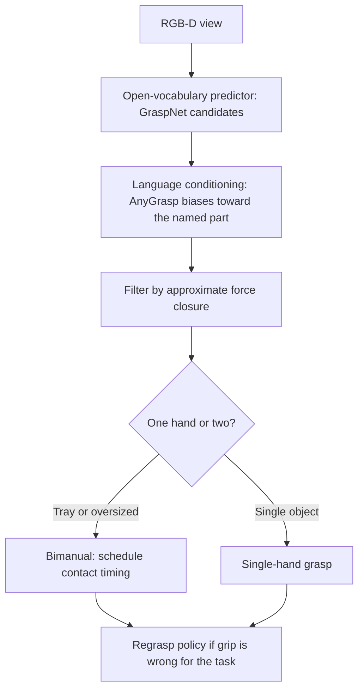

# Grasp Planning with Foundation Models

**Duration:** 55 min · **Level:** Advanced · **Module:** 6. Dexterous Manipulation · **Focus:** `grasping`, `planning`, `learned`, `bimanual`

You have a hand with enough degrees of freedom and fingertips that can feel. The remaining question is the one a person answers without thinking a thousand times a day: *how* should I grab this? Grasp planning is the decision of where to place the hand and which fingers contact an object to achieve a stable, task-appropriate grip — and over the last few years it has been transformed from a hand-tuned geometric problem into a learning problem. This lesson gives you a working understanding of how modern grasp prediction works, when classical force-closure reasoning still matters, and how to handle the harder cases — two hands, the wrong first grab — that real healthcare work demands.

## From geometry to learned grasp prediction

The old way to plan a grasp was to model the object's geometry and solve for contact points analytically. The new way is to learn the mapping from sensor data straight to grasp poses, and the scale involved is what makes it work.

**GraspNet (2020)** is the foundation. It was trained on **97,280 RGB-D images** carrying **1.2 billion grasp annotations**, and from that it learned to predict grasp poses for novel objects in cluttered scenes — **zero-shot on new object categories** it never saw in training. That last property is the whole point. A robot in a hospital supply room will encounter objects no dataset enumerated; a planner that only works on known categories is useless there. GraspNet generalizes because it learned the *visual signature of graspability* rather than a list of specific objects.

**AnyGrasp (2022)** extends this with language. The same scene can afford many valid grasps, and which one you want depends on intent. AnyGrasp conditions grasp selection on natural language, so "grasp the **top** of the bottle" and "grasp the **handle**" produce genuinely different hand configurations from the same image. This is the bridge between perception and instruction: the grasp planner stops being a fixed function of geometry and becomes responsive to what the task asks for.

## The criterion underneath: force closure

Learning did not repeal physics. The classical standard for whether a grasp is *stable* is **force closure**: do the contact forces the fingers can apply span a space capable of resisting **arbitrary external wrenches** — any combination of forces and torques the world might throw at the object? If yes, the grip will hold under disturbance; if no, a nudge in the wrong direction breaks it. Modern learned grasps do not compute this analytically, but the good ones **approximate force closure** — they have effectively learned what stable contact configurations look like from millions of examples.

Why does this matter to you as a builder? Because it tells you how to *evaluate* a learned grasp when it fails. If your network proposes a grip that drops things, the diagnostic question is whether those grasps are force-closure-poor — too few contacts, contacts too close together, normals that cannot oppose an external push. Force closure is the lens that turns "the model is bad" into a specific, fixable hypothesis.

## Task-oriented grasping: use vs. move

Stability is necessary but not sufficient, because *the same object wants different grasps for different purposes*. Consider a hammer. To **move** it, you can grab it anywhere stable. To **use** it, you must grab the handle, leaving the head free — a grasp that is task-appropriate, not merely stable. This **"use" vs. "move"** distinction is exactly where vision-language-action models earn their keep: a VLA model carries the task context and learns to select grasps that fit the downstream action, not just grasps that hold.

In healthcare this is constant. Picking up a syringe to *administer* it requires a grip that leaves the plunger and needle clear; picking it up to *relocate* it does not. The grasp planner cannot be separated from the task — which is why the modern stack pairs an open-vocabulary grasp predictor (GraspNet/AnyGrasp) with a task-aware policy (the VLA layer from the foundation-model lessons) rather than treating grasping as an isolated module.

## The hard cases: two hands and second chances

Two realities break the single-grasp model, and healthcare hits both.

**Bimanual grasps.** Many clinical objects — pill trays, trays of supplies — simply cannot be handled with one hand. Bimanual grasp planning is qualitatively harder than doubling a single-arm planner: it must **coordinate approach trajectories and contact timing** so the two hands arrive in a way that is stable at every instant, not just at the end. A tray gripped by one hand before the other is in place will tip. Plan both contacts as one coupled event.

**Regrasping.** Your first grasp is often suboptimal — fine for lifting, wrong for the task that follows. Rather than aborting, a capable robot **regrasps**: it can pass the object hand-to-hand, or set it against a surface and re-acquire a better grip. This is **underexplored** in the literature but **critical for real-world use**, because the alternative — getting the grasp perfect on the first try, every time — is not achievable. Treat regrasping as a first-class capability, not an error path.

## Putting it into practice

Design the grasp-planning pipeline for one healthcare task, top to bottom.

1. **Pick the object and intent.** Choose something concrete — a medication bottle — and a verb: open it, hand it to a patient, or relocate it. The verb determines whether you need a use-grasp or a move-grasp.
2. **Generate candidates.** Run an open-vocabulary predictor (GraspNet-style) on the RGB-D view to propose grasps zero-shot, then use language conditioning (AnyGrasp-style) to bias toward the part the task needs ("grasp the cap").
3. **Filter for stability.** Rank candidates by an approximate force-closure check — favor grips with well-separated contacts and opposing normals. Discard configurations that cannot resist a sideways disturbance.
4. **Decide one hand or two.** If the object is a tray or oversized, switch to a bimanual plan and explicitly schedule the contact *timing* of both hands so the object is stable throughout the approach, not only at the end.
5. **Plan the recovery.** Define the regrasp policy in advance: if the achieved grip is wrong for the next action, specify whether the robot hands off between hands or braces against a surface to re-acquire. Write it before you need it.

## Key takeaways

- Grasp planning shifted from analytical geometry to large-scale learning: GraspNet (2020), trained on 97,280 RGB-D images and 1.2B annotations, predicts grasps for novel objects zero-shot in clutter.
- AnyGrasp (2022) adds language conditioning, so "grasp the top" vs. "grasp the handle" yield different configurations — connecting instruction to action.
- Force closure — whether contact forces can resist arbitrary external wrenches — remains the stability criterion; learned grasps approximate it, and it is your best lens for diagnosing failures.
- Task-oriented grasping distinguishes "use" grasps from "move" grasps (handle a hammer to use it, anywhere to move it); VLA models supply the task context that selects the right one.
- Bimanual grasps for trays and supplies require coordinating both hands' approach and contact timing as one coupled event, not two independent grabs.
- Regrasping (hand-to-hand or against a surface) is underexplored but essential — design it as a first-class capability, since a perfect first grasp every time is unrealistic.

---

← Previous: **6.2 Tactile Sensing: GelSight, DIGIT, and BioTac**

*Part of Module 6: Dexterous Manipulation.*

