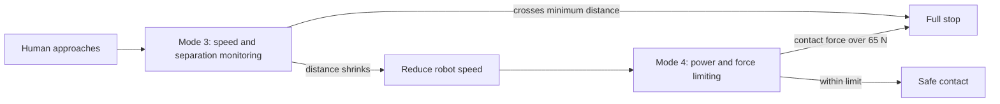

# ISO 10218 & ISO/TS 15066: The Collaborative Robot Safety Standards

**Duration:** 50 min · **Level:** Intermediate · **Module:** 8. Safety & Human-Robot Interaction · **Focus:** `safety`, `ISO`, `standards`, `compliance`

A humanoid that cannot prove it is safe will never roll through a hospital door. Before G1 touches a patient, it has to satisfy a body of standards that translate "don't hurt people" into numbers an engineer can design against and a third party can certify. This lesson maps that standards landscape — ISO 10218, ISO/TS 15066, and the healthcare-specific layers on top — and turns it into the concrete force and pressure budget your control system must respect.

## The two-layer standard: industrial robots and collaborative operation

The foundation is **ISO 10218**, split into Part 1 (the robot itself) and Part 2 (the integrated robot system and cell). It covers safety requirements for industrial robots in general — the guarding, stopping functions, and risk-reduction logic that any moving machine near people needs. On its own, though, ISO 10218 was written for the classic picture of a robot behind a fence.

**ISO/TS 15066** is the layer that breaks the fence. It extends ISO 10218 to *collaborative robots* — machines that operate in direct physical contact with humans by design, not by accident. This is exactly G1's situation: a humanoid handing a patient medication is in deliberate, repeated contact with a person. ISO/TS 15066 is where the biomechanical contact limits live, and it is the document that makes "safe contact" a measurable engineering target rather than a hope.

One practical note for 2026: the technical-specification content of ISO/TS 15066 has been folded into the 2025 revision of ISO 10218-2, so the collaborative requirements now sit inside the main integration standard rather than in a separate cross-referenced document. The *requirements* are the same biomechanical limits you'll design against — treat ISO/TS 15066 as the canonical name for the contact-limit framework, and know that in current practice you cite it through ISO 10218-2.

## The numbers you cannot exceed

The single most important output of these standards is a table of body-region contact limits. The key insight to internalize: **the limits are body-part specific, because tissue tolerance varies enormously across the body, and the head is the most sensitive region.** A force that a forearm shrugs off can injure an eye socket.

The worked example to keep on a card: for **transient contact at the thorax**, the robot must not exceed roughly **65 N of force and 15 kN/m² of pressure**. Two things matter here. First, there are *two* quantities — force and pressure — and you must satisfy both. A 65 N contact spread over a broad, padded surface may be fine, while the same force concentrated on a sharp edge blows past the pressure limit even though the force number looks acceptable. Pressure is force divided by contact area, so **rounding edges and adding compliant covering is a legitimate, standards-recognized way to buy margin** without weakening the robot. Second, "transient" (a brief, bounce-off impact) is treated differently from "quasi-static" (a sustained clamping or pinching contact), and quasi-static limits are stricter because the body cannot recoil away from the load.

Because the head carries the tightest thresholds, the cleanest design move is often to ensure G1's hardware simply cannot drive its end-effectors into head height at speed — eliminating the worst contact by geometry rather than relying purely on sensing.

## Four collaboration modes — and the one G1 needs

ISO/TS 15066 defines **four collaborative operation modes**, and choosing among them is your first architectural decision:

1. **Safety-rated monitored stop** — the robot halts whenever a human is in the shared space and only moves when they leave. Safe but useless for a robot meant to work *with* a patient.
2. **Hand guiding** — the human physically leads the robot via a guiding device. Useful for teaching, not for autonomous care delivery.
3. **Speed and separation monitoring (mode 3)** — the robot continuously tracks the distance to the human and *reduces its speed as the human approaches*, coming to a full stop if the human crosses a minimum protective distance. That distance is not arbitrary: it is calculated from the robot's stopping time, so a robot that stops faster can let people get closer before it must halt.
4. **Power and force limiting (mode 4)** — the robot is allowed to make contact, but if sensed contact force exceeds a threshold it stops or slows. This is the mode that lets G1 actually hand something to a person.

**G1 primarily needs mode 4.** A delivery and assistance humanoid must be permitted to touch people, so it lives or dies by its ability to *sense and limit* contact force in real time — which is precisely the hardware and control problem Lesson 8.2 builds. Mode 3 is a valuable complement: slow down near people so that any contact mode 4 has to handle is gentle to begin with. The two layer naturally — separation monitoring keeps approach speeds low, power/force limiting catches the contact that monitoring couldn't prevent.

The two modes layer as a single approach-to-contact safety loop — mode 3 keeps approach speeds low, and mode 4 catches the contact that monitoring could not prevent:

## Certification and the healthcare overlay

Designing to the limits is necessary but not sufficient — you also have to *prove it to a regulator*. In Europe that means **CE marking**; in North America, **UL certification**. Both require a third-party risk assessment demonstrating compliance with the applicable standards. This is a documentation and evidence exercise as much as an engineering one, and it is why Lesson 8.2's emphasis on a written ISO 10218-2 risk assessment matters: the assessment *is* the deliverable the notified body reviews.

For a hospital humanoid, two further standards stack on top of the robotics ones. **IEC 62061** governs the functional safety of machinery — the integrity of the safety functions themselves (how reliably your force-limiting actually triggers). **IEC 60601** governs medical electrical equipment — the electrical safety expected of anything operating in a patient-care setting. G1 targeting hospital deployment needs to satisfy **both**, in addition to the collaborative-robot standards. Plan for this from day one; retrofitting functional-safety evidence onto a finished design is far more expensive than building the evidence trail as you go.

## Putting it into practice

Produce G1's first contact-safety budget — a one-page artifact you'll hand to the control team.

1. List every body region G1 could plausibly contact in a medication-delivery task (hands, forearm, torso, and — flagged as forbidden-by-design — the head).
2. For each region, write the transient force and pressure limits from the ISO/TS 15066 framework, using the thorax pair (≈65 N, ≈15 kN/m²) as your reference anchor and noting that the head limits are tighter.
3. For one realistic contact — say, the robot's gripper brushing the patient's forearm — estimate the contact area, then back-calculate the maximum force that keeps you under the pressure limit. Compare that to the force limit and adopt whichever is lower.
4. Decide G1's collaboration mode (mode 4, with mode 3 as a complementary speed layer) and write one sentence justifying it against the task.
5. Note which certifications (CE/UL) and overlay standards (IEC 62061, IEC 60601) apply, and assign each an owner.

## Key takeaways

- ISO 10218 (Parts 1 & 2) covers industrial robots; ISO/TS 15066 extends it to collaborative robots in direct human contact — and as of the 2025 revision, that collaborative content is integrated into ISO 10218-2.
- Contact limits are body-region specific (the head is most sensitive); the reference pair is transient thorax contact at ≈65 N force and ≈15 kN/m² pressure, and you must satisfy force *and* pressure.
- Of the four collaboration modes, G1 primarily needs mode 4 (power/force limiting), ideally layered with mode 3 (speed/separation monitoring) to keep approach speeds low.
- Certification (CE in Europe, UL in North America) requires a third-party risk assessment proving compliance — the assessment document is the deliverable.
- Hospital deployment stacks IEC 62061 (functional safety) and IEC 60601 (medical electrical equipment) on top of the robotics standards; design for both from the start.

---

Next: **8.2 Compliant Control & Force-Limiting Architecture** →

*Part of Module 8: Safety & Human-Robot Interaction.*

