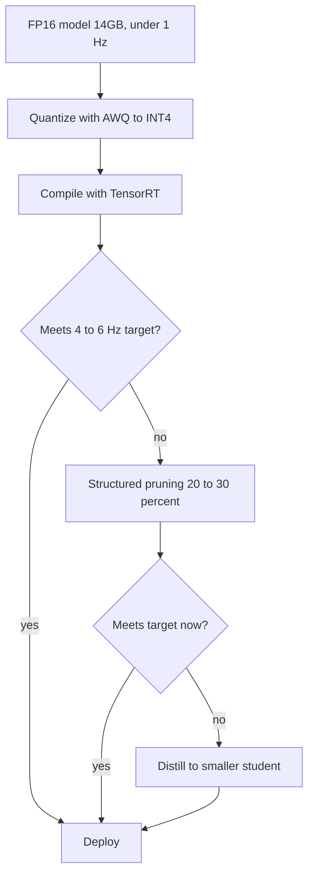

# Model Compression for Edge Deployment

**Duration:** 55 min · **Level:** Advanced · **Module:** 9. Edge AI & On-Board Intelligence · **Focus:** `quantization`, `compression`, `TensorRT`, `efficiency`

The previous lesson left you with an uncomfortable number: a 7B-parameter VLA policy runs at about 1.5 Hz on an AGX Orin, and in full FP32 it would demand **28GB of memory** and crawl at under 1 Hz — unusable for a robot that has to react. This lesson is about closing that gap. Model compression — quantization, distillation, and pruning — can take that same model down to roughly **4GB and 5–10 Hz with no meaningful loss in accuracy**. That is not a minor optimization; it is the difference between a research demo and a robot that moves at human-relevant speed.

## Quantization: the highest-leverage move

Quantization stores model weights at lower numerical precision. Neural networks turn out to tolerate this remarkably well, because the signal that matters lives in the *pattern* of weights, not in their last few decimal places. The arithmetic is compelling: a **7B model in FP16 occupies ~14GB; the same model in INT4 occupies ~3.5GB** — a **4× memory reduction and a 3–4× speedup**, with **under 1% accuracy drop** on action-prediction benchmarks.

Remember why the speedup is so large. From Lesson 9.1, Orin is bandwidth-bound at 204 GB/s, so moving from 16-bit to 4-bit weights cuts the bytes the GPU must fetch by 4×. Quantization buys speed *and* space at once, which is why it is almost always the first compression you reach for.

The naive way to quantize — round every weight uniformly — loses too much accuracy at INT4 because a small number of weights carry outsized influence. **AWQ (Activation-Aware Weight Quantization)**, from Lin et al. (MLSys 2024), solves this elegantly: it observes which weights are *salient* by looking at the activations flowing through them, and protects those salient weights at higher precision while aggressively quantizing the rest. The result is the best practical INT4 method for LLM-derived VLA models, and it ships inside **TensorRT-LLM**, so you can use it without re-implementing the algorithm. **GPTQ** is a comparable alternative; both belong in your toolbox, but AWQ's activation-awareness makes it the default recommendation for VLA weights.

## Distillation: train a smaller model to think like a bigger one

Quantization shrinks a fixed model; **knowledge distillation** changes the model itself. You train a small "student" network to reproduce the outputs of a large "teacher" VLA, so the student learns the teacher's behavior rather than rediscovering it from raw data. The payoff is concrete: a distilled **Pi0-small at ~1B parameters can approach the performance of Pi0-3B**, a model three times its size.

Distillation is more work than quantization — it requires a training run and the teacher's outputs — but it is the right tool when even a quantized large model will not fit your latency or memory budget. It is also complementary: you can distill *and* quantize, getting a model that is both architecturally smaller and numerically cheaper.

## Pruning: remove what the model is not using

**Pruning** deletes weights that contribute little. It comes in two flavors with very different practical implications:

- **Structured pruning** removes whole components — for example, entire attention heads. Because it deletes regular blocks, the result runs faster on real hardware without special kernels.
- **Unstructured pruning** zeroes individual weights anywhere in the network. It can remove more without hurting accuracy, but the resulting sparse pattern needs hardware or libraries that exploit sparsity to actually run faster.

In practice, **20–30% of weights can often be pruned with minimal impact.** The honest recommendation: prefer structured pruning for edge deployment, because the speedup is real on Orin without exotic sparse-execution support. Treat pruning as a complement to quantization, not a replacement — the two attack different sources of waste.

## TensorRT: the compiler that fuses it all

Even after you have shrunk the model, how it executes matters. **TensorRT**, NVIDIA's inference optimizer, takes your network graph and rewrites it for the target hardware: it **fuses layers** (collapsing several operations into one kernel so intermediate results never leave fast memory) and **optimizes memory-access patterns** to suit Orin's architecture. The payoff is a further **2–4× speedup on top of quantization**. This is why the recommended deployment path is not "pick one technique" but a *stack*: quantize with AWQ, optionally prune and distill, then compile the result through TensorRT for the final hardware-specific gains.

## Choosing your stack — an honest recommendation

You do not need every technique, and applying them blindly wastes weeks. A sensible order of operations:

1. **Quantize first** with AWQ to INT4. It is the cheapest to apply (no retraining) and delivers the biggest single win — 4× memory, 3–4× speed, &lt;1% accuracy loss.
2. **Compile with TensorRT** for the hardware-specific 2–4× on top. Also essentially free in engineering effort.
3. If you still miss your latency target, **prune** (structured, ~20–30%) before reaching for distillation.
4. **Distill** only when a quantized, pruned large model still cannot fit — it costs a training run but can deliver a fundamentally smaller architecture (Pi0-small ≈ Pi0-3B).

This ordering is a decision pipeline — apply the cheap, high-yield steps first and only escalate if you still miss the target:

The target this assembles toward is concrete: a **7B VLA at INT4 running 4–6 Hz on a single AGX Orin**, paired with a **1–2 kHz low-level reactive controller on the CPU**. That pairing is the architectural heart of an edge VLA system — a slow, smart policy proposing intent at a few Hz, and a fast, dumb controller keeping the robot stable in between.

## Putting it into practice

Compute your own compression budget for the G1 VLA before you commit to a model size.

1. **Start from the raw footprint.** Write down your model's FP16 size (7B → ~14GB) and its measured rate on Orin (the OpenVLA baseline was ~1.5 Hz).
2. **Apply the INT4 factor.** Estimate the quantized size (÷4 → ~3.5GB) and project the speedup (×3–4). Does it clear your memory headroom under 64GB and reach ~4 Hz?
3. **Layer TensorRT.** Multiply your projected rate by 2–4× and check it against the 4–6 Hz target.
4. **Decide if you still need pruning or distillation.** If projected rate already meets target, stop — do not over-compress and spend accuracy you do not need to spend.
5. **Specify the dual loop.** State the VLA rate (e.g., 5 Hz) and the reactive controller rate (1–2 kHz), and confirm the CPU has headroom for the fast loop while the GPU runs the policy.

## Key takeaways

- A 7B VLA in FP32 (28GB, &lt;1 Hz) is unusable; compression takes it to ~4GB and 5–10 Hz with no meaningful accuracy loss.
- INT4 quantization is the highest-leverage move: 4× smaller, 3–4× faster, &lt;1% accuracy drop — and it cuts bandwidth, which is Orin's real bottleneck.
- AWQ (Lin et al., 2024) protects salient weights identified from activations and is the best practical INT4 method for VLA models; it ships in TensorRT-LLM.
- Distillation (Pi0-small ≈ Pi0-3B) and structured pruning (20–30% of weights) are complementary tools for when quantization alone falls short.
- TensorRT fuses layers and optimizes memory access for a further 2–4× on top of quantization — apply it last, in a stacked pipeline.
- The deployment target is a 7B INT4 VLA at 4–6 Hz on one Orin, paired with a 1–2 kHz CPU reactive controller — the canonical edge-VLA architecture.

## References

- **AWQ: Activation-aware Weight Quantization for On-Device LLM Compression and Acceleration** — Lin et al. (2023). *MLSys 2024*

---

← Previous: **9.1 NVIDIA Jetson AGX Orin: The Humanoid Brain** · Next: **9.3 Neuromorphic Computing & Event Cameras** →

*Part of Module 9: Edge AI & On-Board Intelligence.*

